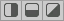
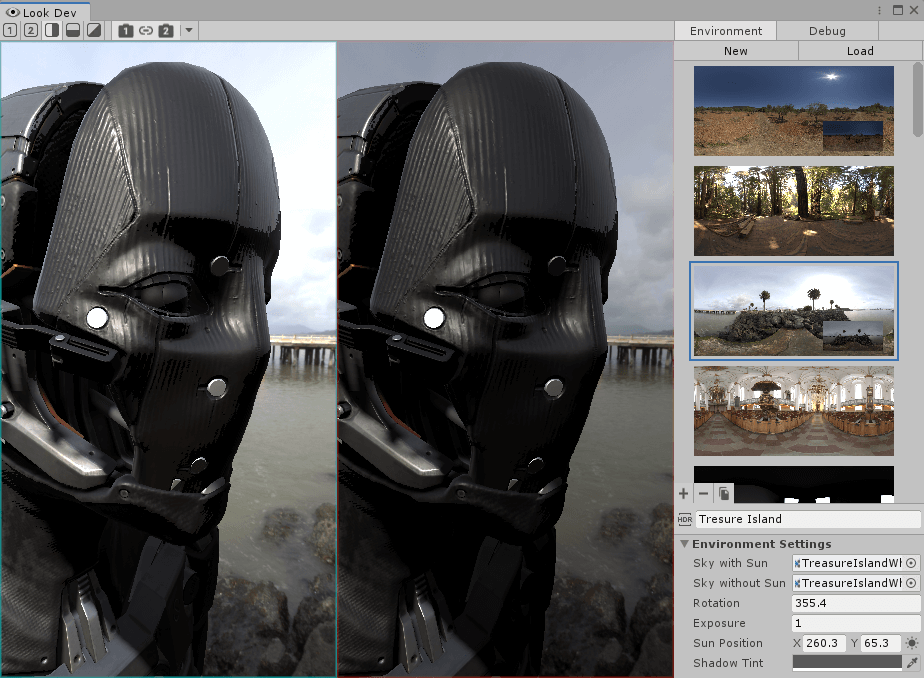
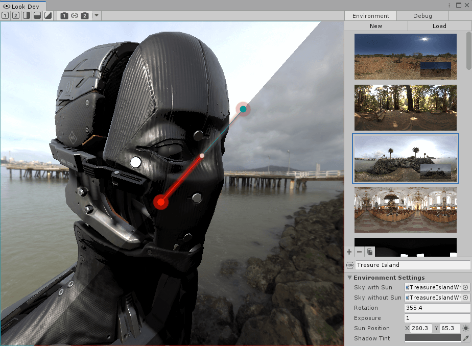
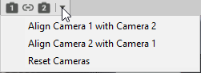
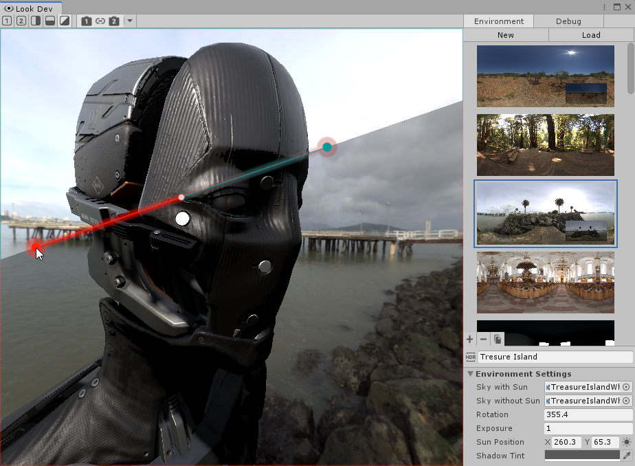
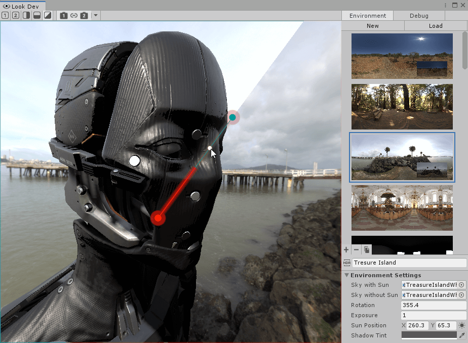

# Look Dev

Look Dev is an image-based lighting tool that contains a viewer for you to check and compare Assets to ensure they work well in various lighting conditions. Look Dev uses the Scriptable Render Pipeline, so it can display the Asset in the same way as it looks in your Scene. You can load Assets into Look Dev either as Prefabs or from the Hierarchy window.

Look Dev is only available in Edit mode. The Look Dev window closes when you enter Play mode.

### Asset validation

Asset validation confirms whether Assets are authored correctly and behave as expected in different lighting environments.

You must use an HDRI (high dynamic range image) to validate your Assets in Look Dev. An HDRI contains real-world lighting with incredibly high detail. As such, it offers perfect lighting that is difficult to create by hand. By using such an accurate lighting environment to test an Asset, you can determine whether the Asset itself or your Project's lighting is reducing the visual quality of your Scene.

You can load two different Assets into Look Dev at the same time and compare them in two viewports. For example, an Art Director can check that a new Asset matches the art direction guidelines of a reference Asset.

## Using Look Dev

To open Look Dev in the Unity Editor, select **Window > Rendering > Look Dev**. The first time you use Look Dev, you must either create a new [Environment Library](Look-Dev-Environment-Library.html) or load one. For information on how to create an Environment Library, see the [Environment Library documentation](Look-Dev-Environment-Library.html).

### Viewports

By default, there is only one viewport in Look Dev, but you can choose from a selection of split-screen views (see the [Multi-view section](#MultiView)).

### Controls

Navigation with the Look Dev Camera works in a similar way to the [Scene view Camera](https://docs.unity3d.com/Manual/SceneViewNavigation.html):

- **Rotate around pivot:** Left click and drag (this is similar to the Scene view except that you need to press the Alt key for the Scene view Camera).
- **Pan camera:** Middle click and drag.
- **Zoom:** Alt + right click and drag.
- **Forward/backward:** Mouse wheel.
- **First Person mode:** Right click + W, A,S, and D.

### Loading Assets into Look Dev

Look Dev lets you view:

**Prefabs** - To load a Prefab into Look Dev, drag it from the Project window into the Look Dev viewport.

**GameObjects** - To load a copy of a Hierarchy GameObject, drag the GameObject from the Hierarchy into the Look Dev viewport.

## Viewport modes

Use the toolbar in the top-left of the window to change which viewing mode Look Dev uses.

### Single viewport

By default, Look Dev displays a single viewport which contains the Prefab or GameObject you are working with. If you are in another viewing mode, you can click either the number **1** or number **2** button to go back to single view. Each button corresponds to a viewport in Look Dev. Select button **1** to use viewport 1, and button 2 to use viewport **2**.

### Multi-viewport

Use multiple viewports to compare different environments and settings for the same Asset. You can arrange viewports:

- Vertically side-by-side. Use this mode to compare two different lighting conditions on the same Asset to check that the Asset behaves correctly.
- Horizontally side-by-side. Use this mode to compare two different lighting conditions for horizontal objects, like an environment Asset, to check that the Asset behaves correctly.
- Split-screen. Use this mode investigate texture problems using a debug Shader mode (for example, use one screen to view Normal or Albedo shading, and the other for environment-lit mode).
- Side-by-side and split-screen: Use this mode to compare two different versions of the same Asset using the same lighting conditions to see which changes improve the Asset’s quality.

All three of these modes are useful to compare two different versions of the same Asset using the same lighting conditions to see which changes improve the Asset’s quality.

To load a different Prefab or Hierarchy GameObject into each split-screen view, drag and drop the Asset into the viewport that you want to view it in.

When using multiple viewports, it only makes sense to compare different Prefabs or GameObjects when you want to look at two versions of the same Asset. Comparing completely different Assets doesn’t give you a good idea of the difference in lighting or visual effect.

##### Vertical or horizontal side-by-side

Vertical and horizontal side-by-side viewports show an identical view of your Asset.

##### Split-screen

In a split-screen view, there is a red/blue manipulation Gizmo that separates the two viewports. For information on how to use this Gizmo, see [Using the manipulation Gizmo](#ManipulationGizmo).

#### Multi-viewport Camera

By default, Look Dev synchronizes the camera movement for both views. To decouple the Cameras from one another, and manipulate them independently, click the **Synchronized Cameras** button in-between the two numbered Camera buttons.

To align the cameras with each other, or reset them, click on the drop-down arrow next to the viewport **2** icon:

### Using the manipulation Gizmo

The manipulation Gizmo represents the separation plane between the two viewports. It has different behavior in split-screen mode, but you use it in the same way for both side-by-side or split-screen modes.

#### Moving the separator

To move the separator, click and drag the straight line of the Gizmo to the location you want.

#### Changing the orientation and length

To change the orientation and length of the manipulator Gizmo, click and drag the circle at either end of the manipulator. Changing the length of the Gizmo lets you  set the orientation and [blending](#Blending) values more precisely.

#### Changing the split in increments

To change the split in increments, click and hold the circle on the end of the manipulation Gizmo, then hold Shift as you move the mouse. This snaps the manipulation Gizmo to set angles in increments of 22.5°, which is useful for a perfectly horizontal, vertical or diagonal angle.

#### Blending

The central white circle on the separator allows you to blend between the two views. Left click on it and drag along the red line to blend the left-hand view with the right-hand view. Drag along the blue line to blend the right-hand view with the left-hand view (as shown in the image below).

The white circle automatically snaps back into the center when you drag it back. This helps you get back to the default blending value quickly.

### HDRI environments in Look Dev

Lighting in Look Dev uses an HDRI. The Look Dev view allows you to manipulate and easily switch between HDRIs to simulate different environments for the Asset you are working on.

Look Dev uses the [Environment Library](Look-Dev-Environment-Library.html) Asset to store a list of environments, which are HDRIs with extra properties that you can use to further refine the environment. For information on how to create, edit, and assign Environment Libraries, see the [Environment Library documentation](Look-Dev-Environment-Library.html#Creation).

## Implementing Look Dev for your custom Scriptable Render Pipeline

In order to use Look Dev in your custom Scriptable Render Pipeline, you must implement the **UnityEngine.Rendering.LookDev.IDataProvider** interface.

| **Function**                                                 | **Description**                                              |
| ------------------------------------------------------------ | ------------------------------------------------------------ |
| **void FirstInitScene(StageRuntimeInterface stage)**         | Look Dev calls this function after it initializes the Scene with a Light and Camera. It uses this function to add and configure extra components according to the needs of your Scriptable Render Pipeline. |
| **void UpdateSky(Camera camera, Sky sky, StageRuntimeInterface stage)** | Look Dev uses this function to update the environment when you change something in Look Dev. You can handle the sky in various ways, so add code that corresponds to your Scriptable Render Pipeline. |
| **IEnumerable****<string>** **supportedDebugModes { get; }** | Use this function to specify the list of supported debug modes. You do not need to add **None** because Look Dev handles that automatically. |
| **void UpdateDebugMode(int debugIndex)**                     | Use this function to update the debug mode based on what the user selects. The **debugIndex** matches the list in **supportedDebugModes**. If the user selects **None**, then the **debugIndex** is **-1**; |
| **void GetShadowMask(ref RenderTexture output, StageRuntimeInterface stage)** | This function computes a shadow map. The given **StageRuntimeInterface** contains access to the Camera and a Light simulating the sun. |
