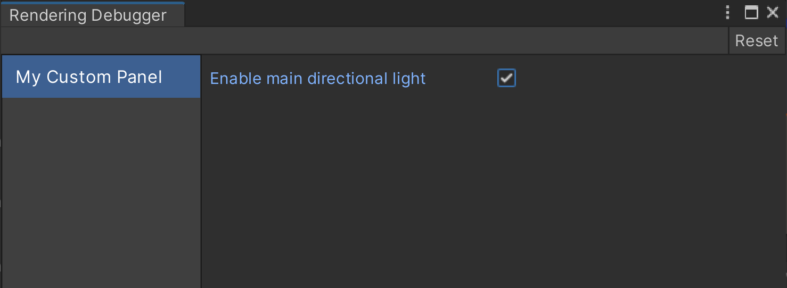

# Rendering Debugger

The **Rendering Debugger** is a window you can customize with your own controls and scripts to visualize your project's lighting, rendering, or Material properties.

If your project uses a custom Scriptable Render Pipeline (SRP), you can add controls to the default empty window.

If your project uses the Universal Render Pipeline (URP) or the High-Definition Render Pipeline (HDRP), refer to the following pages:

- [Add controls to the Rendering Debugger in URP](https://docs.unity3d.com/Manual/urp/features/rendering-debugger-add-controls.html)
- [Add controls to the Rendering Debugger in HDRP](https://docs.unity3d.com/Packages/com.unity.render-pipelines.high-definition@15.0/manual/Rendering-Debugger-Add-Controls.html)

## How to access the Rendering Debugger

The Rendering Debugger window is available in the following modes:

| Mode       | Platform       | Availability                   | How to Open the Rendering Debugger                                                                                                                                                                                            |
|------------|----------------|--------------------------------|-------------------------------------------------------------------------------------------------------------------------------------------------------------------------------------------------------------------------------|
| Editor     | All            | Yes (window in the Editor)     | Select **Window > Analysis > Rendering Debugger**                                                                                                                                                                             |
| Play mode  | All            | Yes (overlay in the Game view) | On a desktop or laptop computer, press **LeftCtrl+Backspace** (**LeftCtrl+Delete** on macOS)<br>On a console controller, press L3 and R3 (Left Stick and Right Stick) |
| Runtime    | Desktop/Laptop | Yes (only in Development builds) | Press **LeftCtrl+Backspace** (**LeftCtrl+Delete** on macOS)                                                                                                                                                                   |
| Runtime    | Console        | Yes (only in Development builds) | Press L3 and R3 (Left Stick and Right Stick)                                                                                                                                                                                  |
| Runtime    | Mobile         | Yes (only in Development builds) | Use a three-finger double tap                                                                                                                                                                                                 |


To disable the runtime UI, use the [enableRuntimeUI](https://docs.unity3d.com/Packages/com.unity.render-pipelines.core@17.0/api/UnityEngine.Rendering.DebugManager.html#UnityEngine_Rendering_DebugManager_enableRuntimeUI) property.

## Navigation at runtime

### Keyboard

| Action                                             | Control                                                                                   |
|----------------------------------------------------|-------------------------------------------------------------------------------------------|
| **Change the current active item**                 | Use the arrow keys                                                                        |
| **Change the current tab**                         | Use the Page up and Page down keys (Fn + Up and Fn + Down keys respectively for MacOS)    |
| **Display the current active item independently of the debug window** | Press the right Shift key                                                                 |

### Xbox Controller

| Action                                             | Control                                                                                   |
|----------------------------------------------------|-------------------------------------------------------------------------------------------|
| **Change the current active item**                 | Use the Directional pad (D-Pad)                                                           |
| **Change the current tab**                         | Use the Left Bumper and Right Bumper                                                      |
| **Display the current active item independently of the debug window** | Press the X button                                                                        |

### PlayStation Controller

| Action                                             | Control                                                                                   |
|----------------------------------------------------|-------------------------------------------------------------------------------------------|
| **Change the current active item**                 | Use the Directional buttons                                                               |
| **Change the current tab**                         | Use the L1 button and R1 button                                                           |
| **Display the current active item independently of the debug window** | Press the Square button                                                                   |


## Add a control

The **Rendering Debugger** window can contain multiple tabs ('panels'). When you select a panel, the window displays one or more controls ('widgets').

To create a widget and add it to a new panel, do the following:

1. Create a script that uses `using UnityEngine.Rendering;` to include the `UnityEngine.Rendering` namespace.
2. Create a widget by creating an instance of a child class of [DebugUI.Widget](../api/UnityEngine.Rendering.DebugUI.Widget.html), for example `DebugUI.Button`.
3. In the widget, implement the `onValueChanged` callback, which Unity calls when you change the value in the widget.
4. Create a panel using [DebugUI.instance.GetPanel](../api/UnityEngine.Rendering.DebugManager.html#UnityEngine_Rendering_DebugManager_GetPanel_System_String_System_Boolean_System_Int32_System_Boolean_).
5. Add the widget to an array.
6. Add the widget array to the list of children in the panel.

If you add 2 or more widgets to the array, the panel displays the widgets in the same order as the array.

The following code sample creates and adds a widget that enables or disables the main directional light:

```
using UnityEngine;
using UnityEngine.Rendering;
using System.Collections.Generic;
using System.Linq;

[ExecuteInEditMode]
public class CustomDebugPanel : MonoBehaviour
{

    static bool lightEnabled = true;

    void OnEnable()
    {
        // Create a list of widgets
        var widgetList = new List<DebugUI.Widget>();

        // Add a checkbox widget to the list of widgets
        widgetList.AddRange(new DebugUI.Widget[]
        {
            new DebugUI.BoolField
            {
                displayName = "Enable main directional light",
                tooltip = "Enable or disable the main directional light",
                getter = () => lightEnabled,

                // When the widget value is changed, change the value of lightEnabled
                setter = value => lightEnabled = value,

                // Run a custom function to enable or disable the main directional light based on the widget value
                onValueChanged = DisplaySunChanged
            },
        });

        // Create a new panel (tab) in the Rendering Debugger
        var panel = DebugManager.instance.GetPanel("My Custom Panel", createIfNull: true);

        // Add the widgets to the panel
        panel.children.Add(widgetList.ToArray());
    }

    // Remove the custom panel if the GameObject is disabled
    void OnDisable()
    {
        DebugManager.instance.RemovePanel("My Custom Panel");
    }

    // Enable or disable the main directional light based on the widget value
    void DisplaySunChanged(DebugUI.Field<bool> field, bool displaySun)
    {
        Light sun = FindObjectsOfType<Light>().Where(x => x.type == LightType.Directional).FirstOrDefault();
        if (sun)
            sun.enabled = displaySun;
    }
}
```

Add the script to a GameObject. You should see a new **My Custom Panel** panel in the **Rendering Debugger** window.



### Add a control to an existing panel

You can only add properties to existing panels if you're using a custom SRP. You shouldn't add widgets to URP or HDRP's built-in Rendering Debugger panels.

To fetch an existing panel, use `DebugManager.instance.GetPanel` with the panel name. Set `createIfNull` to `false`, so you don't accidentally create a new panel if the name doesn't match an existing panel.

The following code sample fetches the panel from the code sample above:

```
var panel = DebugManager.instance.GetPanel("My Custom Panel", createIfNull: false);
```

## Add a container

You can use containers to display groups of widgets together.

1. Create a container using one of the child classes of [DebugUI.Container](../api/UnityEngine.Rendering.DebugUI.Container.html), for example `DebugUI.Foldout`.
2. Add a widget array using the container's `Add` method.

The following example creates a collapsible container that contains 2 checkboxes:

```
using UnityEngine;
using UnityEngine.Rendering;
using System.Collections.Generic;

[ExecuteInEditMode]
public class CustomDebugPanelWithContainer : MonoBehaviour
{
    void OnEnable()
    {
        // Create a list of widgets
        var widgetList = new List<DebugUI.Widget>();

        // Add 2 checkbox widgets to the list of widgets
        widgetList.AddRange(new DebugUI.Widget[]
        {
            new DebugUI.BoolField
            {
                displayName = "Visualisation 1",
            },
            new DebugUI.BoolField
            {
                displayName = "Visualisation 2",
            },
        });

        // Create a container
        var container = new DebugUI.Foldout
        {
            displayName = "My Container"
        };

        // Add the widgets to the container
        container.children.Add(widgetList.ToArray());

        // Create a new panel (tab) in the Rendering Debugger
        var panel = DebugManager.instance.GetPanel("My Custom Panel With Container", createIfNull: true);

        // Add the container to the panel
        panel.children.Add(container);
    }
}
```

## Control the Rendering Debugger overlay

To change the value of the currently active widget:

- On a keyboard, press the Left and Right arrow keys.
- On a touch screen, tap the arrows next to the properties.
- On an Xbox controller, use the Directional pad (D-Pad).
- On a PlayStation controller, use the Directional buttons.

To change the current panel:

- On a Windows keyboard, use the Page up and Page down keys (macOS: fn + Up arrow key, and fn + Down arrow key).
- On a touch screen, tap the arrows next to the tab title.
- On an Xbox controller, use the Left Bumper and Right Bumper.
- On a PlayStation controller, use L1 and R1.

To display the currently active widget independently of the debug window:

- On a keyboard, press Right Shift.
- On an Xbox controller, press X.
- On a PlayStation controller, press Square.

## Disable the Rendering Debugger

To disable the Rendering Debugger in your built application, set [DebugManager.enableRuntimeUI](https://docs.unity3d.com/Packages/com.unity.render-pipelines.core@15.0/api/UnityEngine.Rendering.DebugManager.html#UnityEngine_Rendering_DebugManager_enableRuntimeUI) to `false`.
