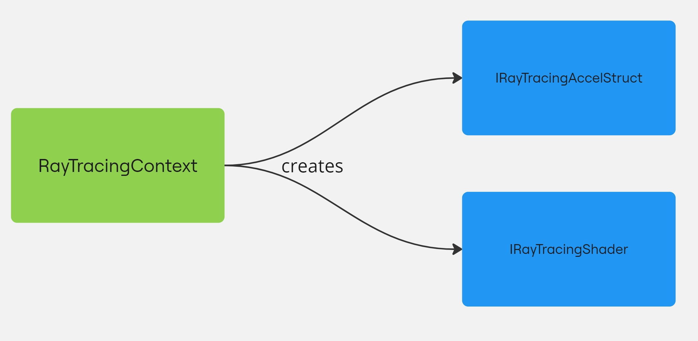

# Get started with ray tracing
The `UnifiedRayTracing` API enables you to write ray tracing code that executes on a wide range of GPUs. Unlike the [`RayTracingAccelerationStructure`](xref:UnityEngine.Rendering.RayTracingAccelerationStructure) API,
its key advantage is that it is able to operate without requiring hardware ray tracing support. It achieves this by offering multiple backends that can be dynamically selected based on the GPU’s capabilities.

## Backends
The following backends are available:
- `Hardware`: Requires a GPU that supports hardware-accelerated ray tracing. This backend uses the [`RayTracingAccelerationStructure`](xref:UnityEngine.Rendering.RayTracingAccelerationStructure) API.
- `Compute` : Software implementation of ray tracing that works only on GPUs that support compute shaders.

By abstracting these different implementations behind a unified interface, the API allows you to write your ray tracing code once, and have it automatically adapt to the appropriate backend.

## Main concepts
The API entry point is the [`RayTracingContext`](xref:UnityEngine.Rendering.UnifiedRayTracing.RayTracingContext) which is initialized for a specific backend.

The [`RayTracingContext`](xref:UnityEngine.Rendering.UnifiedRayTracing.RayTracingContext) enables you to create the 2 essential objects you need to perform ray tracing:
- an acceleration structure ([`IRayTracingAccelStruct`]((xref:UnityEngine.Rendering.UnifiedRayTracing.IRayTracingAccelStruct))) which represents the geometry to trace rays against.
- a shader ([`IRayTracingShader`]((xref:UnityEngine.Rendering.UnifiedRayTracing.IRayTracingShader))) which contains your ray tracing code that will run on the GPU.

For more information, refer to [Using the API workflow](workflow.md).

## Limitations
In order to accomodate both hardware-accelerated and non-accelerated GPUs, the API is more constrained than Unity's [`RayTracingAccelerationStructure` API](xref:UnityEngine.Rendering.RayTracingAccelerationStructure). 
- The API doesn't support any automatic scene updates. You must explicitly call [`IRayTracingAccelStruct.AddInstance`](xref:UnityEngine.Rendering.UnifiedRayTracing.IRayTracingAccelStruct.AddInstance(UnityEngine.Rendering.UnifiedRayTracing.MeshInstanceDesc)) or 
[`IRayTracingAccelStruct.RemoveInstance`](xref:UnityEngine.Rendering.UnifiedRayTracing.IRayTracingAccelStruct.RemoveInstance(System.Int32)) to update the acceleration structure.
- The API supports only ray tracing with mesh geometries.
- Once a hit is found, the `TraceRay` function returns immediately with the hit information. You need to write the shading code in the ray generation shader (`.urtshader`).
