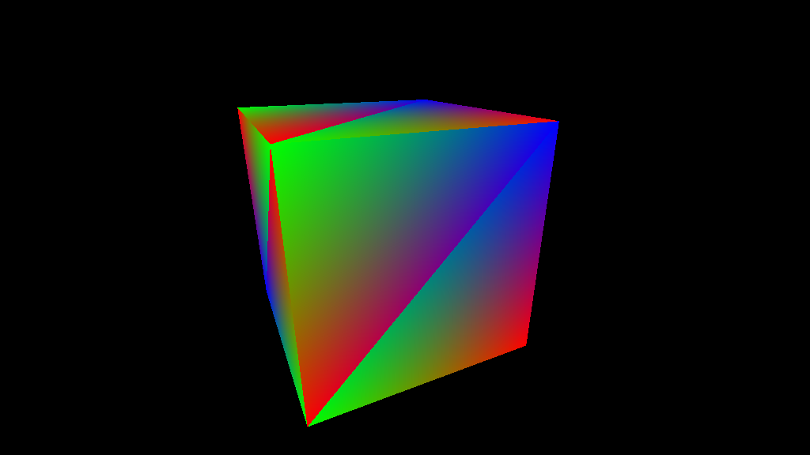

# Sample code: Tracing camera rays
This section demonstrates how to use the API to cast rays from the scene's Main camera and output the results into a `RenderTexture`, providing the complete code for implementation.


Save the following code in your **Assets** folder as a file named `shootCameraRays.urtshader`:
```HLSL 
// Include file for the UnifiedRayTracing API functions
#include "Packages/com.unity.render-pipelines.core/Runtime/UnifiedRayTracing/TraceRayAndQueryHit.hlsl"

// Use this macro to declare the acceleration structure binding
UNIFIED_RT_DECLARE_ACCEL_STRUCT(_AccelStruct);

uint _RenderWidth;
uint _RenderHeight;
float4 _CameraFrustum;
float4x4 _CameraToWorldMatrix;
RWTexture2D<float4> _OutputTexture;

UnifiedRT::Ray GenerateFrustumRay(float2 frameCoord, uint2 resolution)
{
    float2 ndcCoords01 = (frameCoord + 0.5) / float2(resolution);
    float3 viewDirection = float3(
        lerp(_CameraFrustum.x, _CameraFrustum.y, ndcCoords01.x),
        lerp(_CameraFrustum.z, _CameraFrustum.w, ndcCoords01.y),
        -1.0);

    UnifiedRT::Ray ray;
    ray.origin = transpose(_CameraToWorldMatrix)[3].xyz;
    ray.direction = mul((float3x3) _CameraToWorldMatrix, normalize(viewDirection));
    ray.tMin = 0.0f;
    ray.tMax = 100000.0f;

    return ray;
}

// Entry point of the shader. DispatchInfo provides the current thread index in the dispatch
void RayGenExecute(UnifiedRT::DispatchInfo dispatchInfo)
{
    UnifiedRT::Ray ray = GenerateFrustumRay(dispatchInfo.dispatchThreadID.xy, uint2(_RenderWidth, _RenderHeight));

    // Retrieve the acceleration structure
    UnifiedRT::RayTracingAccelStruct accelStruct = UNIFIED_RT_GET_ACCEL_STRUCT(_AccelStruct);

    // Trace a ray in the acceleration structure
    UnifiedRT::Hit hitResult = UnifiedRT::TraceRayClosestHit(dispatchInfo, accelStruct, 0xFFFFFFFF, ray, UnifiedRT::kRayFlagNone);
    float2 uv = hitResult.uvBarycentrics;

    // display the hit triangle barycentrics coordinates as an RGB color
    float3 color = hitResult.IsValid() ? float3(uv.x, uv.y, 1.0 - uv.x - uv.y) : 0.0;
    _OutputTexture[dispatchInfo.dispatchThreadID.xy] = float4(color, 1.0);
}
```

The following C# MonoBehaviour is responsible for creating the acceleration structure, loading the ray tracing shader and dispatching it to the GPU.
Save it as a script file in your **Assets** folder and attach it to one of your scene GameObjects.
```C# 
using UnityEngine;
using UnityEngine.Rendering;
using UnityEngine.Rendering.UnifiedRayTracing;

public class ShootCameraRays : MonoBehaviour
{
    RayTracingResources m_RtResources;
    RayTracingContext m_RtContext;
    IRayTracingShader m_RtShader;
    IRayTracingAccelStruct m_RtAccelStruct;

    // Ray tracing results are written to this texture
    const int width = 1024;
    const int height = 576;
    public RenderTexture OutputTexture;

    void Start()
    {
        var renderTexDesc = new RenderTextureDescriptor(width, height);
        renderTexDesc.graphicsFormat = UnityEngine.Experimental.Rendering.GraphicsFormat.R8G8B8A8_SRGB;
        renderTexDesc.enableRandomWrite = true;
        OutputTexture = new RenderTexture(renderTexDesc);

        m_RtResources = new RayTracingResources();
        m_RtResources.Load();

        // Create the RayTracingContext
        var backend = RayTracingContext.IsBackendSupported(RayTracingBackend.Hardware) ? RayTracingBackend.Hardware : RayTracingBackend.Compute;
        m_RtContext = new RayTracingContext(backend, m_RtResources);

        // Load the unified ray tracing shader
        m_RtShader = m_RtContext.LoadRayTracingShader("Assets/shootCameraRays.urtshader");

        // Create the ray tracing acceleration structure
        m_RtAccelStruct = m_RtContext.CreateAccelerationStructure(new AccelerationStructureOptions());

        // Add an instance to the acceleration structure for each MeshRenderer in the current scene
        uint instanceID = 0;
        var meshRenderers = UnityEngine.Object.FindObjectsByType<MeshRenderer>(FindObjectsSortMode.None);
        foreach (var renderer in meshRenderers)
        {
            var mesh = renderer.GetComponent<MeshFilter>().sharedMesh;
            int subMeshCount = mesh.subMeshCount;

            for (int i = 0; i < subMeshCount; ++i)
            {
                var instanceDesc = new MeshInstanceDesc(mesh, i);
                instanceDesc.localToWorldMatrix = renderer.transform.localToWorldMatrix;
                instanceDesc.instanceID = instanceID++;
                m_RtAccelStruct.AddInstance(instanceDesc);
            }
        }
    }

    void OnDestroy()
    {
        m_RtAccelStruct.Dispose();
        m_RtContext.Dispose();
        OutputTexture?.Release();
    }

    void Update()
    {
        // A scratch buffer is required to build the acceleration structure and for the ray traversal, this helper function allocates one with the required size.
        GraphicsBuffer scratchBuffer = RayTracingHelper.CreateScratchBufferForBuildAndDispatch(m_RtAccelStruct, m_RtShader, width, height, 1);

        var cmd = new CommandBuffer();
        // build the ray tracing acceleration structure
        m_RtAccelStruct.Build(cmd, scratchBuffer);

        // bind the shader gpu resources
        m_RtShader.SetAccelerationStructure(cmd, "_AccelStruct", m_RtAccelStruct);
        m_RtShader.SetIntParam(cmd, Shader.PropertyToID("_RenderWidth"), width);
        m_RtShader.SetIntParam(cmd, Shader.PropertyToID("_RenderHeight"), height);
        m_RtShader.SetVectorParam(cmd, Shader.PropertyToID("_CameraFrustum"), GetCameraFrustum(Camera.main));
        m_RtShader.SetMatrixParam(cmd, Shader.PropertyToID("_CameraToWorldMatrix"), Camera.main.cameraToWorldMatrix);
        m_RtShader.SetTextureParam(cmd, Shader.PropertyToID("_OutputTexture"), OutputTexture);

        // dispatch rays. Workgrid dimensions are supplied in threads, not workgroups
        m_RtShader.Dispatch(cmd, scratchBuffer, width, height, 1);
        Graphics.ExecuteCommandBuffer(cmd);

        scratchBuffer?.Dispose();
    }

    // utility function to extract a frustum from a camera
    Vector4 GetCameraFrustum(Camera camera)
    {
        Vector3[] frustumCorners = new Vector3[4];
        camera.CalculateFrustumCorners(new Rect(0, 0, 1, 1), 1.0f, Camera.MonoOrStereoscopicEye.Mono, frustumCorners);
        float left = frustumCorners[0].x;
        float right = frustumCorners[2].x;
        float bottom = frustumCorners[0].y;
        float top = frustumCorners[2].y;

        return new Vector4(left, right, bottom, top);
    }
}

```

You can now enter Play mode and visualize the ray tracing results. Follow these steps:
1. Select the GameObject you attached the `ShootCameraRays` MonoBehaviour to.
2. In the **Inspector** window, go to the **ShootCameraRays** component and double-click **Output Texture**.
3. The Inspector now displays a preview of the render texture containing the ray tracing results.
