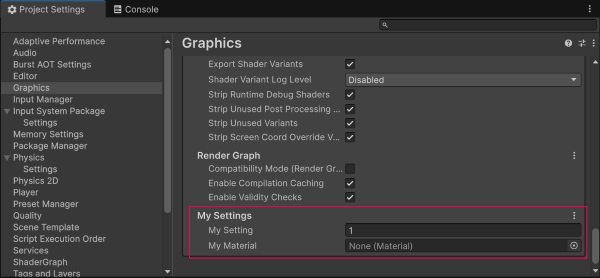

# Add a setting

Add a simple property or a reference property to a [custom graphics settings group](add-custom-graphics-settings.md). You can change the values of the setting in the Unity Editor while you're editing your project.

Unity serializes the graphics settings you add. For more information, refer to [Script serialization](xref:um-script-serialization).

**Note:** The value of a custom setting is static in a built project. You can't change the setting at runtime.

## Add a simple property

To add a simple property, add a field to your `IRenderPipelineGraphicsSettings` class using the `[SerializeField]` attribute. For example:

```c#
using System;
using UnityEngine;
using UnityEngine.Rendering;
using UnityEngine.Rendering.Universal;

[Serializable]
[SupportedOnRenderPipeline(typeof(UniversalRenderPipelineAsset))] 

// Create a new settings group by implementing the IRenderPipelineGraphicsSettings interface
public class MySettings : IRenderPipelineGraphicsSettings
{
  // Add a private field for the version property
  int internalVersion = 1;

  // Implement the public version property
  public int version => internalVersion;

  // Add a float setting
  [SerializeField]
  private float mySetting = 1.0f;

  // Add a Material reference property
  [SerializeField]
  public Material myMaterial;
}
```
<br/>
The **Edit** > **Project Settings** > **Graphics** window with the new custom setting from the example script.

## Set the default asset for a reference property

To set a default asset for a [reference property](xref:um-editing-value-properties#references), for example a material, add a [`[ResourcePath]`](https://docs.unity3d.com/6000.1/Documentation/ScriptReference/Rendering.ResourcePathAttribute.html) attribute. For example:

```c#
public class MySettings: IRenderPipelineGraphicsSettings
{
  ...
  [SerializeField]
  [ResourcePath('path-to-default-file')]
  public Material myMaterial;
}
```

## Additional resources

- [SerializeField](xref:UnityEngine.SerializeField)
- [Reference properties](xref:EditingValueProperties#references)
