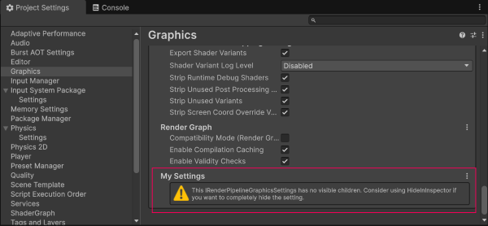

# Add a settings group

To add a custom graphics settings group to a Scriptable Render Pipeline, implement the `IRenderPipelineGraphicsSettings` interface.

Follow these steps:

1. Create a class that implements the `IRenderPipelineGraphicsSettings` interface, then add a `[Serializable]` attribute.

2. To set which render pipeline the setting applies to, add a `[SupportedOnRenderPipeline]` attribute and pass in a `RenderPipelineAsset` type.

    **Note:** If you don't add a `[SupportedOnRenderPipeline]` attribute, the setting applies to any Scriptable Render Pipeline. However each Scriptable Render Pipeline stores its own value for the setting.

3. Implement the `version` property. Unity doesn't currently use the `version` property, but you must implement it. 

Unity adds the new settings group to the **Edit** > **Project Settings** > **Graphics** window.

For example, the following script adds a settings group called **My Settings** in the **Graphics** settings window of the Universal Render Pipeline (URP).

```c#
using System;
using UnityEngine;
using UnityEngine.Rendering;
using UnityEngine.Rendering.Universal;

[Serializable]
[SupportedOnRenderPipeline(typeof(UniversalRenderPipelineAsset))] 

// Create a new settings group by implementing the IRenderPipelineGraphicsSettings interface
public class MySettings : IRenderPipelineGraphicsSettings
{
  // Add a private field for the version property
  int internalVersion = 1;

  // Implement the public version property
  public int version => internalVersion;

}
```

<br/>
The **Edit** > **Project Settings** > **Graphics** window with the new custom settings group from the example script.

## Change the display order of settings groups

To change where a settings group appears, use the `[UnityEngine.Categorization.CategoryInfo]` attribute. For example, the following code gives the settings group the name **My Settings** and moves the group to the top of the graphics settings window.

```c#
[UnityEngine.Categorization.CategoryInfo(Name = "My Settings", Order = 0)]
public class MySettings : IRenderPipelineGraphicsSettings
{
  ...
}
```

## Additional resources

- [Add a setting](add-custom-graphics-setting.md)
