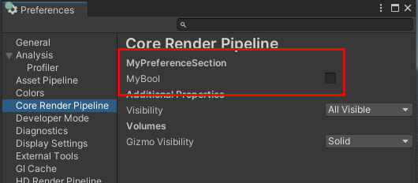

# Adding properties to the Core Render Pipeline settings section

To add properties in the **Core Render Pipeline** settings section (**Edit > Preferences > Core Render Pipeline**), create a class that implements the interface `ICoreRenderPipelinePreferencesProvider`.

For example:

```
    class MyPreference : ICoreRenderPipelinePreferencesProvider
    {
        class Styles
        {
            public static readonly GUIContent myBoolLabel = EditorGUIUtility.TrTextContent("My check box", "The description of the property.");
        }

        public List<string> keywords => new List<string>() {Styles.myBoolLabel.text};
        public GUIContent header => EditorGUIUtility.TrTextContent("My property section", "The description of my property section.");

        public static bool s_MyBoolPreference;
        public void PreferenceGUI()
        {
            EditorGUI.BeginChangeCheck();
            var newValue = EditorGUILayout.Toggle(Styles.myBoolLabel, s_MyBoolPreference);
            if (EditorGUI.EndChangeCheck())
            {
                s_MyBoolPreference = newValue;
            }
        }
    }
```

Unity shows the new properties in the **Core Render Pipeline** settings section:


