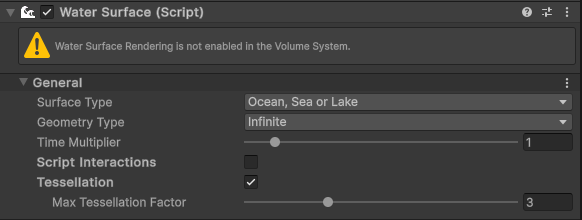
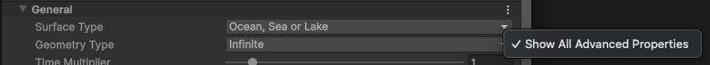
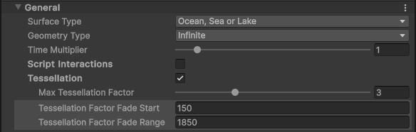
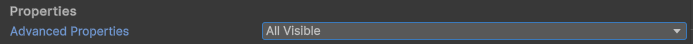

# Advanced Properties

Unity Render Pipelines components expose standard properties by default that are suitable for most use-cases.
However, there are components and Volume Overrides that include **advanced properties** which you can use to fine-tune the behavior of the component.

There is a global state per user that stores if Unity displays **advanced properties** or not. 

## Exposing advanced properties within the inspector

Not every component or Volume Override includes advanced properties.
If one does, it has a contextual menu to the right of each property section header that includes additional properties. To expose advanced properties for that section, open the contextual menu and click **Advanced Properties**.

For an example, see the **Water Surface** component in [High Definition Render Pipeline (HDRP)](https://docs.unity3d.com/Packages/com.unity.render-pipelines.high-definition@latest).

By default only standard properties are shown.

When you select **Advanced Properties**:

**Advanced Properties** become visible:

For Volume Overrides, the already existing contextual menu has a **Advanced Properties** toggle as well.

## Exposing advanced properties on preferences

You can also access to this global preference by:

1. Open the **Graphics** tab in the **Preferences** window (menu: **Edit > Preferences > Graphics**).
2. Under **Properties**. Set **Advanced Properties** to **All Visible**.

