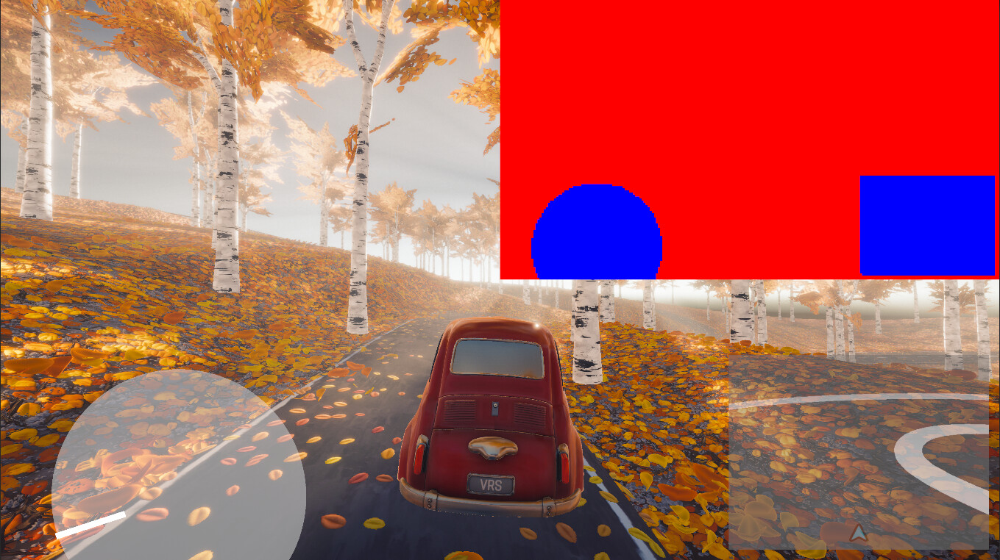

# What's new in SRP Core 17 / Unity 6

**Note:** Starting with 17.2 (Unity 6.2), refer to [What’s new in Unity](xref:um-whats-new) for the latest updates and improvements.

## What's new in SRP Core 17.1 / Unity 6.1
The following are the new features and improvements added to the SRP Core package 17.1, embedded Unity 6.1.

## Added
### Disable pass merging in the render graph system
Added a render graph debug setting that allows you to temporarily disable pass merging to isolate issues or investigate performance changes.

### New variable rate shading (VRS) API
You can use the new variable rate shading (VRS) API to control the shading rate of Scriptable Renderer Features, and balance between GPU performance and image quality. This API is supported on DirectX 12, Vulkan, and compatible consoles.

VRS is also known as fragment shading rate, and is a technique which allows you to decouple the rasterization and pixel shading rate. VRS can vary the shading rate across the screen space by using a shading rate image, which encodes the shading rates for different regions of the screen at different rates. When setting a lower shading rate, the pixel shader will execute at a lower frequency, which can drastically improve GPU performance.

For more information about VRS, refer to the [Optimize Renderer Features with Variable Rate Shading in Unity 6.1](https://discussions.unity.com/t/optimize-renderer-features-with-variable-rate-shading-in-unity-6-1/1605893/1) Unity Discussions page.

## What's new in SRP Core version 17.0 / Unity 6.0

The following is an overview of new features, improvements, and issues resolved in version 17 of the Scriptable Render Pipeline (SRP) Core package, embedded in Unity 6.

## Improvements

### Render graph system optimization

The render graph system API and compiler are now carefully optimized to reduce their cost on the main CPU thread. To prevent Unity compiling the render graph each frame, there's now a caching system so Unity only compiles when the rendering is different from the previous frame. This means performance on the main CPU thread should be faster, especially in non-development builds.

### Native Render Pass support in the render graph system

The render graph system API now provides automatic Native Render Pass support using the `AddRasterRenderPass` API. This means Unity can use framebuffer fetch operations on platforms with tile-based GPUs, which improves performance. 

Native Render Pass support is implemented in the Universal Render Pipeline (URP). For more information, refer to [Render graph system](https://docs.unity3d.com/Packages/com.unity.render-pipelines.universal@17.0/manual/render-graph.html) in the URP manual.

**Note:** You can't use the `AddRasterRenderPass` API with the existing `AddRenderPass` API. Instead, use the new `AddComputePass` and `AddUnsafePass` APIs.
