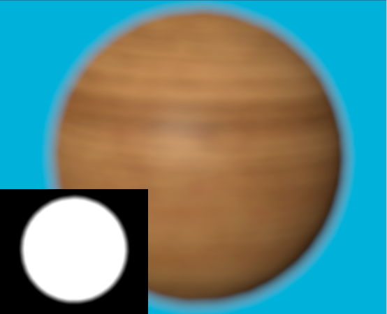
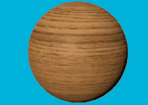
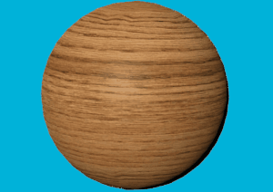

# Alpha channel configuration

To maximize performance and minimize bandwidth usage, HDRP by default renders image frames in the **R11G11B10** format. However, this format doesn't include an alpha channel, which might be required for applications that want to composite HDRP's output over other images.

To configure HDRP to output an alpha channel:

1. Open your [HDRP Asset](HDRP-Asset.md) in the Inspector window.
2. Go to **Rendering** > **Color Buffer Format**.
3. Select **R16G16B16A16**.

**Note**: Enabling this option incurs a performance overhead.

In HDRP, opaque materials always output 1 in the alpha channel, unless you enable [Alpha Clipping](Alpha-Clipping.md). If you want to export the alpha of an opaque material, one solution is to enable **Alpha Clipping** and set the Threshold to 0.

Furthermore, when you enable post-processing, also set the Buffer Format for post-processing operations to **R16G16B16A16** to apply post-processing operation in the alpha channel. You can select this from the **Post-Processing** section of the HDRP asset. If you set the post-processing format to **R11G11B10**, HDRP outputs a copy of the alpha channel without any post-processing on it.

The following table summarizes the behavior of HDRP regarding the alpha channel of the output frames.

Rendering Buffer Format | Post-processing Buffer Format | Alpha Output
---|---|---
**R11G11B10** | **R11G11B10** | No alpha output
**R16G16B16A16** | **R11G11B10** | Alpha channel without post-processing (AlphaCopy)
**R16G16B16A16** | **R16G16B16A16** | Alpha channel with post-processing

**Note**: Alpha output is also supported in [Path Tracing](Ray-Tracing-Path-Tracing.md).

## DoF and Alpha Output
Another case which might require post-processing of the alpha channel is for scenes that use Depth Of Field. In this case, if the alpha isn't processed, compositing results in a sharp cut-off of an object that appears blurred. This is better illustrated in the images below:

An out-of-focus sphere composited over a solid blue background using a R16G16B16A16 buffer format for both rendering and post-processing. In this case, DoF is applied in the alpha channel, resulting in a proper composition (the output alpha used in the composition is shown in the image inset).

An out-of-focus sphere composited over a solid blue background using AlphaCopy. In this case, DoF isn't applied in the alpha channel, resulting in a sharp outline around the composited sphere (the output alpha used in the composition is shown in the image inset).

## Temporal Anti-Aliasing and Alpha Output
When you enable Temporal Anti-Aliasing (TAA), it's highly recommended to enable post-processing for the alpha channel (R16G16B16A16 format for both rendering and post-processing). If the alpha channel isn't post-processed, then the alpha mask is jittered, as shown in the images below:

A sphere rendered with TAA using AlphaCopy, composited over a solid blue background using the alpha channel. The alpha channel isn't temporally stabilized by TAA, resulting in jittering on the final image.

A sphere rendered with TAA (R16G16B16A16 for both rendering and post-processing), composited over a solid blue background using the alpha channel. TAA is also applied in the alpha channel, resulting in a stable composition.
