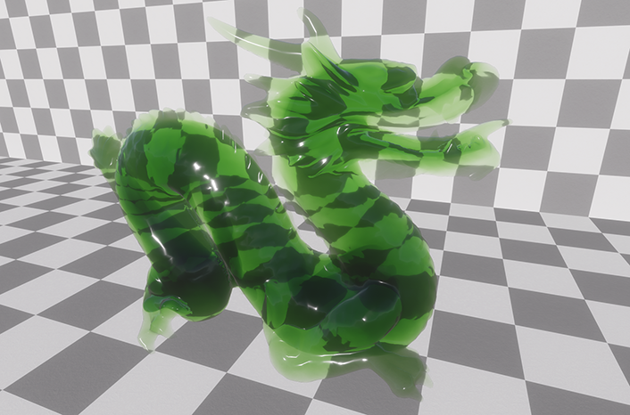
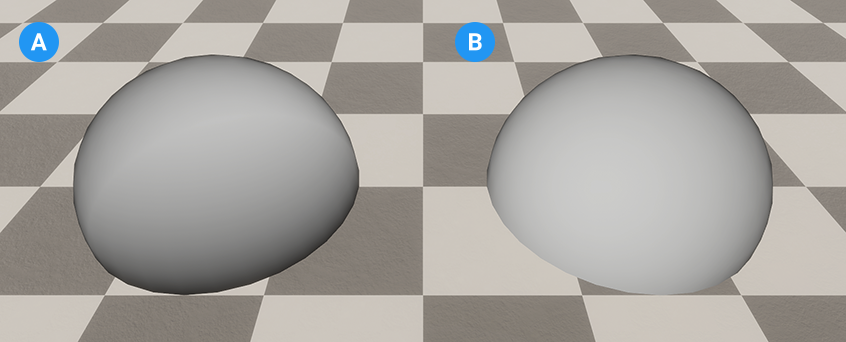
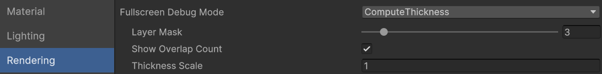

# Compute Thickness

HDRP can use the optical path to make transparent or opaque materials appear more dense in larger internal areas of a mesh. This is called compute thickness.

Compute thickness is ideal for transparent materials that use [subsurface scattering](skin-and-diffusive-surfaces-subsurface-scattering.md) or [refraction](Override-Screen-Space-Refraction.md). You can also use it on flat geometry like grass and leaves.

To use compute thickness, perform the following actions: 

1. [Enable compute thickness in your scene](#computethickness-enable).
2. [Create a shader graph that samples the thickness of a material](#computethickness-shader-graph) 
3. [Set up a compute thickness layer](#computethickness-layers).

## Enable compute thickness

To enable compute thickness in your project, set up the following properties: 

1. Open the Project Settings (**Edit** > **Project Settings**).
2. In **Quality** > **HDRP**, open the **Rendering** section.
3. Enable the **Compute Thickness** toggle.
4. In **Graphics** > **Pipeline Specific Settings** > **HDRP** > **Frame Settings**.
5. In the **Camera** section, select the **Rendering** heading. 
6. Enable the **Compute Thickness** toggle.

## Sample the thickness of a material in shader graph

To create a material that uses compute thickness, use the [HD Sample Buffer node](https://docs.unity3d.com/Packages/com.unity.shadergraph@latest?subfolder=/manual/HD-Sample-Buffer-Node.html):

1. In a Shader graph window, create a **HD Sample Buffer** node.
2. Open the **Source Buffer** dropdown and select **Thickness**.
3. Select one of the following outputs to set the type of thickness HDRP samples:
	* **Thickness**: This option samples the Worldspace value in meters, between the near and the far plane of the camera. Use this output for GameObjects with closed geometry.
	* **Overlap Count**: This is useful for vegetation or flat surfaces. Multiply this output with other nodes to control how thick this material appears.
5. In the **Layer Mask** field, enter the number of the [compute thickness layer](#computethickness-layers).

To test how the HD Sample Buffer node works on its own, connect the **Thickness** output to the **Base Color** Fragment node.

## Set up a compute thickness layer

Compute thickness requires [layers](https://docs.unity3d.com/Manual/Layers.html) to do the following: 

- [Determine which GameObjects to calculate the thickness of.](#computethickness-layers-assign)
- [Create a compute thickness layer mask](#computethickness-layer-mask) to use in the HD Sample Buffer node, the Project Settings window, and the HDRP Asset.

Use layers to manage and optimize compute thickness in your scene. For example, you can use one layer for vegetation objects and another layer for refractive objects.

**Important:** Assign GameObjects with closed (solid) geometry to a different layer from GameObjects with open or flat geometry. If you assign them both to the same layer, it can create black artifacts.

### Assign GameObjects to a compute thickness layer

To set up a compute thickness layer, perform the following actions: 

1. [Create a new layer](https://docs.unity3d.com/Manual/create-layers.html) and name it Compute Thickness.
2. Select a GameObject you want to apply compute thickness to.
3. In the Inspector window, open the **Layer** dropdown and select the Compute Thickness layer. 

**Note**: The **Layer** drop-down lists each layer by its layer number. Use the layer number to assign this layer as a layer mask in the [HD Sample Buffer node](https://docs.unity3d.com/Packages/com.unity.shadergraph@latest?subfolder=/manual/HD-Sample-Buffer-Node.html).

### Create and apply a compute thickness layer mask

To create a layer mask to apply compute thickness to, assign the compute thickness layer to the following properties: 

* In the [Compute Thickness shader graph](#computethickness-shader-graph): 
   1. Go to the HD Sample Buffer node. 
   2. In the Layer Mask input, enter the layer number of the compute thickness layer.
* In the Project Settings window:
   1. Go to **Quality** > **HDRP**
   2. Select the **Compute thickness** tab.
   3. Open the **Layer Mask** dropdown and select the custom layer you want to compute the thickness of. 
   4. Go to **Graphics** > **Pipeline Specific Settings** > **HDRP**
   5. Open the **Rendering** tab.
   6. Enable the **Compute thickness** toggle.
* In the HDRP Asset:
   1. Open the **Rendering tab**. 
   2. Select the **Compute thickness** tab.
   3. Open the **Layer Mask** dropdown and select the custom layer you want to compute the thickness of.

HDRP creates a texture that contains the thickness of all the GameObjects in each compute thickness layer. You can sample this texture in the [HD Sample Buffer node](https://docs.unity3d.com/Packages/com.unity.shadergraph@latest?subfolder=/manual/HD-Sample-Buffer-Node.html) in Shader Graph.

**Note**: If you create more than one layer that uses compute thickness, the thickness of these layers doesn’t affect each other.

## Set up compute thickness for opaque and transparent materials

HDRP calculates compute thickness for opaque materials before transparent materials. This means opaque materials affect the thickness of transparent materials, but opaque materials do not affect each other’s thickness. 

 
A: A sphere with a transparent compute thickness material intersecting an opaque plane.
B: A sphere with an opaque compute thickness material intersecting an opaque plane.

To use compute thickness on opaque and transparent materials in a scene, add GameObjects with an opaque compute thickness material to a different layer from GameObjects that use a transparent compute thickness material. This stops the materials from clipping in front and behind each other.

## Optimize a compute thickness material

HDRP calculates thickness for the full screen which can have a high impact on memory usage. To reduce the amount of memory compute thickness uses, change the following properties: 

- [Lower the compute thickness resolution.](#computethickness-resolution)
- [Reduce the number of layers HDRP calculates compute thickness on.](#computethickness-optimize-layers)

### Set the resolution of compute thickness 

To control the memory impact of compute thickness, reduce the target resolution of compute thickness in the [HDRP Asset](HDRP-Asset.md):

1. Open the **Rendering** section.
2. Expand the **Compute Thickness** section.
3. Open the **Resolution** dropdown. 
4. Select one of the following options:

- **Quarter**: Renders the thickness at quarter the current screen resolution.
- **Half**: Renders the thickness at half the current screen resolution. This resolution is the best balance of detail and performance.
- **Full**: Renders the thickness at the current full screen resolution.

### Set the number of compute thickness layers

The amount of memory compute thickness uses increases when you enable it on multiple layers. You can change the number of layers HDRP calculates the thickness for in the [HDRP Asset](HDRP-Asset.md):

1. Open the **Rendering** section.
2. Expand the **Compute Thickness** section.
3. Select the **Layer Mask** dropdown.
4. Select the layers to apply compute thickness to.

## Debug compute thickness

To visualize the compute thickness debug mode, perform the following actions: 

1. Open the Rendering Debugger window (menu: **Window** > **Analysis** > **Rendering Debugger)**.
2. Select the Rendering tab.
3. Open the Fullscreen Debug Mode dropdown and select **Compute Thickness**.

This view displays the thickness or overlap count of the objects in the layer you select in the **Layer Mask** property.

A: The default appearance of the compute thickness debug view.
B: The compute thickness debug view when you enable **Show Overlap Count**.

| **Debug view color**                                         | **Description**                                              |
| ------------------------------------------------------------ | ------------------------------------------------------------ |
| Vidris color scale | A gradient scale that represents thickness. Purple represents the minimum thickness and yellow represents the maximum thickness. When you enable **Show Overlap Count,** yellow areas indicate a high number of overlapping triangles. |
| Red             | Negative thickness caused by an open mesh, flipped triangles, or an odd number of triangles in the optical path. |
| Gray           | The default background color.  Gray areas inside a mesh indicate pixels that are in a similar position (z-fight) or have no thickness. |
| Orange       | Compute Thickness is not active in HDRP graphics settings. To fix this, [enable compute thickness](#computethickness-enable). |
| Pink           | This layer is not assigned to the HDRP Asset’s Layer Mask property. To fix this, [enable compute thickness](#computethickness-enable). |

## Limitations

Compute thickness does not support the following: 
- Tessellation.
- [Alpha Clipping](Alpha-Clipping.md).
- Transparent and opaque GameObjects in the same layer.
- GameObjects that have closed and open geometry in the same layer.
