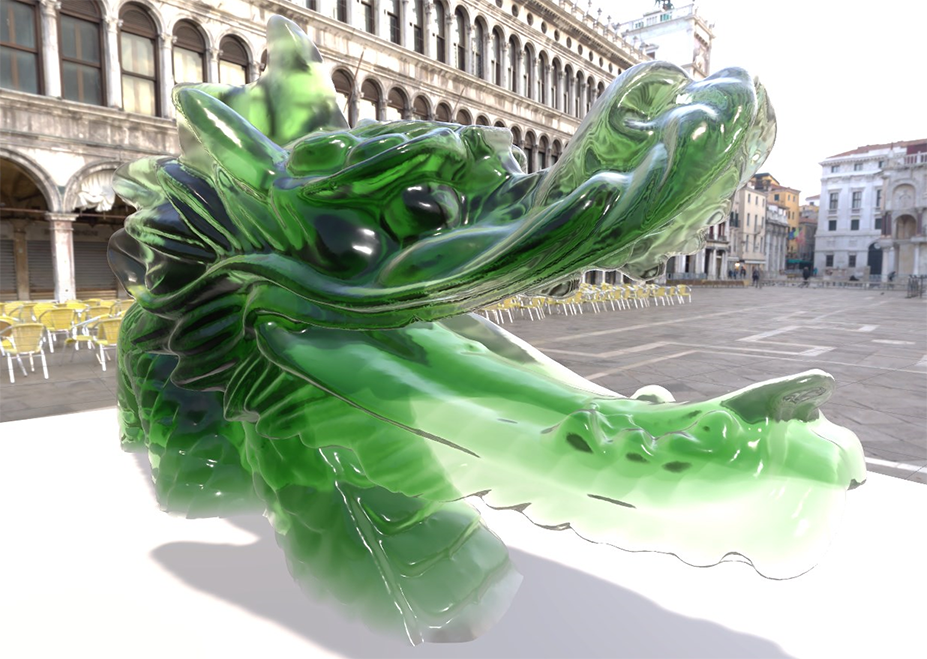
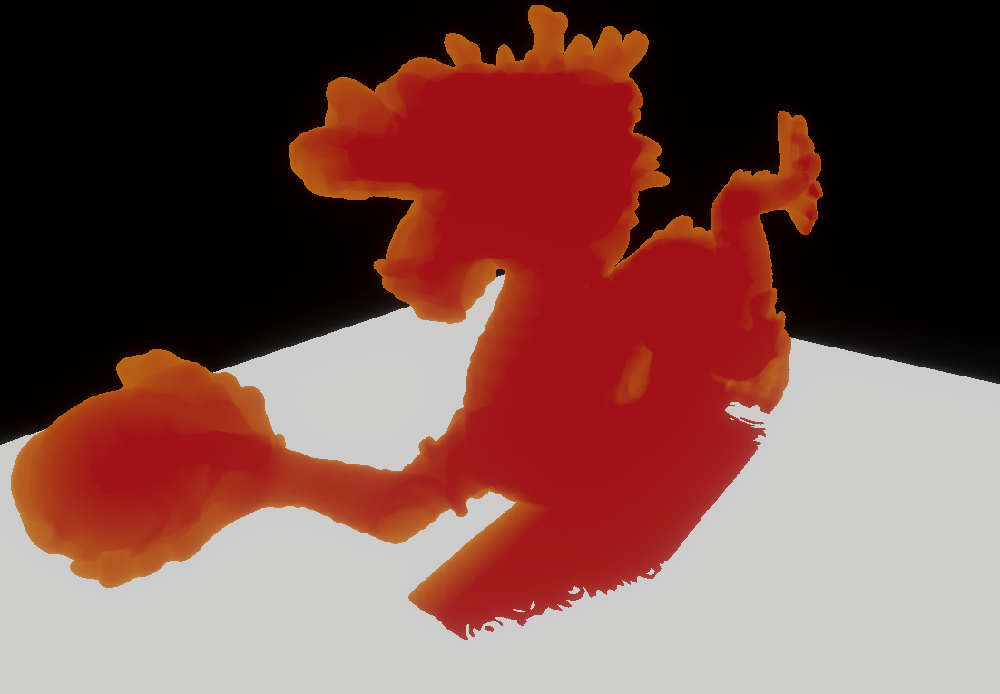
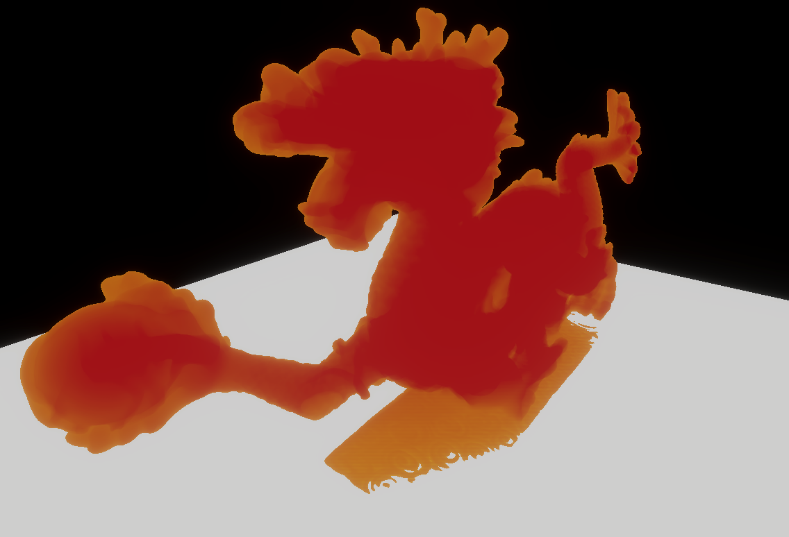
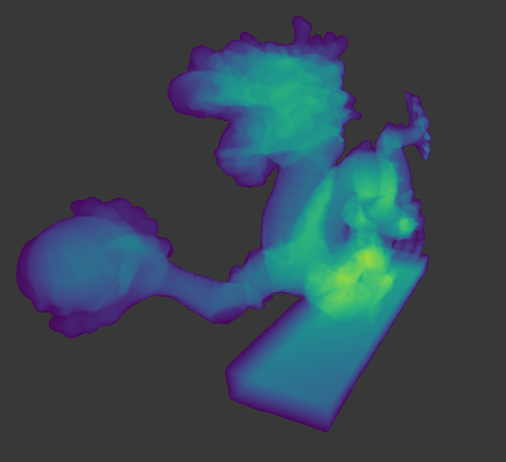
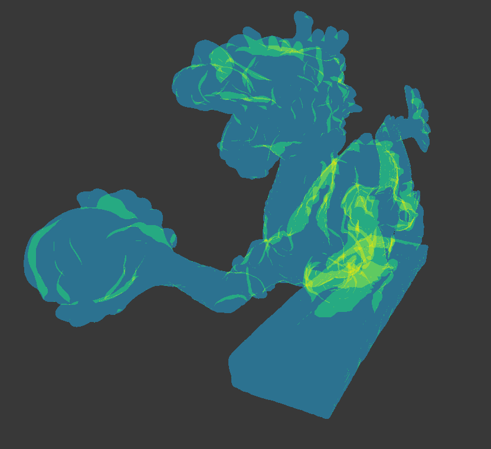

# Compute Thickness

HDRP provides a screen-space pass to compute the accumulated thickness for objects (opaque or transparent) in a given LayerMask. HDRP computes the optical path and overlap count, which can be useful for [Subsurface Scattering](Subsurface-Scattering.md) or [Refraction](Override-Screen-Space-Refraction.md). The overlap count can be used for non-closed or flat geometry like vegetation. This thickness can be sampled in a ShaderGraph via the HD Sampler Buffer node using the LayerMask as an input.

### Enable Compute Thickness

1. Open the Project Settings.
2. In **Quality** > **HDRP**, open the **Rendering** section and enable **Compute Thickness**.
3. In **Graphics** > **HDRP Global Settings** > **Frame Settings**, open the **Rendering** section and enable Compute Thickness.

### Compute Thickness Parameters

As the thickness is computed fullscreen it has an impact on the memory footprint, HDRP allows you to choose the resolution at which it is computed.

In **Quality** > **HDRP**, open the **Rendering**, then under **Compute Thickness** you can choose **Resolution**:

* Quarter: Quarter resolution of the current resolution
* Half: Half resolution of the current resolution
* Full: Current full screen resolution

To compute an object thickness, at least one Layer Mask needs to be selected on the HDRP Asset:

In **Quality** > **HDRP**, open the **Rendering**, then under **Compute Thickness** you can select one or more **LayerMask**.

For each selected layer, a texture is created containingthe thickness of all the objects flagged with this Layer Mask.
For example, you could use one layer for vegetation objects and another layer for refractive objects.

On the HD Sample Buffer node, HDRP provides 2 outputs:
* Thickness: Worldspace value in meters, between the near and the far plane of the camera.
    * To work properly, the object needs to be closed in the optical path, which means there need to be the same number of front and back faces for a given pixel.
* Overlap: Count the number of triangles for a given pixel. This is useful for vegetation or flat surfaces. This number can then be multiplied in a ShaderGraph by the thickness of a leaf for exemple.

### Compute Thickness Limitations

* Do not support [Tesselation](Tessellation.md)
* Do not support [Alpha Clipping](Alpha-Clipping.md)
* Mixing open and closed mesh on the same layer can cause negatives values. For better results, use separate layers. 
* Mixing transparent and opaque objects can creates issues:

The Compute Thickness for opaque and transparent objects is not calculted at the same time: 

For transparent objects, the thickness computed depends on the already present opaque objects in the scene. 
For opaque objects, the thickness computed does **not** depend on the already present transparent objects in the scene.  

In the images below, the thickness of the stand on the object is thiner when transparent due to the interaction with the opaque white plane.

|            Opaque           |          Transparent          |
|:----------------------------:|:----------------------------:|
|  |  |

Opaque objects are rendered before transparent objects. When both opaque and transparent objects are in the same LayerMask, opaque objects cannot be accumulated by transparent objects, but transparent objects will accumulate with already present opaque objects.

### Compute Thickness Debug Mode

To open the debug mode, select **Window** > **Analysis** > **Rendering Debugger** > **Rendering** > **Fullscreen Debug Mode** > **Compute Thickness**

From there, you can use different parameters:
|||
|:----------------------------:|:----------------------------:|
| **Layer Mask** | Specifies which layer is currently being viewed in the debug view. |
| **Show Overlap Count** | When enabled, HDRP shows only the number of triangles for a given pixel. |
| **Thickness Scale** | Controls the scale the thickness (or Overlap Count). |

|           Thickness          |         Overlap Count        |
|:----------------------------:|:----------------------------:|
|  |  |

The Compute Thickness debug mode uses the Viridis color scale.
Debug View Color Scale:
* 🟠 Orange: Compute Thickness Feature not enabled
* 🟣 Purple: Layer not used
* 🔴 Red: Negative thickness, due to open meshes, flipped triangles or odd number of triangle of optical path.
* ⚫ Grey: Thickness equal 0, Background, Z-Fight or no thickness computed for this pixel