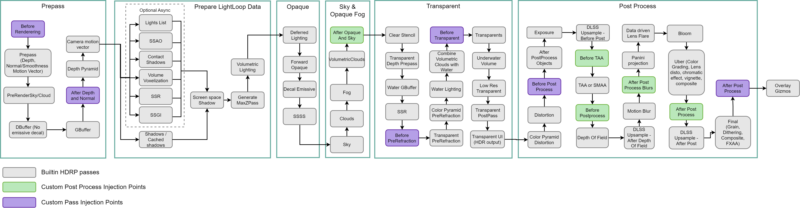

# Custom Post Process

The High Definition Render Pipeline (HDRP) allows you to write your own post-processing effects that automatically integrate into [Volumes](Volumes.md). A custom effect needs two files:
* A **C# Custom Post Process**(C# file)
* An associated **FullScreen Shader** (HLSL file).

You can generate a template of each file:

* **C# Custom Post Process**: Right click in the Assets folder and select **Create** > **Rendering** > **HDRP C# Post Process Volume**.

* **FullScreen Shader**: Right click in the Assets folder and select **Create** > **Shader** > **HDRP** > **Post Process**.

**Note**: By default, your custom effect doesn't run if you just add it to a Volume. You also need to add the effect to your Project's list of supported effects. (it's the same list used to order the effect, see the Effect Ordering section).

## Example

This example shows you how to create a **grayscale** effect. To get started:

1. Create a **C# Custom Post Process** file (right click in the Assets folder: **Create** > **Rendering** > **HDRP C# Post Process Volume**) and call it **GrayScale**.

**Note**: Because of how serialization works in Unity, the file name and the class name must be identical or Unity doesn't serialize it properly.

2. Copy the example code from the [GrayScale C# script section](#CSharp) into your **C# Post Process Volume**.

3. Create a full screen post-process Shader (right click in the Assets folder: **Create** > **Shader** > **HDRP** > **Post Process**) and call it **GrayScale**.

4. Copy the example code from the [GrayScale Shader section](#Shader) into your post-process Shader.

5. Add the **GrayScale** effect to the list of custom post-processes that your Project executes. To do this, go to **Edit** > **Project Settings** > **HDRP Default Settings** and, at the bottom of the **After Post Process** list, click on the **+**  and select **GrayScale**.

6. Now you can add the **GrayScale** post-process override to **Volumes** in the Scene. To change the effect settings, click the small **all** text just below the foldout arrow and adjust with the **Intensity** slider.

7. Optionally, you can create a custom editor for your post-processing effect. For information on how to do this, see [custom editor](#CustomEditor).

<a name="CSharp"></a>

### GrayScale C# script

This is the C# Custom Post Process file. Custom post-process effects store both configuration data and logic in the same class. To create the settings for the effect, you can either use a pre-existing class that inherits from [VolumeParameter<T>](https://docs.unity3d.com/Packages/com.unity.render-pipelines.core@latest/index.html?subfolder=/api/UnityEngine.Rendering.VolumeParameter-1.html), or, if you want to use a property that the pre-existing classes don't include, create a new class that inherits from VolumeParameter<T>.

```C#
using UnityEngine;
using UnityEngine.Rendering;
using UnityEngine.Rendering.HighDefinition;
using System;

[Serializable, VolumeComponentMenu("Post-processing/Custom/GrayScale")]
public sealed class GrayScale : CustomPostProcessVolumeComponent, IPostProcessComponent
{
    [Tooltip("Controls the intensity of the effect.")]
    public ClampedFloatParameter intensity = new ClampedFloatParameter(0f, 0f, 1f);

    Material m_Material;

    public bool IsActive() => m_Material != null && intensity.value > 0f;

    public override CustomPostProcessInjectionPoint injectionPoint => CustomPostProcessInjectionPoint.AfterPostProcess;

    public override void Setup()
    {
        if (Shader.Find("Hidden/Shader/GrayScale") != null)
            m_Material = new Material(Shader.Find("Hidden/Shader/GrayScale"));
    }

    public override void Render(CommandBuffer cmd, HDCamera camera, RTHandle source, RTHandle destination)
    {
        if (m_Material == null)
            return;

        m_Material.SetFloat("_Intensity", intensity.value);
        cmd.Blit(source, destination, m_Material, 0);
    }

    public override void Cleanup() => CoreUtils.Destroy(m_Material);

}
```
This example code uses a `ClampedFloatParameter` that you can clamp to a range. In the constructor:

* The first parameter is the default value of the property.

* The second parameter represents the minimum value to clamp the property to.

* The third parameter represents the maximum value to clamp the property to.

HDRP calls the `IsActive()` function before the `Render` function to process the effect. If this function returns `false`, HDRP doesn't process the effect. It's good practice to check every property configuration where the effect either breaks or doesn'thing. In this example, `IsActive()` makes sure that HDRP can find the `GrayScale.shader` and that the intensity is greater than 0.

The **injectionPoint** override allows you to specify where in the pipeline HDRP executes the effect. There are currently five injection points:

* **AfterOpaqueAndSky**

* **BeforeTAA**

* **BeforePostProcess**

* **AfterPostProcessBlurs.**

* **AfterPostProcess.**

The following diagram gives more information on where HDRP injects custom post-process passes:



**Note**: When you enable [Temporal anti-aliasing (TAA)](Anti-Aliasing.md#TAA), HDRP applies TAA between the injection points **BeforeTAA** and **beforePostProcess**. When you use [Depth Of Field](Post-Processing-Depth-of-Field.md) and enable its **Physically Based** property, HDRP performs a second TAA pass to perform temporal accumulation for this effect.

The `Setup`, `Render`, and `Cleanup` functions allocate, use, and release the resources that the effect needs. The only resource that the above script example uses is a single Material. This example creates the Material in `Setup` and, in `Cleanup`, uses `CoreUtils.Destroy()` to release the Material.

In the `Render` function, you have access to a [CommandBuffer](https://docs.unity3d.com/2019.3/Documentation/ScriptReference/Rendering.CommandBuffer.html) which you can use to enqueue tasks for HDRP to execute. You can use [CommandBuffer.Blit](https://docs.unity3d.com/ScriptReference/Rendering.CommandBuffer.Blit.html) here to render a fullscreen quad. When you use the `Blit` function, Unity binds the source buffer in parameter to the `_MainTex` property in the shader. For this to happen, you need to declare the `_MainTex` property in the [Properties](https://docs.unity3d.com/Manual/SL-Properties.html) section of the shader.

**Note**: You can also use the [HDUtils.DrawFullscreen](https://docs.unity3d.com/Packages/com.unity.render-pipelines.high-definition@latest?subfolder=/api/UnityEngine.Rendering.HighDefinition.HDUtils.html#UnityEngine_Rendering_HighDefinition_HDUtils_DrawFullScreen_UnityEngine_Rendering_CommandBuffer_UnityEngine_Material_UnityEngine_Rendering_RTHandle_UnityEngine_MaterialPropertyBlock_System_Int32_) method. To do this, you need to multiply the `input.texcoord` by the `_RTHandleScale.xy` property to account for dynamic scaling.

<a name="Shader"></a>

### GrayScale Shader

HDRP gives you total control over the vertex and fragment Shader so you can edit both of them to suit your needs.

There are several utility functions in [Common.hlsl](https://github.com/Unity-Technologies/Graphics/blob/master/com.unity.render-pipelines.core/ShaderLibrary/Common.hlsl) and [Color.hlsl](https://github.com/Unity-Technologies/Graphics/blob/master/com.unity.render-pipelines.core/ShaderLibrary/Color.hlsl) that the Shader includes by default. This means that you have access to these utility functions in your effect. For example, the GrayScale Shader uses the `Luminance()` function to convert a linear RGB value to its luminance equivalent.

```glsl
Shader "Hidden/Shader/GrayScale"
{
    Properties
    {
        // This property is necessary to make the CommandBuffer.Blit bind the source texture to _MainTex
        _MainTex("Main Texture", 2DArray) = "grey" {}
    }

    HLSLINCLUDE

    #pragma target 4.5
    #pragma only_renderers d3d11 playstation xboxone xboxseries vulkan metal switch

    #include "Packages/com.unity.render-pipelines.core/ShaderLibrary/Common.hlsl"
    #include "Packages/com.unity.render-pipelines.core/ShaderLibrary/Color.hlsl"
    #include "Packages/com.unity.render-pipelines.high-definition/Runtime/ShaderLibrary/ShaderVariables.hlsl"
    #include "Packages/com.unity.render-pipelines.high-definition/Runtime/PostProcessing/Shaders/FXAA.hlsl"
    #include "Packages/com.unity.render-pipelines.high-definition/Runtime/PostProcessing/Shaders/RTUpscale.hlsl"

    struct Attributes
    {
        uint vertexID : SV_VertexID;
        UNITY_VERTEX_INPUT_INSTANCE_ID
    };

    struct Varyings
    {
        float4 positionCS : SV_POSITION;
        float2 texcoord   : TEXCOORD0;
        UNITY_VERTEX_OUTPUT_STEREO

    };

    Varyings Vert(Attributes input)
    {
        Varyings output;

        UNITY_SETUP_INSTANCE_ID(input);
        UNITY_INITIALIZE_VERTEX_OUTPUT_STEREO(output);

        output.positionCS = GetFullScreenTriangleVertexPosition(input.vertexID);
        output.texcoord = GetFullScreenTriangleTexCoord(input.vertexID);

        return output;
    }

    // List of properties to control your post process effect
    float _Intensity;
    TEXTURE2D_X(_MainTex);

    float4 CustomPostProcess(Varyings input) : SV_Target
    {
        UNITY_SETUP_STEREO_EYE_INDEX_POST_VERTEX(input);

        float3 sourceColor = SAMPLE_TEXTURE2D_X(_MainTex, s_linear_clamp_sampler, input.texcoord).xyz;

        // Apply greyscale effect
        float3 color = lerp(sourceColor, Luminance(sourceColor), _Intensity);

        return float4(color, 1);
    }

    ENDHLSL

    SubShader
    {
        Pass
        {
            Name "GrayScale"

            ZWrite Off
            ZTest Always
            Blend Off
            Cull Off

            HLSLPROGRAM
                #pragma fragment CustomPostProcess
                #pragma vertex Vert
            ENDHLSL
        }
    }

    Fallback Off
}
```

If none of your Scenes reference the Shader, Unity doesn't build the Shader and the effect doesn't work when you run your application outside of the Editor. To resolve this, do one of the following:

* Add the Shader to a [Resources folder](https://docs.unity3d.com/Manual/LoadingResourcesatRuntime.html)
* Go to **Edit** > **Project Settings** > **Graphics** and add the Shader to the **Always Included Shaders** list.

**Note**: When HDRP executes your post-process effect, it uses a render target pooling system. It means that you don't know what the current color buffer contains, which is why you should never use any instructions that could display this color buffer. don't use transparency, blend modes, or the **clip()** instruction in your Shader, otherwise your effect breaks.

#### Shader inputs

By default, the Shader template provides you with the following inputs:

| Input| description |
|:---|:---|
| positionCS| The clip space position of the pixel. This value is between 0 and the current screen size. |
| texcoord| The full screen UV coordinate. This value is between 0 and 1. |
| _InputTexture| The source Texture. The GrayScale C# script passes this to the Shader. |
| _Intensity| The intensity of the effect. The GrayScale C# script passes this to the Shader. |


<a name="EffectOrdering"></a>

## Effect ordering

HDRP allows you to customize the order of your custom post-processing effect at each injection point. To order your effects:

1. Go to **Edit** > **Project Settings** > **Graphics** and select the [HDRP Global Settings](Default-Settings-Window.md) tab.

2. Scroll down until you find the **Custom Post Process Orders** section. This section contains three lists, one for each injection point.

3. Add your custom effects to these lists so that HDRP can render them.


HDRP processes effects from the top of the list to the bottom and the order of execution for each list is:

1. After Opaque And Sky.

2. Before TAA.

3. Before Post Process.

4. After Post Process Blurs.

5. After Post Process.

<a name="CustomEditor"></a>

## Custom editor

By default, Unity automatically creates an editor for classes but, if you want more control over how Unity displays certain properties, you can create a custom editor. If you do create a custom editor script, make sure to put it in a folder named **Editor**.

The following is an example of a custom editor for the GrayScale effect:

```C#
using UnityEditor.Rendering;

using UnityEngine;

using UnityEngine.Rendering.HighDefinition;

using UnityEditor;

[VolumeComponentEditor(typeof(GrayScale))]

sealed class GrayScaleEditor : VolumeComponentEditor

{

    SerializedDataParameter m_Intensity;

    public override bool hasAdvancedMode => false;

    public override void OnEnable()

    {

        base.OnEnable();

        var o = new PropertyFetcher<GrayScale>(serializedObject);

        m_Intensity = Unpack(o.Find(x => x.intensity));

    }

    public override void OnInspectorGUI()

    {

        PropertyField(m_Intensity);

    }

}
```

This custom editor isn't useful as it produces the same result as the editor that Unity creates. Custom Volume component editors also support an [additonal properties toggle](More-Options.md). To add it, you have to set the `hasAdvancedMode` override to true. Then, inside `OnInspectorGUI`, you can use the `isInAdvancedMode` Boolean to display more properties.

## Dynamic resolution and DLSS support

If you want to use DLSS or dynamic resolution on your pass, and you need to interpolate or sample UVs from color, normal, or velocity, you must use the following functions to calculate the correct UVs:

```glsl
#include "Packages/com.unity.render-pipelines.high-dynamic/Runtime/ShaderLibrary/ShaderVariables.hlsl"

//...

float2 UVs = ... //the uvs coming from the interpolator
float2 correctUvs = ClampAndScaleUVForBilinearPostProcessTexture(UV); // use these uvs to sample color / normal and velocity

```

## Troubleshooting

If your effect doesn't display correctly:

* In your Project Settings, make sure this effect is listed under one of the post process order lists (see [Effect Ordering](#EffectOrdering)).

* Check that your effect's Shader compiles and that the reference to the Material in your post process Volume isn't null.

* In the Volume that contains your post process, make sure that it has a high enough priority and that your Camera is inside its bounds.

* Check that your shader doesn't contain any **clip()** instructions, that the blend mode is set to Off and the output alpha is always 1.

* If your effect doesn't work with dynamic resolution, use the _PostProcessScreenSize constant to make it fit the size of the screen correctly. You only need to do this when you use dynamic resolution scaling (DRS), and you need normal / velocity and color.

## Known issues and limitations

* Renaming a custom post process class name and file will remove it from the list in HDRP Project Settings causing the effect not to be rendered anymore.
