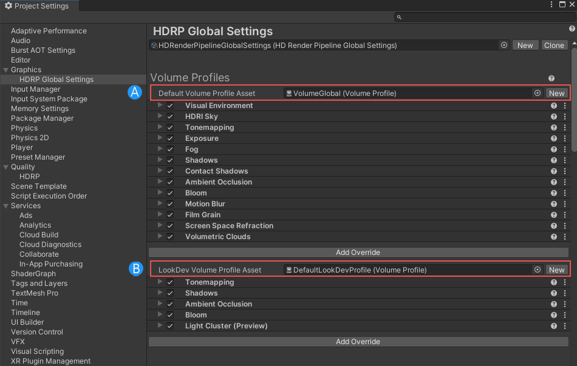
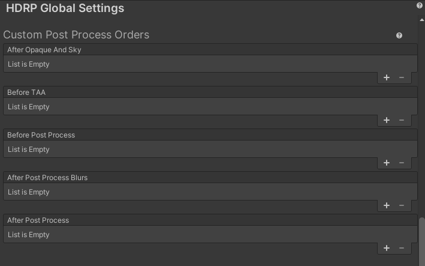

# HDRP Global Settings Window

The High Definition Render Pipeline (HDRP) adds the HDRP Settings tab to Unity's Graphics Settings window. Use this tab to set up default settings for certain features in your Project. You can:

- Assign Render Pipeline Resources Assets for your HDRP Project.
- Set the verboseness of Shader variant information that Unity writes to the Console window when you build your Project.
- Set up default [Frame Setting](Frame-Settings.md) values for [Cameras](HDRP-Camera.md) to use.
- Assign and edit a default [Volume Profile](Volume-Profile.md).

The HDRP Settings tab is part of the Graphics Settings window. To get to this tab, select **Edit > Project Settings > Graphics** and then, in the sidebar, click **HDRP Global Settings**.

##  Volume Profiles

You can use the **Volume Profiles** section to assign and edit a [Volume Profile](Volume-Profile.md) that [Volumes](Volumes.md) use by default in your Scenes. You do not need to create a Volume for this specific Volume Profile to be active, because HDRP always processes it as if it's assigned to a global Volume in the Scene, but with the lowest priority. This means that any Volume that you add to a Scene takes priority.

The **Default Volume Profile Asset** (A) references a Volume Profile in the HDRP package folder called `DefaultSettingsVolumeProfile` by default. Below it, you can add [Volume overrides](Volume-Components.md), and edit their properties. You can assign your own Volume Profile to this property field. Be aware that this property must always reference a Volume Profile. If you assign your own Volume Profile and then delete it, HDRP automatically re-assigns the `DefaultSettingsVolumeProfile` from the HDRP package folder.

The **LookDev Volume Profile Asset** (B) references the Volume Profile HDRP uses in the [LookDev window](Look-Dev.md). This Asset works in almost the same way as the Default Volume Profile Asset, except that it overrides [Visual Environment Components](Override-Visual-Environment.md) and sky components.

## Diffusion Profile Assets

Use this section to select which custom [Diffusion Profiles](Diffusion-Profile.md) can be in view at the same time. To use more than 15 custom Diffusion Profiles in a Scene, use the [Diffusion Profile Override](Override-Diffusion-Profile.md) inside a Volume. This allows you to specify which Diffusion Profiles to use in a certain area (or in the Scene if the Volume is global).

The following image shows the Diffusion Profile Assets section set up for HDRP's default scene:

## Frame Settings (Default Values)

The [Frame Settings](Frame-Settings.md) control the rendering passes that Cameras perform at runtime.

Use this section to set default values for the Frame Settings that all Cameras use if you don't enable their Custom Frame Settings checkbox. For information about what each property does, see [Frame Settings](Frame-Settings.md).

## Layers Names

| **Property**              | **Description**                                              |
| --------------------------| ------------------------------------------------------------ |
| Light Layer Names                     | The name displayed on Lights and Meshes when using [Light Layers](Light-Layers.md). |
| Decal Layer Names                     | The name displayed on decals and Meshes when using [Decal Layers](Decal.md). |

## Custom Post Process Orders

Use this section to select which custom post processing effect HDRP uses in the project and at which stage in the render pipeline it executes them.

HDRP provides one list for each post processing injection point. See the [Custom Post Process](Custom-Post-Process.md) documentation for more details.

## Miscellaneous

| **Property**              | **Description**                                              |
| --------------------------| ------------------------------------------------------------ |
| Shader Variant Log Level              | Use the drop-down to select what information HDRP logs about Shader variants when you build your Unity Project.  &#8226; **Disabled**: HDRP doesn’t log any Shader variant information. &#8226; **Only HDRP Shaders**: Only log Shader variant information for HDRP Shaders. &#8226; **All Shaders**: Log Shader variant information for every Shader type. |
| Lens Attenuation Mode                 | Set the attenuation mode of the lens that HDRP uses to compute exposure.   &#8226;**Imperfect lens**: This mode loses some energy when HDRP converts from EV100 to the exposure multiplier.  &#8226;**Perfect lens**: This mode has no attenuation and doesn't lose any energy. |
| Dynamic Render Pass Culling           | When you enable this option, HDRP uses the RendererList API to skip drawing passes based on the type of GameObjects visible in the current frame objects. For example, if HDRP doesn't draw an object with distortion, it skips the Render Graph passes that draw the distortion effect and their dependencies, like the color pyramid generation. |
| Use DLSS Custom Project ID           | Controls whether to use a custom project ID for the NVIDIA Deep Learning Super Sampling module. If you enable this property, you can use **DLSS Custom Project ID** to specify a custom project ID. This property only appears if you enable the NVIDIA package (com.unity.modules.nvidia) in your Unity project. |
| DLSS Custom Project ID               | Controls whether to use a custom project ID for the NVIDIA Deep Learning Super Sampling (DLSS) module. If you enable this property, you can use **DLSS Custom Project ID** to specify a custom project ID. If you disable this property, Unity generates a unique project ID.  This property only appears if you enable the NVIDIA package (com.unity.modules.nvidia) in your Unity project. |
| Runtime Debug Shaders                 | When enabled, Unity includes shader variants that let you use the Rendering Debugger window to debug your build. When disabled, Unity excludes (strips) these variants. Enable this when you want to debug your shaders in the Rendering Debugger window, and disable it otherwise. |

## Resources

The Resources list includes the Shaders, Materials, Textures, and other Assets that HDRP uses.

| **Property**              | **Description**                                              |
| ------------------------- | ------------------------------------------------------------ |
| **Player Resources**      | Stores references to Shaders and Materials that HDRP uses. When you build your Unity Project, HDRP embeds all the resources that this Asset references.  Use this property to set up multiple render pipelines in a Unity Project. When you build the Project Unity only embeds Shaders and Materials relevant for that pipeline. This is the Scriptable Render Pipeline equivalent of Unity’s Resources folder mechanism. When you create a new HDRP Global Settings Asset, the `HDRenderPipelineRuntimeResources` from HDRP package is automatically referenced in it. |
| **Ray Tracing Resources** | Stores references to Shaders and Materials that HDRP uses for ray tracing. HDRP stores these resources in a separate Asset file from the main pipeline resources so that it can use less memory for applications that don't support ray tracing. When you create a new HDRP Global Settings Asset, the `HDRenderPipelineRayTracingResources` from HDRP package is automatically referenced in it if your project use ray tracing. |
| **Editor Resources**      | Stores reference resources for the Editor only. Unity doesn't include these when you build your Unity Project. When you create a new HDRP Global Settings Asset, the `HDRenderPipelineEditorResources` from HDRP package is automatically referenced in it. |
