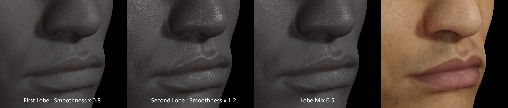

# Diffusion Profile

The High Definition Render Pipeline (HDRP) stores most [Subsurface Scattering](Subsurface-Scattering.md) settings in a __Diffusion Profile__ Asset. You can assign a __Diffusion Profile__ Asset directly to Materials that use Subsurface Scattering.

To create a Diffusion Profile, navigate to __Assets > Create > Rendering > HDRP Diffusion Profile__.
For HDRP to detect it, you must add it to the **Diffusion Profile List** of the [Diffusion Profile List Component](Override-Diffusion-Profile.md) in an active [Volume](Volumes.md).

## Properties

| Property| Description |
|:---|:---|
| **Name** | The name of the Diffusion Profile. |
| **Scattering Color** | Use the color picker to define the shape of the Diffusion Profile. It should be similar to the diffuse color of the material. This affects the Transmission color. |
| **Multiplier** | Acts as a multiplier on the scattering color to control how far light travels below the surface. Controls the effective radius of the filter. This affects the Transmission color. |
| **Max Radius** | The maximum radius of the effect you define in **Scattering Color** and **Multiplier**. The size of this value depends on the world scale. For example, when the world scale is 1, this value is in millimeters. When the world scale is 0.001, this value is in meters.  When the size of this radius is smaller than a pixel on the screen, HDRP doesn't apply Subsurface Scattering. |
| **Index of Refraction** | This value is controlled by the highest of the **Scattering Distance** RGB values. Use the slider to set the refractive behavior of the Material. Larger values increase the intensity of specular reflection. For example, the index of refraction of skin is about 1.4. For more example values for the index of refraction of different materials, see Pixel and Poly’s [list of indexes of refraction values](https://pixelandpoly.com/ior.html). |
| **World Scale** | Controls the scale of Unity’s world units for this Diffusion Profile. By default, HDRP assumes that 1 Unity unit is 1 meter. This property only affects the subsurface scattering pass. |

### Subsurface Scattering only

| Property| Description |
|:---|:---|
| **Texturing Mode** | Use the drop-down to select when HDRP applies the albedo of the Material. &#8226; **Post-Scatter**: HDRP applies the albedo to the Material after the subsurface scattering pass. This means that the contents of the albedo texture aren't blurred. Use this mode for scanned data and photographs that already contain some blur due to subsurface scattering.  &#8226; **Pre- and Post-Scatter**: Albedo is partially applied twice, before and after the subsurface scattering pass. Effectively, this blurs the albedo, resulting in a softer, more natural look. |
| **Dual Lobe Multipliers** | Use the sliders to set the smoothness multipliers for the two specular lobes of the Material. The base material smoothness will be multiplied by the values of each slider to calculate the smoothness for both lobes. |
| **Lobe Mix** | The amount of mixing between the primary and secondary specular lobes. |
| **Diffuse Shading Power** | Use the slider to control the exponent on the cosine component of the diffuse lobe. This is mainly used to simulate the diffuse lighting on non Lambertian surfaces that exhibit strong subsurface scattering. |

The following image displays the effect of each Texturing Mode option on a human face model:

When simulating skin, it is common to use two specular lobes to account for the thin oily layer covering the epidermis.\
For the Lit shader, both lobes cannot be evaluated for every source of light for performance reasons, so it is limited to direct lighting from directional, punctual and area lights. Other sources of light will use the regular Material smoothness.\
For the StackLit shader, the dual lobes are used everytime the specular BRDF needs to be evaluated. Set the __Dual Specular Lobe Parametrization__ to __From Diffusion Profile__ in your StackLit ShaderGraph surface options to control the lobe smoothnesses from the diffusion profile, otherwise they will be controlled by parameters set from the Shader Graph.

The following image displays the effect of Dual Lobe on a human face model:

The following image displays the effect of Diffuse Shading Power on a human face model:

### Transmission only

| Property| Description |
|:---|:---|
| **Transmission Mode** | Use the drop-down to determine how HDRP calculates light transmission: • **Thick Object**: Select this mode for geometrically thick objects. This mode uses shadow maps. Shadow maps of directional lights aren't precise enough to use to estimate thickness. Directional lights instead use the **Transmission Multiplier** setting from the [Shadows volume component](Override-Shadows.md#properties) to scale transmission. • **Thin Object**: Select this mode for thin, double-sided geometry. |
| **Transmission Tint** | Specifies the tint of the translucent lighting (that's transmitted through objects). The color of transmitted light depends on the **Scattering Color**. |
| **Min-Max Thickness (mm)** | Sets the range of thickness values (in millimeters) corresponding to the [0, 1] range of texel values stored in the Thickness Map. This range corresponds to the minimum and maximum values of the Thickness Remap (mm) slider below. |
| **Thickness Remap (mm)** | Sets the range of thickness values (in millimeters) corresponding to the [0, 1] range of texel values stored in the Thickness Map. This range is displayed by the Min-Max Thickness (mm) fields above. |

The image below displays a human ear model without transmission (left) and with a configured **Thickness Remap** value (right):

### Profile Previews

| Property| Description |
|:---|:---|
| **Profile Preview** | Displays the fraction of lights scattered from the source located in the center. The distance to the boundary of the image corresponds to the Max Radius. |
| **Transmission Preview** | Displays the fraction of light passing through the GameObject depending on the values from the Thickness Remap (mm).  |

## Working with different Transmission Modes

The main difference between the two __Transmission Modes__ is how they use shadows.
If you disable shadows on your Light, both __Transmission Modes__ give the same results, and derive their appearance from the __Thickness Map__ and the __Diffusion Profile__.
The results change if you enable shadows. The __Thin Object__ mode (that only evaluates shadowing once, at the front face) is likely to cause self-shadowing issues (for thick objects) that can cause the object to appear completely black. The __Thick Object__ mode derives the thickness from the shadow map, taking the largest value between the baked thickness and the shadow thickness, and uses this to evaluate the light transmittance.

Because you can't control the distances HDRP derives from the shadow map, the best way to approach __Thick Object__ is to enable shadows, then adjust the __Scattering Distance__ until the overall transmission intensity is in the desired range, and then use the __Thickness Map__ to mask any shadow mapping artifacts.
