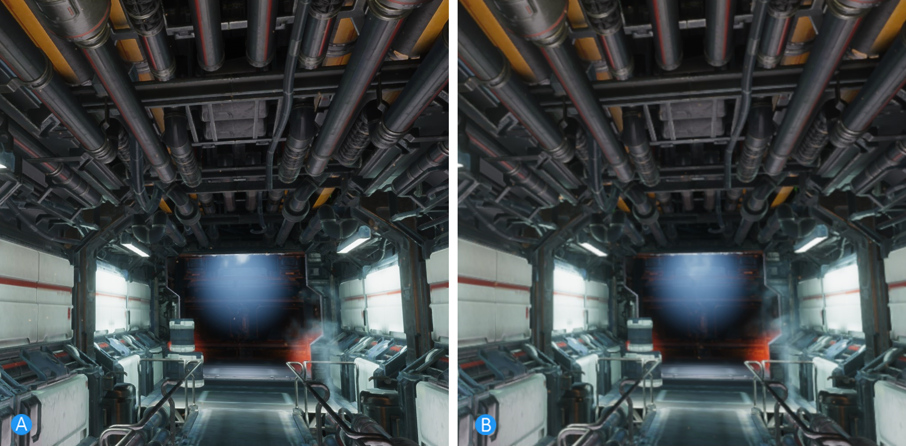
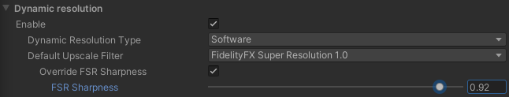
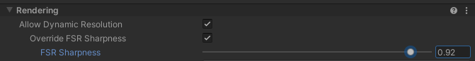

# Dynamic resolution

Dynamic resolution reduces the workload on the GPU and maintains a stable target frame rate. The High Definition Render Pipeline (HDRP) uses dynamic resolution to lower the resolution of the render targets that the main rendering passes use.

HDRP uses hardware dynamic resolution by default. If hardware dynamic resolution is not available on your platform, HDRP uses software dynamic resolution. Hardware dynamic resolution treats the render targets, up until the back buffer, as if they are all the scaled size. This means HDRP clears the render targets faster.

Hardware dynamic resolution is supported on the following platforms:

- All Console platforms supported by HDRP.
- PCs that use DX12, Vulkan or Metal.

When you enable dynamic resolution, HDRP allocates render targets to accommodate the maximum resolution possible. HDRP rescales the viewport so it can render at varying resolutions. At the end of each frame, HDRP upscales the result of the scaled rendering to match the back buffer resolution.

HDRP always uses a software method to upscale the result. The method HDRP uses is defined in the **Upscale Filter**. You can select which upscaling method HDRP uses to do this. For more information, see [Choosing an upscale filter](#Choosing_Upscale_Filter).


## Using dynamic resolution

To use dynamic resolution in your Project, you must enable dynamic resolution in your [HDRP Asset](HDRP-Asset.md) and then enable it for each [Camera](HDRP-Camera.md) you want to use it with. To do this:

1. In the Inspector for your HDRP Asset, go to **Rendering** **> Dynamic Resolution** and enable the **Enable** checkbox. For information on how to customize the rest of the HDRP Asset’s global dynamic resolution properties, see the dynamic resolution section of the [HDRP Asset documentation](HDRP-Asset.md#DynamicResolution).
2. For every [Camera](HDRP-Camera.md) you want to perform dynamic resolution, go to the **General** section and enable **Allow Dynamic Resolution**.
3. Add a HD Dynamic Resolution component.

## HD Dynamic Resolution component

The HD Dynamic Resolution component changes the screen resolution based on the average amount of GPU frame time between each frame over a given number of frames.
If the average frame time is different from the target frame time, HDRP changes the resolution in a series of steps.

| **Property**                         | **Description**                                              |
| ------------------------------------ | ------------------------------------------------------------ |
| **Default Target Frame Rate** | The desired target frame rate in FPS. If Application.targetFrameRate is already set, Application.targetFrameRate overrides this parameter. |
| **Evaluation Frame Count** | Per how many frames we evaluate GPU performance against the target frame rate, using the averaged GPU frame time over frames. |
| **Scale Up Duration** | The number of consecutive times where the GPU performance is above the target to increase dynamic resolution by one step. |
| **Scale Down Duration** | The number of consecutive times where the GPU performance is below the target to decrease dynamic resolution by one step. |
| **Scale Up Step Count** | The number of steps to upscale from minimum screen percentage to maximum screen percentage set in the current HDRP Asset. |
| **Scale Down Step Count** | The number of steps to downscale from maximum screen percentage to minimum screen percentage set in the current HDRP Asset. |
| **Enable Debug View** | Enables the debug view of dynamic resolution. |

## Custom dynamic resolution
Instead of using a HD Dynamic Resolution component, you can write custom logic for dynamic resolution. To do so, call the following function in your script:

```DynamicResolutionHandler.SetDynamicResScaler(PerformDynamicRes scaler, DynamicResScalePolicyType scalerType)```

This function can use one of the following policy types:

- `DynamicResScalePolicyType.ReturnsPercentage`:  The DynamicResolutionHandler expects the `scaler` to return a screen percentage value. The value set will be clamped between the minimum and maximum percentage set in the HDRP Asset.
- `DynamicResScalePolicyType.ReturnsMinMaxLerpFactor`:  The DynamicResolutionHandler expects the `scaler` to return a factor `t` that is the [0 ... 1] range and that will be used as a lerp factor between the minimum and maximum screen percentages set in the HDRP asset.

HDRP supports values from 5% to 100% and clamps anything above 100%. It is best practice to keep the screen percentage above 50%.

The simple example below demonstrates how to call `DynamicResolutionHandler`. If you use this function in development, call it based on the performance of your application.


```c#
using System.Collections;
using System.Collections.Generic;
using UnityEngine;
using UnityEngine.Rendering;

public class DynamicRes : MonoBehaviour
{
    public float secondsToNextChange = 1.0f;
    public float fractionDeltaStep = 0.1f;
    private float currentScale = 1.0f;
    private float directionOfChange = -1.0f;
    private float elapsedTimeSinceChange = 0.0f;

    // Simple example of a policy that scales the resolution every secondsToNextChange seconds.
    // Since this call uses DynamicResScalePolicyType.ReturnsMinMaxLerpFactor, HDRP uses currentScale in the following context:
    // finalScreenPercentage = Mathf.Lerp(minScreenPercentage, maxScreenPercentage, currentScale);
    public float SetDynamicResolutionScale()
    {
        elapsedTimeSinceChange += Time.deltaTime;

        // Waits for secondsToNextChange seconds then requests a change of resolution.
        if (elapsedTimeSinceChange >= secondsToNextChange)
        {
            currentScale += directionOfChange * fractionDeltaStep;

            // When currentScale reaches the minimum or maximum resolution, this switches the direction of resolution change.
            if (currentScale <= 0.0f || currentScale >= 1.0f)
            {
                directionOfChange *= -1.0f;
            }

            elapsedTimeSinceChange = 0.0f;
        }
        return currentScale;
    }

    void Start()

    {
        // Binds the dynamic resolution policy defined above.
        DynamicResolutionHandler.SetDynamicResScaler(SetDynamicResolutionScale, DynamicResScalePolicyType.ReturnsMinMaxLerpFactor);
    }
}
```
<a name="Choosing_Upscale_Filter"></a>

## Choosing an upscale filter

You can select which software method HDRP uses to perform upscaling in the [HDRP Asset](HDRP-Asset.md#DynamicResolution). To do this, navigate to **Rendering > Dynamic Resolution**, select **Enable** and open the **Upscale Filter** drop down.

HDRP supports NVIDIA Deep Learning Super Sampling (DLSS) for GPUs that support it. For more information, see [DLSS in HDRP](deep-learning-super-sampling-in-hdrp.md).

Each upscale filter gives a different effect. If your project uses Temporal Anti-Aliasing (TAA), select the **Temporal Anti-Aliasing (TAA) Upscale** method first, and then experiment with the other options to see what best fits your project. If your project is not suited for TAA, then select the **FidelityFX Super Resolution 1.0** method first.

The following images give an example of the difference between the Temporal Anti-Aliasing Upscale (A) and Catmull-Rom (B) methods.



In the image comparison above, the image that uses the Temporal Anti-Aliasing Upscale method (A) is sharp and well-defined. The image that uses the Catmull-Rom upscale method (B) appears blurrier and less defined.

HDRP provides the following upscale filter methods:

| **Upscale Filter Name**              | Description                                                  |
| ------------------------------------ | ------------------------------------------------------------ |
| Catmull-Rom                          | Catmull-Rom uses four bilinear samples. This uses the least resources, but it can cause blurry images after HDRP performs the upscaling step.<br/><br/> Catmull-Rom has no dependencies and runs at the end of the post-processing pipeline. |
| Contrast Adaptive Sharpen (CAS)      | Contrast Adaptive Sharpen (CAS) uses **FidelityFX (CAS) AMD™**. This method produces a sharp image with an aggressive sharpening step. Do not use this option when the dynamic resolution screen percentage is less than 50%. For information about FidelityFX and Contrast Adaptive Sharpening, see[ AMD FidelityFX](https://www.amd.com/en/technologies/radeon-software-fidelityfx).<br/><br/> Contrast Adaptive Sharpen (CAS) has no dependencies and runs at the end of the post-processing pipeline. |
| FidelityFX Super Resolution 1.0      | FidelityFX Super Resolution 1.0 uses a spatial super-resolution method that balances quality and performance. For more information, see [AMD FidelityFX](https://www.amd.com/en/technologies/radeon-software-fidelityfx).<br/><br/> FidelityFX Super Resolution 1.0 has no dependencies and runs at the end of the post-processing pipeline.<br />FidelityFX Super Resolution 1.0 also runs when at 100% resolution as it can have beneficial sharpening effects.  <br />For more information, see the section [Notes on FidelityFX Super Resolution 1.0](Dynamic-Resolution.md#notes-on-fidelityfx-super-resolution-1.0-(FSR))|
| Temporal Anti-Aliasing (TAA) Upscale | Temporal Anti-Aliasing (TAA) Upscale uses temporal integration to produce a sharp image. Unity performs this method alongside the normal anti-aliasing.<br />HDRP executes this upscale filter before post processing and at the same time as the TAA step. This means you can only use the TAA anti-aliasing method. This filter is not compatible with other anti-aliasing methods. <br /><br/>Temporal Anti-Aliasing (TAA) Upscale performs antialiasing on each frame. This means that it also runs when you enable Dynamic Resolution, even when the screen percentage is at 100% resolution. <br />For more information, see the section [Notes on TAA Upscale](Dynamic-Resolution.md#Notes). |

## Overriding upscale options with code

You can also override the upscale options in the HDRP Asset for each Camera in your scene using code. To do this, call `DynamicResolutionHandler.SetUpscaleFilter(Camera camera, DynamicResUpscaleFilter filter)`, to make HDRP ignore the value in the HDRP Asset for a given Camera.

<a name="TAA_Notes"></a>

## Notes on Temporal Anti-Aliasing (TAA) Upscale

When you enable **Temporal Anti-Aliasing (TAA) Upscaling**, it replaces Temporal Anti-Aliasing in the pipeline. This means:

- When Temporal Anti-Aliasing (TAA) Upscale  is active, Temporal Anti-Aliasing (TAA) is the only anti-aliasing method. No other post-process or anti-aliasing option will work.
- When TAA Upscale is active, Post-processing uses more GPU resources. This is because TAA Upscale upscales a down-sampled texture before HDRP applies post-processing. Post-processing then runs at final resolution which gives a more precise result.

TAA Upscaling sets the [Camera's](HDRP-Camera.md) **TAA Quality Preset** to **High Quality**. When you enable the Temporal Anti-Aliasing (TAA) Upscaling, you cannot change this preset.

Any option that can control TAA also controls TAA Upscaling. However, the source of the current frame is lower resolution than the final image/history buffer. For best results, take the following into account:

- Speed rejection can produce an image that appears to have a low resolution at lower screen percentages. This is because the speed rejection threshold can reduce the influence of the history buffer in favor of the current frame.

- You can compensate for this low resolution source image by setting the [Camera's](HDRP-Camera.md) **TAA Sharpen Strength** setting to higher values.

<a name="FSR_Notes"></a>

## Notes on FidelityFX Super Resolution 1.0 (FSR)

The intensity of the sharpening filter used by FSR can be controlled using the **FSR Sharpness** setting. This setting is available as a global pipeline asset override, but it can also be adjusted at a per-camera level if desired. A value of 1.0 yields maximum sharpness and a value of 0.0 disables the sharpening filter entirely.

### Pipeline Asset Override


### Per-Camera Override


> This setting is **not visible** in the editor until the **Override FSR Sharpness** checkbox is checked. The checkbox itself is **also not visible** unless the default  default upscaling filter is set to FSR.
