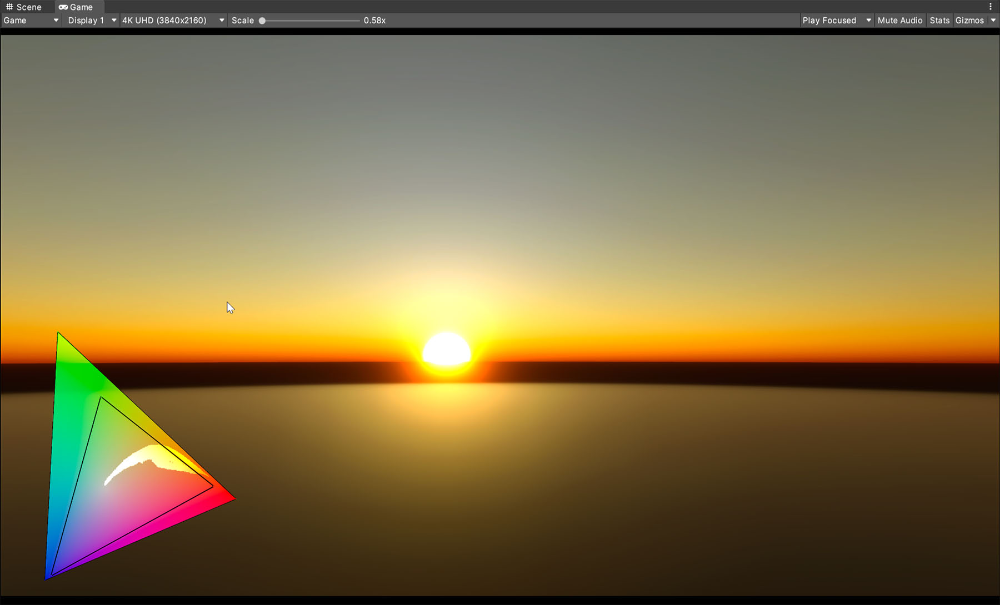
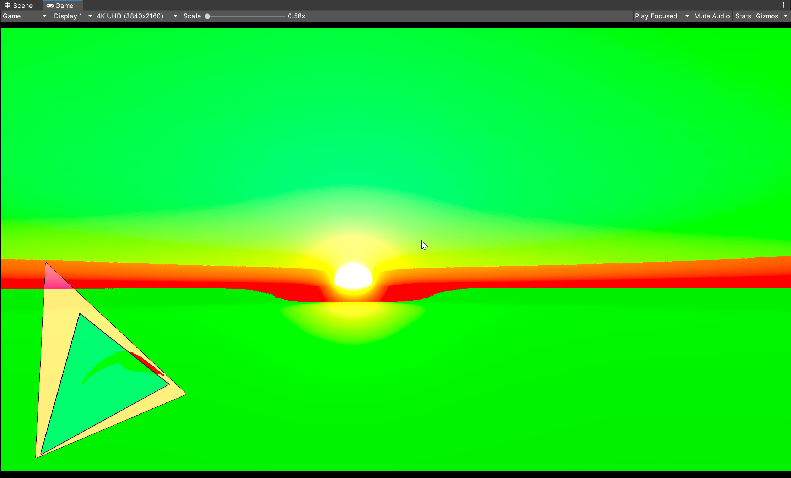
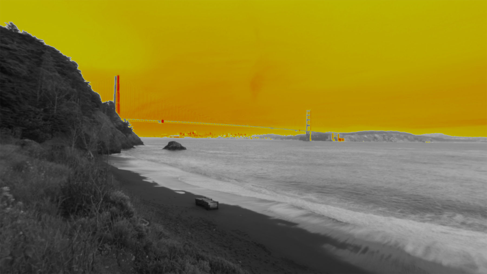

# High Dynamic Range (HDR) Output

[High Dynamic Range](https://en.wikipedia.org/wiki/High_dynamic_range) content has a wider color gamut and greater luminosity range than standard definition content.

HDRP can output HDR content for displays which support that functionality.

## Enabling HDR Output

To activate HDR output, navigate to **Project Settings > Player** > **Other Settings** and enable the following settings:

* **Allow HDR Display Output**
* **Use HDR Display Output**

> **Note**: Only enable **Use HDR Display Output** if you need the main display to use HDR Output.

HDR Output is only active in the Player when using DirectX 11, and both in the Player and Game View when using DirectX 12.

## HDR tonemapping in HDRP

After you enable **Use display in HDR mode**, you must configure [Tonemapping](Post-Processing-Tonemapping.md) settings for your HDR input.

In order to configure these settings effectively, you need to understand how certain values related to tone mapping determine the visual characteristics of your HDR output.

### Important tone mapping values

To properly make use of the capabilities of HDR displays, your **Tonemapping** configuration must take into account the capabilities of the target display, specifically these three values (in[ nits](https://en.wikipedia.org/wiki/Candela_per_square_metre)):

* **Minimum supported brightness.**
* **Maximum supported brightness.**
* **Paper White value.** This value represents the brightness of a paper-white surface represented on the display, which determines the display's brightness overall. Low Dynamic Range (LDR) and High Dynamic Range (HDR) content do not appear equally bright on displays with the same Paper White value. This is because displays apply extra processing to low dynamic range content that bumps its brightness levels up. For this reason, it is best practice to implement a calibration menu for your application.

### Usable user interfaces depend on accurate Paper White values

[Unlit](unlit-material.md) materials do not respond to lighting changes, so it is standard practice to use an Unlit material for user interfaces. Calculations for Unlit material rendering define brightness with values between 0 and 1 when you are not specifically targeting HDR displays. In this context, a value of 1 corresponds to white, and a value of 0 corresponds to black.

However, in HDR mode, HDRP uses Paper White values to determine the brightness of Unlit materials. This is because HDR values can exceed the 0 to 1 range.

As a result, Paper White values determine the brightness of UI elements in HDR mode, especially white elements, whose brightness matches Paper White values.

### Configure HDR Tone Mapping settings in the Volume component

You can select and adjust Tonemapping modes in the [Volume](understand-volumes.md) component settings. You can also adjust some aspects of your HDR Tonemapping configuration with a script (see [The HDROutputSettings API](#the-hdroutputsettings-api)).

After you enable **Use display in HDR mode**, HDR [Tonemapping](Post-Processing-Tonemapping.md) options become visible in the [Volume](volume-component.md) component.

### Tone mapping modes

HDRP provides the **Tonemapping** modes **Neutral** and **ACES**. Each Tonemapping mode has some unique properties. To learn about tonemapping mode properties, refer to [High Dynamic Range (HDR) tonemapping properties](reference-hdr-tonemapping.md).

#### Misuse of **Hue Shift Amount**

Creators might author some content with the intention to use **Hue Shift Amount** to produce special effects. In the illustration below, the **Hue Shift Amount** is 0 for image A and 1 for image B. The flames image B appear more intense because of the hue shift effect. It is preferable not to author content in this way, because settings optimized for special effects can have undesirable effects on other content in the Scene.

  *Image A: Output when Hue Shift Amount is 0.* *Image B: Output when Hue Shift Amount is 1.*

### ACES

## The HDROutputSettings API

The [HDROutputSettings](https://docs.unity3d.com/ScriptReference/HDROutputSettings.html) API makes it possible to enable and disable HDR mode, as well as query certain values (such as Paper White).

These values are also listed on the HDR output display table on the Rendering Debugger. To access the table, navigate to **Window** > **Analysis** > **Render Pipeline Debugger** > **Rendering** > **HDR Output**.

## HDR Debug Views

HDRP offers three debug views for HDR rendering. To access them, navigate to **Window > Analysis > Render Pipeline Debugger > Lighting > HDR**.

### Gamut View

The triangles in this debug view indicate which parts of three specific color gamuts this scene covers. The small triangle displays the [Rec709](https://en.wikipedia.org/wiki/Rec._709) gamut values, the medium triangle displays the [P3-D65](https://en.wikipedia.org/wiki/DCI-P3) gamut values, and the large triangle displays the [Rec2020](https://en.wikipedia.org/wiki/Rec._2020) gamut values. This enables you to check color plot changes while color grading. It can also help you ensure that you benefit from the wider color gamut available in HDR.

### Gamut Clip

This debug view indicates the relationship between scene values and specific color gamuts. Areas of the screen with values within the Rec709 gamut are green, areas outside of the Rec709 gamut but inside the P3-D65 gamut are blue, and areas outside of both are red.

### Values exceeding Paper White

This debug view uses a color coded gradient to indicate parts of the Scene that exceed the Paper White value and Max Nits. The gradient ranges from yellow to red and blue. Yellow corresponds to **Paper White** +1, red corresponds to **Max Nits**, and blue corresponds to **Max Nits**+1.

## Platform Compatibility

HDRP only supports HDR Output on the following platforms:

* Windows with DirectX 11, DirectX 12 or Vulkan
* HDRP Supported Devices that use Metal
* Consoles
* XR devices with HDR support
