# High Definition Render Pipeline overview

This is a high level overview of all the features you can use in the High Definition Render Pipeline (HDRP). This document presents the features in the following categories:

- [Project](#Project)
- [Material](#Material)
- [Lighting](#Lighting)
- [Environmental Effects](#EnvironmentalEffects)
- [Camera](#Camera)
- [Path Tracing](#PathTracing)
- [Tools](#Tools)
- [Programming](#Programming)

## Project

### Platform support

HDRP projects run on the following platforms: 
- Compute Shader compatible devices that use:
   - DirectX 12
   - DirectX 11 
   - Metal
   - Vulkan
- Console platforms. For information on which console platforms are supported, see the platform-specific documentation.
  
  For information about requirements for each platform, see [System requirements](System-Requirements.md).

### Virtual Reality

HDRP is compatible with VR and optimized for single-pass rendering. For more information about Virtual Reality, see the [VR documentation](configure-hdrp-for-virtual-reality.md).

### Camera-relative rendering

Use HDRP to render distant GameObjects with large world-space coordinates in a more robust and numerically stable way than the built-in render pipeline. For information on how HDRP achieves this, see the [Camera-relative rendering documentation](Camera-Relative-Rendering.md).

### Dynamic resolution

When you use dynamic resolution, HDRP can render at varying resolutions. To do this, it either uses hardware features, if available, or renders to render targets that are equal size or smaller than the current viewport. This helps maintain a stable frame rate in your Unity Project. 
HDRP supports the following dynamic resolution methods:
- Catmull-Rom
- AMD FSR 1.0
- DLSS
- Temporal Anti-aliasing Upscaling

For more information on dynamic resolution, and the types of dynamic resolution that HDRP supports, see the [dynamic resolution documentation](Dynamic-Resolution.md).

### Volumes

Use Volumes to localize environmental Scene settings and post-processing effects. You can have multiple Volumes inside a Scene, and make effects like fog density, sky color, or exposure depend on the position of the Camera. For information on how to use Volumes in HDRP, see the [Volumes documentation](understand-volumes.md).

## Materials

HDRP Shaders allow you to use the following features:

- [Opaque/transparent surfaces](Surface-Type.md).
  - Different blend modes for transparent surfaces including premultiplied alpha.
  - Transparent surfaces that work with fog.
  - Refraction and distortion for transparent surfaces.

- [Material types](Material-Type.md).

  - Anisotropy, for surfaces that have highlights that change when you view them from different angles, like brushed metal or velvet.
  - Iridescence, for surfaces that appear to change color as you view them from different angles, like soap bubbles or insect wings.
  - Metallic, for surfaces only lit by specular lighting and that take the base color input for specular color. For example, aluminum, copper, and steel.
  - Specular Color, for surfaces that you want to have a colored specular highlight.
  - Subsurface Scattering, for translucent surfaces that simulate light interaction and scattering, like skin or plant leaves.
  - Translucent, for surfaces that simulate light interaction, but don't blur light that transmits through the Material.
  - Vertex, tessellation and pixel deformation and displacement.
  - Emission, for materials that act as a self-illuminating light source.
  - Custom motion vector, for procedural surfaces.
  - [Decals](create-a-decal-material.md), that project a texture onto a surface.

### Lit Shader

The Lit Shader is the default Shader in HDRP. Use the Lit Shader to create realistic Materials. The Lit Shader also includes options for effects including subsurface scattering, iridescence, and translucency. For more information, including the full list of Shader properties, see the [Lit Shader documentation](lit-material.md) and [Lit master stack](lit-master-stack-reference.md).

### Layered Lit Shader

The Layered Lit Shader combines a main Material with other tileable Materials to produce visuals with a similar quality to a single high-resolution texture, but in a way that's less resource intensive than a [Lit Shader](lit-material.md) using the single high-resolution Texture. For more information, including a full list of Shader properties, see the [Layered Lit Shader documentation](layered-lit-material-inspector-reference.md).

### Unlit Shader

The Unlit Shader allows you to create Materials that aren't affected by lighting. Unlit Shaders are perfect for visual effects. For more information, including a full list of Shader properties, see the [Unlit Shader documentation](unlit-shader.md) and [Unlit master stack](unlit-master-stack-reference.md).

With the **Shadow Matte** option, you can have the surface receive shadow without lighting. You can use Opaque or Transparent shadow with alpha for each of them.

### StackLit Shader

The StackLit Shader is a higher quality than the Lit Shader, but more resource intensive. This Shader coats surfaces more accurately than the Lit Shader, and, unlike the Lit Shader, allows you to use multiple Material features like anisotropy, subsurface scattering iridescence, and hazy parametrization at the same time. For more information, including a full list of Shader properties, see the [Stacklit master stack](stacklit-master-stack-reference.md)

### Hair Shader

The Hair Shader is purpose-built to accurately render realistic and stylized hair in your Unity Project. You can use the following modes: 
- Physically based: Uses the Marschner lighting model with multiple scattering to improve the realism of light-colored hair. 
- Approximate: Uses an improved Kajiya Kay lighting model that offers more customization for a stylized appearance.  

For more information, including a full list of Shader properties, see the [Hair Shader](create-a-hair-and-fur-material.md) and [Hair Master Stack](hair-master-stack-reference.md) documentation.

### Fabric Shader

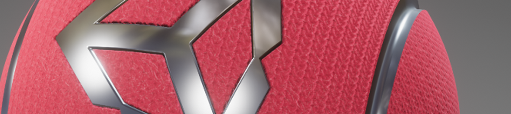

The Fabric Shader allows you to render realistic fabric Materials in HDRP. You can use the cotton wool or silk lighting model to create a wide variety of fabrics. For more information, including a full list of Shader properties, see [Create a fabric material](create-a-fabric-material.md).

### Eye Shader

The Eye Shader allows you to render realistic eye Materials in HDRP. The Eye shader can use the following material types: 
- Eye: Uses a low resource-intensity method to calculate caustics.
- Eye Cinematic With Caustic: Uses refracted light direction and caustic approximation to shade the iris. This is the algorithm used in [Enemies](https://unity.com/demos/enemies).

To see an example of a configured Eye material, download the [Material Sample](HDRP-Sample-Content.md#material-samples) from the Package Manager window and open the **Eye** scene.

For more information, including a full list of Shader properties, see the [Eye Shader](eye-material-inspector-reference.md) and [Eye Master Stack](eye-master-stack-reference.md) documentation.

### AxF Shader

The AxF Shader supports the [X-Rite AxF](https://www.xrite.com/axf) measured Material format. The AxF importer, available in [Unity Enterprise for Product Lifecylce](https://unity.com/products/unity-enterprise-product-lifecycle), automatically populates an AxF Material when it imports AxF Assets. For more information, including a full list of Shader properties, see the [AxF Shader documentation](AxF-material-inspector-reference.md).

### Decals

Use Decals to apply a separate texture to surfaces in your Scene. To apply a decal to a surface, you can either use the [Decal Projector component](decal-projector-reference.md) to project the decal onto the surface, or assign the decal shader directly to a Mesh and then place the Mesh on the surface. 

You can use Decal Projectors with [Surface Gradients](use-decals.md#additive-normal-blending) to accurately accumulate normal maps when you project a Decal onto a GameObject. Use [Rendering Layers](Rendering-Layers.md) to control which GameObjects receive decals.

For more information, see [Decals](decals.md).

### Terrain Shader

The Terrain Lit Shader is compatible with the built-in terrain system and supports up to eight layers in a single draw call. This Shader uses the same lighting model as the Lit Shader. For more information, including the full list of Shader properties, see the [Terrain Lit Shader documentation](terrain-lit-material.md).

### Compute Thickness
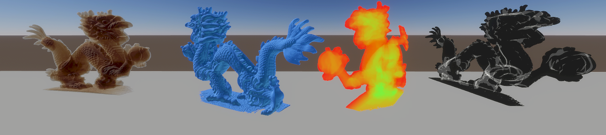
Compute Thickness is a screen-space pass that calculates the accumulated [thickness](Compute-Thickness.md) of objects in a specific Layer. HDRP calculates the optical path and overlap count, which you can use with [Subsurface Scattering](skin-and-diffusive-surfaces-subsurface-scattering.md) and [Refraction](Override-Screen-Space-Refraction.md). You can also use the overlap count to calculate compute thickness on non-closed or flat geometry like vegetation. Use the [HD Sample Buffer](https://docs.unity3d.com/Packages/com.unity.shadergraph@latest/index.html?preview=1&subfolder=/manual/HD-Sample-Buffer-Node.html) node to sample the thickness in a Shader Graph.

### Volumetric Materials

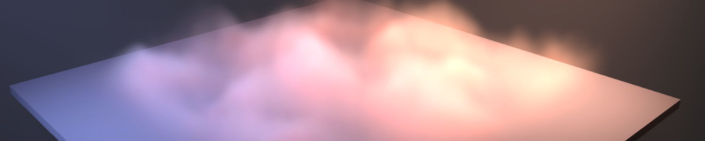

In HDRP, you can control the density of fog in an area to create a Volumetric fog effect. Use a [local volumetric fog](create-a-local-fog-effect.md) volume override to set a 3D Mask texture or a shader graph that controls the fog color and the density.

The Visual Effect Graph supports volumetric outputs, like the [Volume (Cone)](https://docs.unity3d.com/Packages/com.unity.visualeffectgraph@latest/index.html?subfolder=//manual/Operator-Volume(Cone).html) operator. You can use these volumetric operators to output particles into HDRP's Volumetric Fog.

## Lighting

### Light types

The HDRP light types use [physical light units](#PLU) to help you light your Scene in the most realistic way possible. To assist you in creating physically accurate lights, the [Light component](Light-Component.md) Inspector includes icons alongside the **Intensity** and **Temperature** properties. Each icon displays the real-world light source that the value of each property currently represents. Each icon is also a button which you can click to access a list of preset values that match real-world light sources. For lights to behave properly when using PLU, you need to respect HDRP unit convention (1 Unity unit equals 1 meter). The HDRP light types are:

- **Directional**
  - Color temperature
  - Colored cookie
  - [Shadowmask](Lighting-Mode-Shadowmask.md) support

- **Spot**
  - Color temperature
  - Colored cookie
  - [Shadowmask](Lighting-Mode-Shadowmask.md) support
  - Cone, pyramid and box shapes

- **Point**
  - Color temperature
  - Colored cookie
  - [Shadowmask](Lighting-Mode-Shadowmask.md) support

- **Rectangle**
  - Color temperature
  - Colored Cookie
  - [Shadowmask](Lighting-Mode-Shadowmask.md) support

- **Tube**
  - Color temperature
  - No [Shadowmask](Lighting-Mode-Shadowmask.md) support

- **Disk (Baked only)**
  - Color temperature
  - No [Shadowmask](Lighting-Mode-Shadowmask.md) support

For more information, including the full list of light properties, see the [Light component documentation](Light-Component.md).

### Rendering Layers

Rendering Layers are Layer Masks that you specify for Lights, Decals and Meshes. Lights only illuminate Meshes that are on the same Rendering Layer. You can also use Rendering Layers in the shadow map settings to decouple shadows from lighting. For more information on Rendering Layers, see the [Rendering Layers documentation](Rendering-Layers.md).

You can use Rendering layers in the shadow map dropdown to control which GameObject receives a shadow from which light. By default, both Light Rendering Layers and Shadow Map Rendering Layers are synchronized so the result is coherent. This means that when a GameObject receives light it also casts shadows. For more information on Shadow Map Rendering Layers, see the [Shadow Rendering Layer section](Rendering-Layers.md#ShadowLightLayers).

### IES Profiles and light cookies

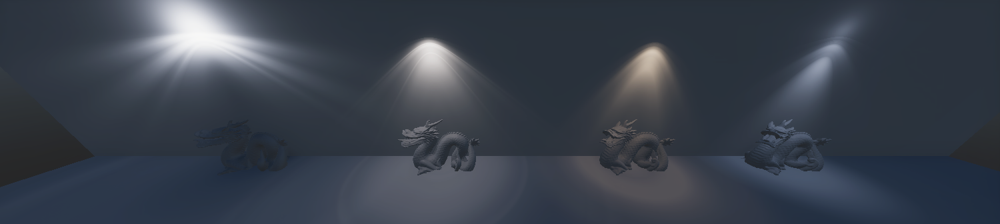

HDRP supports the Illuminating Engineering Society's (IES) file format for describing the distribution of light from a light source. HDRP supports the IES profile for Point, Spot (Cone, Pyramid, and Box), and rectangular Area [Lights](Light-Component.md). You can also mix the IES profile with [cookies](https://docs.unity3d.com/Manual/Cookies.html) and even use the profile and cookie mix for [light map baking](https://docs.unity3d.com/Manual/LightMode-Baked.html).

### Light Anchor

HDRP's [Light Anchor component](light-anchor.md) allows you to manipulate a light from the Main Camera view.

### Light Explorer

HDRP adds options to the [Light Explorer](https://docs.unity3d.com/Manual/LightingExplorer.html) that you can use to select and edit the following light sources: 
- Directional lights 
- Point lights 
- Spot lights
- Area lights
- Reflection Probes 
- Planar Probes 
- Sky and Fog Global Volumes

### Lens Flare, data-driven

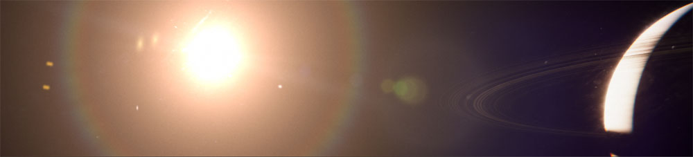

Use HDRP's data-driven Lens Flare system provides a [lens flare asset](shared/lens-flare/lens-flare-asset.md) and a [lens flare component](shared/lens-flare/lens-flare-component.md) that you can attach to any GameObject. You can control each element of a Lens Flare individually. 

### Lens Flare, Screen Space

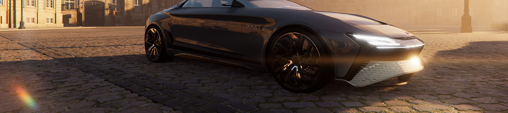

HDRP generates the Screen Space Lens Flare effect from screen information to create multiple types of flares based on the [Bloom](Post-Processing-Bloom.md) texture. This is useful for view-dependent bright spots (like specular reflection and overexposed areas) that don't have a defined position in world space.

### Reflection probes

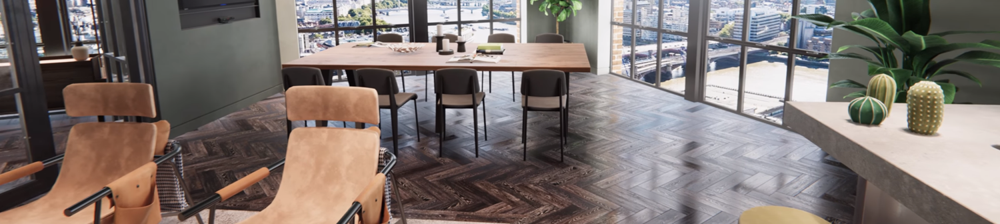

HDRP supports cubemap reflections that take surface smoothness into account. HDRP cubemap reflection optionally supports a fake distance based roughness. This helps you produce realistic reflections in your Scene in real time. You can control the reflection probe resolution for each probe. 
For more information, see [introduction to Reflection Probes](Reflection-Probes-Intro.md)

### Planar reflection probe

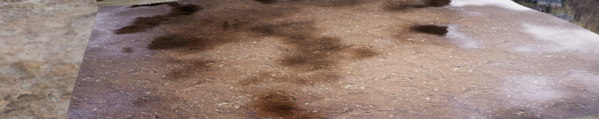

HDRP supports Planar reflection probes that take surface smoothness into account. This allows you to create effects that mimic a shiny mirror or a wet floor. HDRP includes accurate filtering for planar reflection that's close to being physically based. For more information, see [Planar Reflection Probe](Planar-Reflection-Probe.md).

### Screen-space reflection and refraction

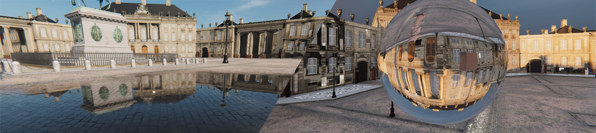
HDRP provides a screen-space solution for reflection and refraction. It uses the depth and color buffer of the screen to help simulate the path that light travels to the Camera and uses this to calculate accurate reflection and refraction. You can use this feature for transparent materials too, such as windows or water. For more information, see [screen-space reflection](Override-Screen-Space-Reflection.md) and [screen-space refraction](Override-Screen-Space-Refraction.md).
To see how to setup refractive materials and understand the limitations of Screen Space Refraction, download the [Material Sample](HDRP-Sample-Content.md#material-samples) from the Package Manager window and open the **Transparency** scenes.

### Screen-space distortion

HDRP provides a screen-space solution for distortion. Distortion gives a similar effect to refraction, but it requires configuration. For more information, see [Distortion](Surface-Type.md#TransparencyInputs).

### Screen space ambient occlusion

HDRP includes a [screen space ambient occlusion](Override-Ambient-Occlusion.md) effect that approximates ambient occlusion in real time. It approximates the intensity and position of ambient light on a GameObject’s surface based on the light in the Scene and the environment around the GameObject.

### Screen space specular occlusion

Screen space ambient occlusion in HDRP can apply a direction to indirect specular lighting. To improve the specular occlusion approximation, you can use a texture that contains bent normal information that corresponds to the light direction.

### Adaptive Probe Volumes 
 demo, with a woman sitting playing chess in a large ornate room.](Images/HDRPFeatures-APV.png)

Adaptive Probe Volumes (APV) is a probe-based global illumination system that automatically places light probes based on the geometry density in your scene. APV features include:
- Per-pixel probe selection and lighting.
- Volumetric light support. 
- Reduced light leaking.
- Settings to improve memory management.
- Properties to blend different lighting scenarios.
- Sky occlusion.

For more information, see [APV](probevolumes.md).

### Screen-space global illumination

HDRP supports screen-space global illumination (SSGI). SSGI is an algorithm that accesses the indirect diffuse lighting that the environment generates. It works in the same way as the [Screen Space Reflection](Override-Screen-Space-Reflection.md) in that it uses ray marching to calculate the result.

### Physical light units

HDRP uses real-world physical light units, so you can light your Scene in a realistic way. For more information on physical light units, including a list of which units HDRP uses, see [physical light units](Physical-Light-Units.md).

Physical light units increase the intensity of lights and can cause precision issues and clamp highlights.
To fix this effect, HDRP uses pre-exposure. Pre-exposure applies the camera's position from the previous frame before HDRP stores the lighting information.

### Exposure

HDRP allows you to calculate exposure using several methods. This includes:

##### Histogram exposure

HDRP's exposure implementation computes a histogram of the image which allows you to select high and low percentile values to discard. Discarding outlying values in the shadows or highlights helps to calculate a more stable exposure. For more information, see [Exposure](Override-Exposure.md).

##### Metering mode

HDRP's exposure implementation includes a metering mask. This includes a texture-based mask and a procedural mode. For more information, see [Exposure](Override-Exposure.md).

### Emission

HDRP Materials support light [emission](lit-material-inspector-reference.md#EmissionInputs), which allows you to make a Material into a self-illuminated visible source of light. Global illumination takes emission into account and you can use [physical light units](#PLU) to set the intensity based on real-world lights.

### Shadows

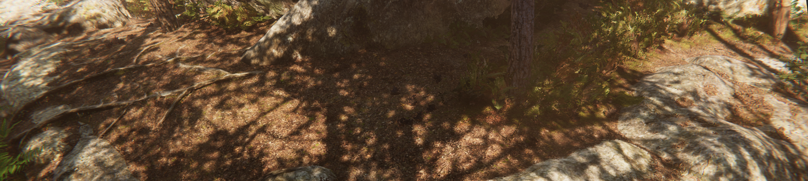

HDRP uses multiple methods to calculate shadows:

- [Shadow cascades](Override-Shadows.md): HDRP uses cascade splits to control the quality of shadows cast by Directional Lights based on the distance from the Camera.
- [Contact Shadows](Override-Contact-Shadows.md): HDRP [raymarches](Glossary.md#RayMarching) inside the depth buffer to process these shadows. That way, HDRP captures small details that regular shadow algorithms fail to capture.
- [Micro Shadows](Override-Micro-Shadows.md): HDRP uses the normal map and ambient occlusion map of a Material to estimate the shadows that those maps would cast if they were Meshes.

To decrease aliasing for the main cascade shadow maps, you can apply different filters to them, like PCF or PCSS.

For punctual and area light shadows, HDRP allows for dynamic resolution based on how much screen the light covers. HDRP rescales the content of the shadow atlas when it would be otherwise full. For more information on the filtering algorithms that HDRP uses, see the [filtering qualities documentation](HDRP-Asset.md#filtering-quality).

You can use a staggered cascade shadow map update for directional lights.

HDRP can cache shadow maps for the following shadow types:
- Cascade
- Punctual 
- Area
This means you can update shadow maps when you request an update, or only update the shadow maps for dynamic objects. This method can improve performance significantly. For more information, see [Shadows](shadow-update-mode.md).

To apply a tint to the shadow or the penumbra of the shadow:
1. Open the Light's Inspector window.
2. Go to the Shadows section.
3. Open the **More** (⋮) menu.
4. Select *Advanced Properties**.

### Ray tracing

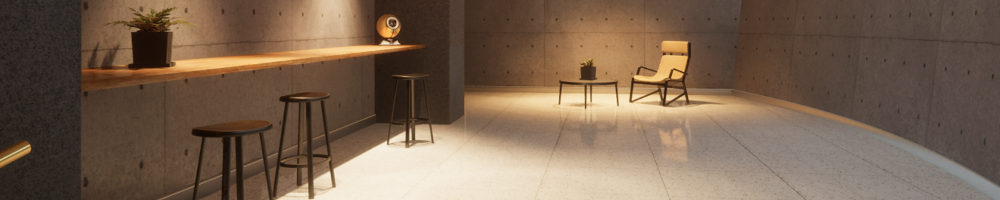

You can use ray tracing as an alternative to some screen space effects, shadowing techniques, and Mesh rendering techniques:

- [Ray-Traced Ambient Occlusion](Ray-Traced-Ambient-Occlusion.md) replaces [screen space ambient occlusion](Override-Ambient-Occlusion.md) with a more accurate, ray-traced, ambient occlusion technique that can use off screen data.
- [Ray-Traced Contact Shadows](Ray-Traced-Contact-Shadows.md) replaces [contact shadows](Override-Contact-Shadows.md) with a more accurate, ray-traced, contact shadow technique that can use off screen data.
- [Ray-Traced Global Illumination](Ray-Traced-Global-Illumination.md) is an alternative to Light Probes and lightmaps in HDRP. This feature includes the following tracing modes: 
   -  **Ray Tracing**: This mode can use off-screen data.
   -  **Mixed**: This mode uses a raymarching algorithm, and uses ray tracing where raymarching failed. You can use unsupported features of ray tracing (like decals or detail meshes on Terrain) with this mode.
- [Ray-Traced Reflections](Ray-Traced-Reflections.md) is a replacement for [screen space reflection](Override-Screen-Space-Reflection.md). This feature includes the following tracing modes: 
   -  **Ray Tracing**: This mode can use off-screen data.
   -  **Mixed**: This mode uses a raymarching algorithm, and uses ray tracing where raymarching failed. You can use unsupported features of ray tracing (like decals or detail meshes on Terrain) with this mode. 
- [Ray-Traced Shadows](Ray-Traced-Shadows.md) replaces shadow maps for Directional, Point, and Area [Lights](Light-Component.md).
- [Recursive Ray Tracing](Ray-Tracing-Recursive-Rendering.md) replaces the rendering pipeline for Meshes. Meshes that use this feature cast refraction and reflection rays recursively.
- [Ray-Traced Subsurface Scattering](Ray-Traced-subsurface-scattering.md) is an alternative to [Subsurface-Scattering](skin-and-diffusive-surfaces-subsurface-scattering.md) that can use off-screen data.
- Ray tracing is compatible with Unity Terrain geometry, but doesn't include detail meshes and trees from the Terrain system. To include detail meshes and trees in ray traced reflections or ray traced global illumination, use [Mixed Tracing](Override-Screen-Space-Reflection.md).
- Ray tracing supports some visual effects created with VFX Graph.

## Environmental Effects

### Sky

In HDRP, you set up the sky inside a [Volume](understand-volumes.md), so you can change sky settings, or even the type of sky itself, depending on the position of the Camera in the Scene. HDRP allows you to separate the visual sky from the sky that you use for environment lighting. HDRP includes the following built-in sky types for you to use in your Unity Project:

- [Gradient Sky](create-a-gradient-sky.md): Renders a simple sky with three color zones for the top, middle, and bottom sections of the sky.
- [HDRI Sky](create-an-hdri-sky.md): Constructs a sky environment based on a cubemap texture you set within the HDRI Volume component.
- [Physically Based Sky](Override-Physically-Based-Sky.md): Simulates a spherical planet with a two-part atmosphere which features exponentially decreasing density with respect to altitude. It also supports multiple Celestial bodies to simulate a Sun and Moon and procedural stars in the night sky.

HDRP is able to handle multiple skies seen by different Cameras.

#### Backplate

A backplate projects the bottom part of a [HDRI Sky](create-an-hdri-sky.md) onto a plane in one of the following shapes:
- **Rectangle**
- **Disc** 
- **Ellipse**
- **Infinite** 

To match the scale of the GameObjects in your Scene, change the Backplate's **Scale** value to adjust the pixel footprint.

### Cloud Layer

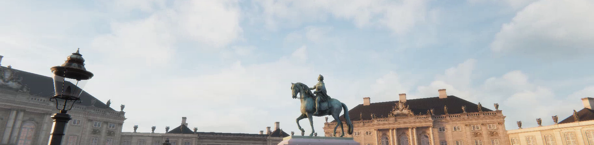

In HDRP, you set up cloud layers inside a [Volume](volume-component.md), so you can change clouds settings, or even the type of clouds itself, depending on the position of the Camera in the Scene. HDRP allows you to separate the clouds in the visual sky from the clouds that you use for environment lighting. HDRP includes the following built-in cloud type for you to use in your Unity Project:

- [Cloud Layer](create-simple-clouds-cloud-layer.md): Renders a cloud texture with options to simulate sky and sun light scattering in the clouds, and to project shadows on the ground.

### Volumetric Clouds

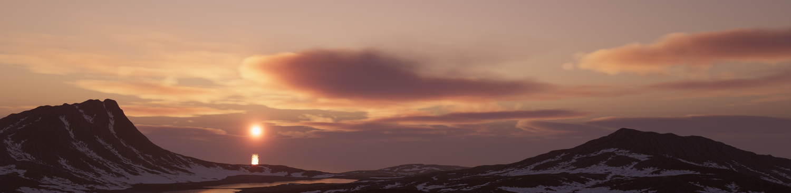

You can use a [Volume](understand-volumes.md) component to create volumetric clouds. Volumetric clouds physically exist inside a scene, HDRP does not project them on the HDRI sky. A camera can fly through volumetric clouds and volumetric clouds have accurate interactions with the sky, sun and fog. Volumetric clouds cast shadows on themselves and the ground using a Beer shadow map. For more information, refer to [Volumetric Clouds](create-realistic-clouds-volumetric-clouds.md).

### Fog

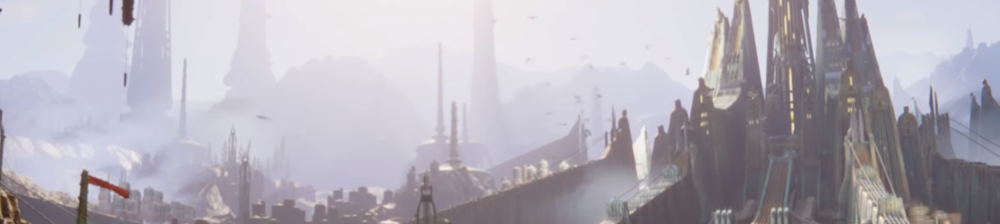

In HDRP, you set up fog inside a [Volume](understand-volumes.md) which means you can change fog settings or the fog type depending on the position of the Camera in the Scene. You can set the color of the fog yourself or use the color of the sky. HDRP fog affects Materials with both opaque and transparent surfaces. HDRP implements an exponential [fog](fog.md) with optional volumetric effects.

### Water Surface

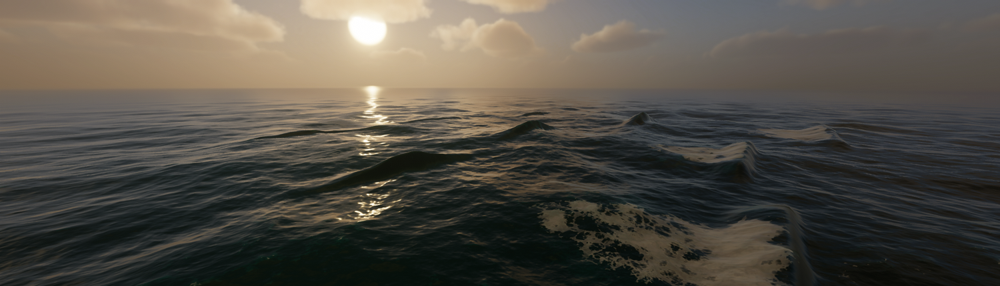

Use HDRP's water system to create and control realistic water surfaces. HDRP's water system includes the following features:
- Multiple presets.
- Simulation-based caustics.
- Underwater rendering.
- Deformation.
- Foam.
- Water Excluder.
- A mirrored simulation on the CPU for high-fidelity game interactions.
- A shader graph interaction for advanced visual customization.
- Visualize transparent objects that intersect the water line.

For more information, refer to [Water system](water.md).

## Camera

### Post-processing

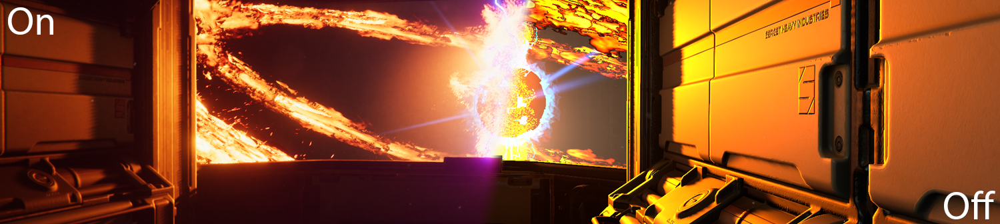

HDRP includes its own purpose-built implementation for post-processing to produce exceptionally high-quality graphics. You can use post-processing to apply full-screen filters and effects to the Camera to drastically improve the visuals of your Unity Project with little set-up time. For an overview on HDRP post-processing, see the [post-processing documentation](Post-Processing-Main.md).

### HDR Display Output

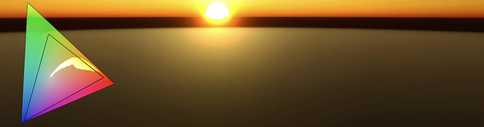

You can output a HDRP scene to high dynamic range (HDR) displays and customize the output in the following ways: 

- Adjust tonemapping operations according to the capabilities of the output display.
- Create a color grading pipeline that is compatible with wide color gamuts. 
- Use the ACES pipeline to customize the high dynamic range process. 

For more information see the [High Dynamic Range Output documentation](HDR-Output.md).

### Accumulation motion blur

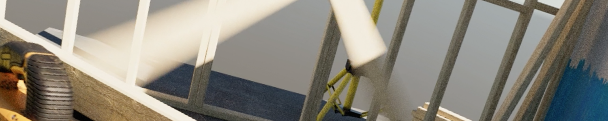

HDRP includes a recording API that you can use to render effects like high-quality accumulation motion blur. This technique combines information from multiple intermediate sub-frames to create a converged frame. Use this API to extract the converged frame and perform further processing or save it to disk. For information about this feature, and some example scripts, see [Multiframe rendering and accumulation](Accumulation.md).

### Anti-Aliasing

HDRP includes the following [antialiasing](Anti-Aliasing.md) methods to help you remove aliasing effects with performance and quality in mind:

- [Multisample antialiasing](Anti-Aliasing.md#MSAA)(MSAA): Samples multiple locations within every pixel and combines these samples to produce the final pixel. You can use an alpha to mask out an area to use MSAA. This is the most resource intensive antialiasing technique in HDRP.
- [Temporal antialiasing](Anti-Aliasing.md#TAA)(TAA): Uses frames from a history buffer to smooth edges more effectively than fast approximate antialiasing. It's better at smoothing edges in motion, but you must enable motion vectors for this.
- [Subpixel morphological antialiasing](Anti-Aliasing.md#SMAA)(SMAA): Finds patterns in borders of the image and blends the pixels on these borders according to the pattern.
- [Fast approximate antialiasing](Anti-Aliasing.md#FXAA)(FXAA): Smooths edges on a per-pixel level. This is the least resource intensive antialiasing technique in HDRP.

### Physical Camera

HDRP uses a physically based Camera system that works seamlessly with the other physical features of HDRP, such as [physical light units](#PLU), to produce physically accurate, unified results. A physically based camera works like a real-world camera, so it uses the same properties. This allows you to configure an HDRP Camera to mimic the behavior of a real-world camera, with expected results for effects such as exposure and depth of field. For more information on HDRP's physically based camera, including a description of how to use it, see [Camera component](hdrp-camera-component-reference.md).

### Custom Post-processing

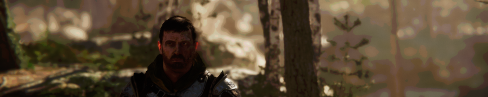

HDRP allows you to add your own custom post processes integrated with the volume framework. You can inject them after opaque and sky object, before the [temporal antialiasing](Anti-Aliasing.md#TAA) pass, before built-in post processes or after built-in post processes. For more information, see the [Custom Post-processing documentation](Custom-Post-Process.md).

### Custom Passes

Use a Custom Pass to inject shaders and C# scripts at certain points inside the render pipeline. You can use a Custom Pass to draw objects, override the rendering properties of objects in your scene, perform fullscreen passes and read some camera buffers like depth, color, normal or motion vectors. You can also use this Camera override to render some GameObjects with a different field of view, like arms in a first-person application. For more information, see [Custom Pass](Custom-Pass.md).

Use the [Custom Pass API](https://docs.unity3d.com/Packages/com.unity.render-pipelines.high-definition@latest?subfolder=/api/UnityEngine.Rendering.HighDefinition.CustomPassUtils.html) to render GameObjects from another point of view, like a disabled camera, within the rendering of your main Camera. You can use this API to render `Depth`, `Normal`, and `Tangent` into an `RTHandle`.

### High Quality Line Rendering

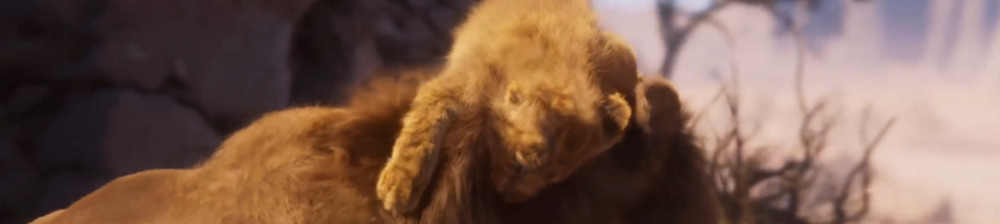

High Quality Line Rendering allows you to render hair, wires, and other line-based geometry with high quality anti-aliasing and transparency. For more information, refer to [High Quality Line Rendering](Override-High-Quality-Lines.md).

### Custom Pass AOV Export

This feature allows you to export arbitrary data from custom pass injection points using an extension of the Arbitrary Output Variables (AOV) API in HDRP. An example use-case is for exporting “Object IDs” that are rendered with a custom pass. For information about the feature and example scripts, see the [AOV documentation](AOVs.md).

### Fullscreen Shader Graph

Use the Fullscreen Shader Graph to create custom post process and fullscreen custom passes effects. Use the [HD Sample Buffer](https://docs.unity3d.com/Packages/com.unity.shadergraph@16.0/manual/HD-Sample-Buffer-Node.html) node in ShaderGraph to fetch camera buffers like world position, normals, and roughness. For more information, see [Create a fullscreen material](create-a-fullscreen-material.md).

### Custom Render Texture in Shader Graph

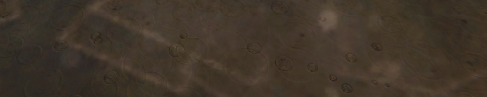

In HDRP, you can use [Custom Render Textures](https://docs.unity3d.com/Manual/class-CustomRenderTexture.html) as a Shader Graph target to create static or dynamic textures. Custom Render Textures support multiple texture dimensions. For example, you can use 3D textures with Local Volumetric Fog, and Cubemaps in the HDRI sky.

You can also create complex effects like dynamic ripples and snow deformation wne you enable **Double Buffered**.

### Canvas Shader Graph

Use the [Canvas ShaderGraph](canvas-material.md) to create custom [UGUI user interface elements](https://docs.unity3d.com/Packages/com.unity.ugui@1.0/manual/UICanvas.html).

### Graphics Compositor
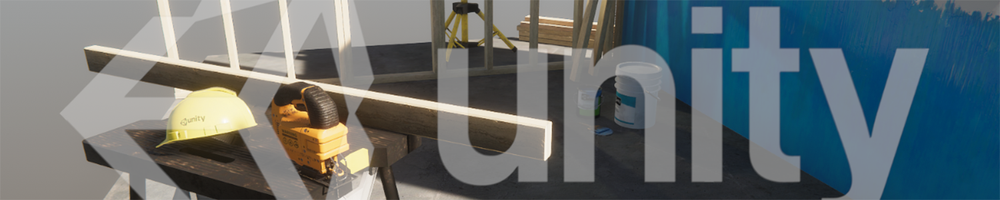

Use the Graphics Compositor to compose images and videos with 3D content into a final frame in real-time, without an external compositing tool.

This tool includes the following compositing techniques:

- **Camera stacking**: Renders multiple cameras to the same render target, then uses the result in graph-based composition.
- **Graph-based composition**: Uses Shader Graph to control the result.
- **3D composition**: Inserts composition layers into a 3D Scene to create effects like reflection and refraction between composited layers on a 3D GameObject.

For information, see [HDRP Compositor](graphics-compositor.md).

## Path tracing

### Path-traced depth of field

HDRP includes a depth of field mode for producing path-traced images with high-quality defocus blur. This mode can use multiple layers of transparency and doesn't produce any artifacts. However, path tracing can cause some noise. To fix noise artefacts, increase the sample count or using an external denoising tool. For more information about, see [Depth-of-field](Post-Processing-Depth-of-Field.md).

### Path tracer convergence

HDRP includes a recording API which you can use to render converged path-traced images. This technique creates the final "converged" frame by combining information from multiple intermediate sub-frames. This API allows your scripts to extract the properly converged final frames and perform further processing or save them to disk.

### Path-traced sub-surface scattering

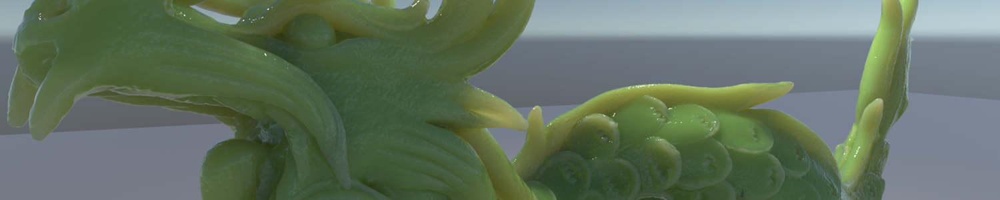

Path tracing supports subsurface scattering (SSS), using a random walk approach. To use it, enable path tracing and set up SSS in the same way as you would for HDRP materials. For information on SSS in HDRP, see [subsurface scattering](skin-and-diffusive-surfaces-subsurface-scattering.md).

### Path-traced fog

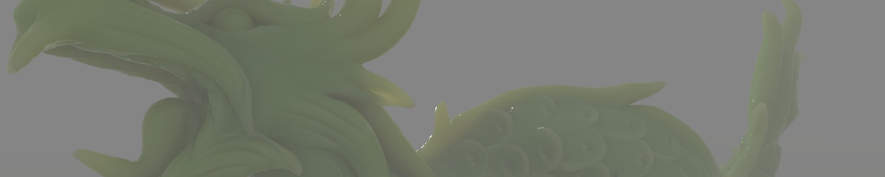

Path tracing in HDRP supports anisotropic fog absorption. To use this feature enable path tracing and set up fog in HDRP. For information, refer to [fog](fog.md).

### Path-traced decals

Path tracing works with [decals](decals.md). For more information, refer to [Understand path tracing](path-tracing-understand.md).

### Materials support

Path tracing can render the following rasterization engine [Materials](#Material):

- Lit
- Layered Lit
- Unlit
- Stacklit
- Fabric
- AxF

When you enable path tracing, objects that use non-HDRP Materials won't appear in the final image.

### Denoising support

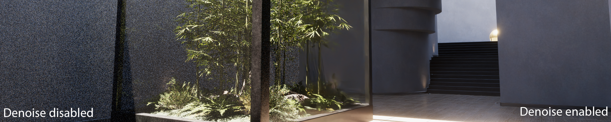

HDRP supports denoising for frames that use path tracing. You can choose from the following denoising libraries:
- Optix Denoiser.
- Intel Open Image Denoise.

## Tools

### Color checker

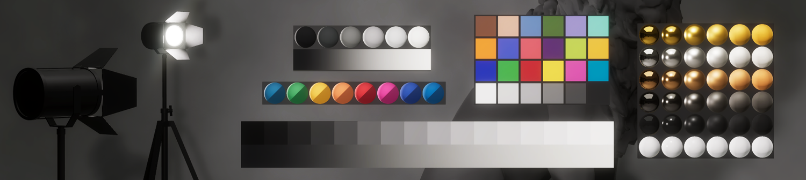

Use the Color Checker tool to check the calibration of lighting and post processing. To open the color checker tool, go to **GameObject** > **Rendering** > **Color Checker Tool**. HDRP doesn't save any changes you make in the color checker.

### Light placement tool

Use the Light Placement Tool to look through a light and use the camera movement controls to move the light around the scene.
To enter this mode select a light GameObject and select the Light Placement Tool button in the Tools Panel. For more information, refer to [Light placement tool](lights-placement-tool.md)

### LookDev

The LookDev is a viewer that allows you to import and display Assets in a consistent lighting environment. Use the LookDev window to validate outsourced Assets or to showcase your own created Asset with HDRP. For more information on the LookDev, including a description of how to use it, see the [LookDev documentation](test-and-debug-materials-in-different-lighting-conditions-look-dev.md).

### Render Pipeline Wizard

To help you set up HDRP, HDRP provides the Render Pipeline Wizard. Use the wizard to fix configuration issues with a single button click, and create a template Scene that's already configured with default Scene settings. For more information on the Render Pipeline Wizard, including a description of how to use it, see the [Render Pipeline Wizard documentation](Render-Pipeline-Wizard.md).

### Rendering Debugger

The Rendering Debugger contains debugging and visualization tools to help you to understand and solve any issues. For more information on the Rendering Debugger, including a description of how to use it, see the [Rendering Debugger documentation](rendering-debugger-window-reference.md).

#### Debug modes

HDRP includes debug modes to help you debug your assets, your lighting, and your scene.

##### Material debug view

Use the Material view to inspect a material's properties, attributes, and Gbuffer information.

##### Lighting debug view

To help you to debug lighting in your Scene, HDRP includes various lighting debug view modes that allow you to separate the various components of the light into multiple parts. These debug modes are also available in the [AOV](AOVs.md) API to allow recorders to export them:

- Diffuse
- Specular
- Direct diffuse
- Direct specular
- Indirect diffuse
- Reflection
- Refraction
- Screen-space lighting effects

##### Rendering Layer Mask debug mode

HDRP includes a [Rendering Layer](Rendering-Layers.md) debug mode that displays the Rendering Layer Mask of each GameObject or highlights GameObjects that match the Rendering Layer Mask of a specific Light.

For more information, see the Lighting panel section in the [Rendering Debugger](rendering-debugger-window-reference.md).

##### Volume debug mode

The [Rendering Debugger](rendering-debugger-window-reference.md) has a Volume panel that you can use to visualize the Volume components that affect a specific Camera.

For each Volume that contributes to the final interpolated value, the Volume panel shows the value of each property and whether it's overridden. It also calculates the Volume's influence percentage using the Volume's weight and blend distance.

For more information, see the Volume panel section in the [Rendering Debugger](rendering-debugger-window-reference.md#VolumePanel).

##### Quad Overdraw and Vertex Density

This debug tool is made of two parts:

- Quad Overdraw: This highlights GPU quads running multiple fragment shaders caused by small or thin triangles.
- Vertex Density: This displays pixels running multiple vertex shaders.

This is useful for Meshes that are far away or highly detailed. This debug tool can help you find GameObjects in your scene that may require LODs. This mode isn't currently supported on Metal.

##### Color monitors debug modes

HDRP 14 includes a set of industry-standard color monitors that you can use to control the overall look and exposure of a scene. These include a waveform view and parade view to visualize the distribution of luma information in the scene and a vectorscope view to visualize the overall range of hue and saturation in the image.

### MatCap mode

In MatCap mode, HDRP replaces the functionality of the Scene view's Lighting button with a material capture view (MatCap). This mode is particularly useful to navigate and get a sense of the Scene without setting up the Scene lighting. For more information on the MatCap mode, including a description of how to use it, see [MatCap mode](debug-materials-and-shaders-matcap.md)

## Programming

### Material architecture

HDRP supports forward and deferred Materials. Deferred Materials are more efficient than Forward Materials, but have fewer properties.

HDRP's Material architecture allows you to add your own forward Materials and includes a list of rules you must follow to compile your Material in HDRP.

### Material Scripting API

HDRP provides an API you can use to [modify materials from script](modify-materials-at-runtime.md). You can find a list of available methods in the [Scripting API documentation](xref:UnityEngine.Rendering.HighDefinition.HDMaterial) that support a common set of operations. You can perform the required modifications on the material, then call [HDMaterial.ValidateMaterial](xref:UnityEngine.Rendering.HighDefinition.HDMaterial) to set up the required keywords. 

### Lighting architecture

HDRP uses a hybrid tile and cluster renderer for [forward and deferred rendering](Forward-And-Deferred-Rendering.md) of opaque and transparent GameObjects. This creates a local light list to allow HDRP to render a high number of Lights. Use the forward renderer to light more complex Materials, such as those that use subsurface scattering or are anisotropic. Use the deferred renderer to increase the processing speed of lighting for common Materials, such as standard Lit or Unlit Materials. For more information on HDRP's lighting architecture, including an explanation of tile and cluster rendering, see the [lighting pipeline documentation](https://docs.unity3d.com/Manual/BestPracticeLightingPipelines.html).

#### Light count limit

HDRP has a maximum limit on the number of lights a single pixel can get influence from. You can change this limit with a setting in `ShaderConfig.cs` called `FPTLMaxLightCount`. To increase the `FPTLMaxLightCount` value, generate a new Shader config project. To see how to create a new Shader config project, refer to [HDRP-Config-Package](configure-a-project-using-the-hdrp-config-package.md).

### Lights Scripting API

HDRP includes API in the [HDAdditionalLightData](https://docs.unity3d.com/Packages/com.unity.render-pipelines.high-definition@latest?subfolder=/api/UnityEngine.Rendering.HighDefinition.HDAdditionalLightData.html) class that you can use to modify lights and use specific features like [Physical Light Units](Physical-Light-Units.md).

Use this API makes to control light settings in a script, and access properties that only exist in HDRP in the [Light component](https://docs.unity3d.com/ScriptReference/Light.html).

### Control on Shadow Update

HDRP provides an API you can use to make a light update its shadow maps. To do this, set the shadow map **Update Mode** to **OnDemand** and call `RequestShadowMapRendering()` in the `RequestShadowMapRendering` class.

### Render Graph

Internally, HDRP uses the Render Graph API to describe its render loop. This allows the HDRP to optimize how much GPU memory it uses, and cull out unused passes depending on the Camera's [Frame Settings](Frame-Settings.md).

#### Dynamic Renderer List Culling

HDRP can use the Render Graph system to cull out passes when they depend on an empty rendering object list. For example, the distortion pass can be removed if no object generating distortion are visible within the camera frustum. However, this particular type of pass culling can create unwanted dependency between the main thread and the culling jobs which can in turn reduce CPU performance. For this reason, this optimization is disabled by default and needs to be considered on a case by case basis depending on each game specificities.
You can enable it in the Miscellaneous section of the [HDRP Graphics settings window](Default-Settings-Window.md).

### Volume System API

To modify volumes and component properties in code, use the [Volume System API](Volumes-API.md).

