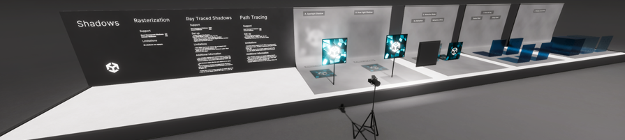
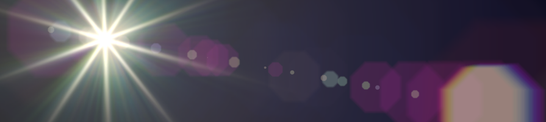
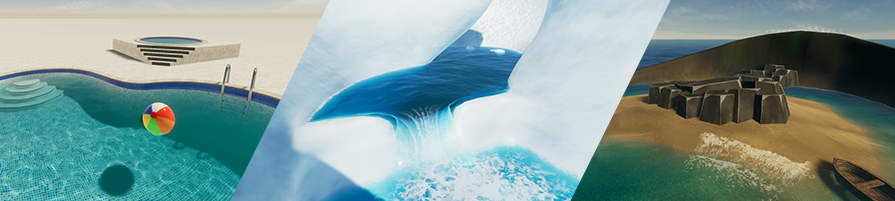
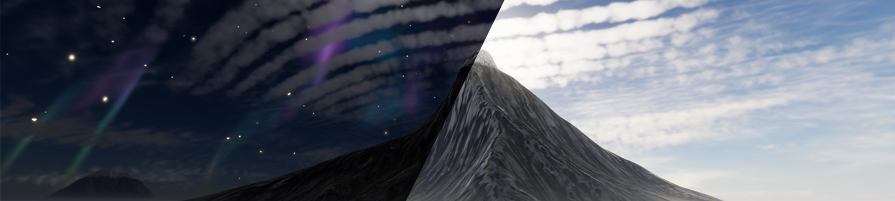

# HDRP Sample Content

The High Definition Render Pipeline (HDRP) comes with a set of Samples to help you get started.

A Sample is a set of Assets that you can import into your Project and use as a base to build upon or learn how to use a feature.

To find these Samples:

1. Go to **Window** > **Package Manager**, and select **High Definition RP** from the package list.
2. In the main window that shows the package's details, find the **Samples** section.
3. To import a Sample into your Project, click the **Import into Project** button. This creates a **Samples** folder in your Project and imports the Sample you selected into it. This is also where Unity imports any future Samples into.

## Additional Post-Processing Data

Additional Post-Processing Data gives you access to Textures you can use with post-processing effects. It provides:

- Lens Dirt Textures (designed for use in [Bloom](Post-Processing-Bloom.md)).
- Spectral Look-up Textures (designed for use in [Chromatic Aberrations](Post-Processing-Chromatic-Aberration.md)).
- [Look-Up Textures](Authoring-LUTs.md).

## Procedural Sky

The Procedural Skyis a deprecated sky type from older versions of HDRP which you can use for compatibility. This Sample also includes an example of how to create a custom sky in your Project that is compatible with HDRP's [Volume framework](understand-volumes.md). HDRP will remove the Procedural Sky in a future version because it behaves incorrectly with HDRP's physically based light units.

## Particle System shader samples

This Sample includes various examples of lit and unlit particle effects.

## Material samples

This Sample includes various examples of Materials. It includes Materials that use the [Lit Shader](lit-material.md), [Fabric Master Stack](fabric-master-stack-reference.md), [Hair Master Stack](hair-master-stack-reference.md), [Eye Shader](eye-master-stack-reference.md) and [Decal Master Stack](decal-master-stack-reference.md). The included Materials use effects such as subsurface scattering, displacement, and anisotropy. The **MaterialSamples** Scene requires Text Mesh Pro to display the text explanations.

The Fabric, Hair and Eye Master Nodes usually require various work from artists inside the Shader Graph and the Samples are a good head start.

In the **Eye** Scene, the eye examples use a carefully designed mesh with a particular UV setup at a specific import scale factor. If you want to produce eyes of similar quality, open the eye mesh in 3D modelling software to see how the mesh is constructed and the UVs are setup.

## Transparent samples

In the Transparency scene, the examples contain information on how to setup properly transparents in your projects using different rendering methods (Rasterization, Ray Tracing, Path Tracing).
To take advantage of all the content of this section, a GPU that supports [Ray Tracing](Ray-Tracing-Getting-Started.md) is needed.

## Lens Flare samples

The [Lens Flare](shared/lens-flare/lens-flare-component.md) samples include the following examples that you can use in your project:
- Lens Flare Assets.
- Lens Flare Textures.
- A scene you can use to preview Lens Flare Assets.
- A scene to showcases the use of Lens Flares with interior lighting.
- A scene to showcases the use of Lens Flares with a directional light.

## Volumetric samples

The volumetric samples include a scene that contains multiple examples of [volumetric fog](create-a-local-fog-effect.md). This scene includes the following:

- 3D textures.
- Procedural 3D noise subgraphs.
- Fog Volume Shader Graph examples.

## Fullscreen samples

This sample includes examples on how to create a [Fullscreen Shader](create-a-fullscreen-material.md) and use it with a Custom Pass, Custom Post Process and Custom Render Target. The sample scene includes prefabs for the following effects:

- Custom Pass: Edge Detection, Sobel Filter, Object Highlight, Night Vision, Speed Lines.
- Custom Render Targets: Dynamic Custom HDRi for Night Sky, Animated Water Droplets.
- Custom Post Process: Colorblindness Filter.

## Water samples

The Water samples contain the following scenes you can use to learn about HDRP's [Water](water.md) features: 

- Pool: Demonstrates ripples and buoyancy.
- Glacier: Demonstrates current, water deformers, floating objects, and a water mask.
- Island: Demonstrates waves, foam, and the water excluder.
- Rain: Demonstrates how to add pertubations to the normals using shader graph.
- Waterline: Demonstrates how to override rendering of the waterline using a [Custom Pass](Custom-Pass.md).

## Environment samples

This sample puts multiple environment effects together in the same scene with different lighting conditions.
The scene includes examples focusing on the following effects:
- Volumetric Clouds: Demonstrates simple, advanced and manual mode.
- Lens Flare: How to update SRP Lens Flares data at runtime.
- Night Sky: How to add stars and northern lights.
- Time Of Day: Full 24h cycle with sun, moon and proper shadow map swapping.
- Celestial Bodies: Includes the moon with automated or sun-position-dependent moon phases.
- Customizable PBR Sky: Allows the night sky's appearance customization using the shader graph, with textures from NASA or other sources.
- Atmospheric Scattering: Replaces volumetric fog for distant coloration, integrated directly into the PBR Sky.
- Aerosol Parameters: Uses existing parameters in the PBR Sky, requiring no additional setup.
- Ozone Light Scattering: Accounts for the ozone layer's density at the camera's altitude, improving visual fidelity.
