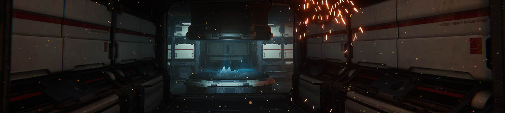

# HDRP Sample Projects

To explore more complex usages of the High Definition Render Pipeline (HDRP), you have access to several fully interactive Unity Projects.

These projects are hosted on Unity Technology's GitHub.

When you clone the Project's repository, make sure to use git or a git client. This is because if you use the Green button on the GitHub website, it does not download all the Assets.

## Fontainebleau

https://github.com/Unity-Technologies/FontainebleauDemo

This Project demonstrates how to use Photogrammetry to create game ready Assets. From Unity 2020.1, Fontainebleau will no longer receive updates; Unity 2019.4 is the last supported version.

Graphics Features used:

* Shader Graph (Wind animation)
* Contact Shadows
* SubSurface Scattering, Hair and Fabric Shaders (third person character)
* Volumetric fog

Relevant  links :

* [Photogrammetry](https://unity.com/solutions/photogrammetry)
  * [Photogrammetry in Unity: Making Real-World Objects into Digital Assets](https://unity.com/blog/engine-platform/photogrammetry-real-world-objects-into-digital-assets)
  * [Siggraph 2017 - Photogrammetry workflow and the tech behind the de-lighting tool](https://www.youtube.com/watch?v=Ny9ZXt_2v2Y)

## Spaceship

https://github.com/Unity-Technologies/SpaceshipDemo

This project demonstrates how to use the Visual Effect Graph to create interactive AAA grade Visual Effects.

Graphics features used:

* Visual Effect Graph
* Volumetric fog
* Area Lights
* Decals
* Screen Space reflections
* GPU Lightmapper

Relevant links :
* [VFX Graph: building visual effects in the Spaceship Demo | Unite Now 2020](https://www.youtube.com/watch?v=Od16mcOzl2M)

## VR Alchemy Lab

https://github.com/Unity-Technologies/VRAlchemyLab

This project demonstrates the following HDRP rendering features in the context of a VR interactive demo:

* Visual Effect Graph
* Shader Graph
* Refraction
* Custom Render Texture
* Custom Pass
* Object Motion Blur
* Decals

## Water scenes

https://github.com/Unity-Technologies/WaterScenes

This project demonstrates the following HDRP water system features:

* Water system
* Visual Effect Graph
* Shader Graph
* Custom Render Texture
* Decals
