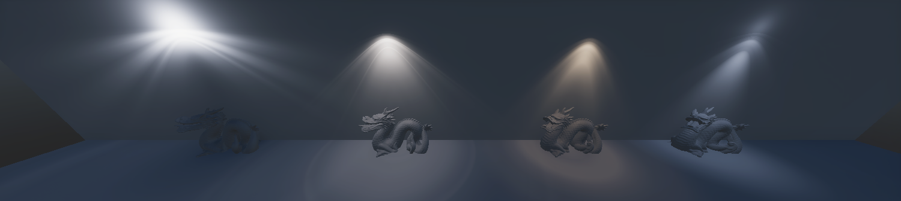

# Understand IES light profiles

IES profiles describe how light spreads for a given direction. They are similar to [light cookies](https://docs.unity3d.com/Manual/Cookies.html) in that they use a multiplier mask to achieve this goal. The Unity IES profile supports Point, Spot (Cone, Pyramid, Box), and Area (Rectangular) [Lights](Light-Component.md).

The main benefit of using IES profiles over cookies is that light manufacturers provide the profiles. This means that they are physically accurate to the real-world light they represent and also artists do not need to dedicate time authoring them.

You can mix the IES profile with cookies and even use the profile and cookie mix for [light map baking](https://docs.unity3d.com/Manual/LightMode-Baked.html).

## Using IES profiles

In Unity, when you import an IES profile into the editor, the [importer](IES-Importer.md) automatically creates a [Light](Light-Component.md) Prefab. The Prefab includes the IES profile and sets the correct light intensity. In order to have a physically correct light in your scene, drag the Prefab into the Scene view or Hierarchy, then tweak the temperature color.

For information on the IES profile importer, see the [IES importer documentation](IES-Importer.md).

## IES profile providers

There are many providers you can use to source IES profiles. Real-world light manufacturers provide IES profiles to match the physical lights they produce. Also, some lighting artists create and share IES profiles.

**Real-world manufacturers**

- [Philips](https://www.usa.lighting.philips.com/support/support/literature/photometric-data)
- [Lithonia Lighting](https://lithonia.acuitybrands.com/resources/technical-downloads/photometricdownloads)
- [Efficient Lighting Systems](http://elslighting.com.au/downloads/ies-files/)
- [Atlas](https://www.atlaslightingproducts.com/ies-files)
- [Erco](https://www.erco.com/download/en)
- [Lamp](https://www.lamp.es/en/products_1791?pd-type=indoor)
- [Osram](https://www.osram.com/cb/)

**Artist sources**

- [Renderman](https://renderman.pixar.com/ies-profiles)
