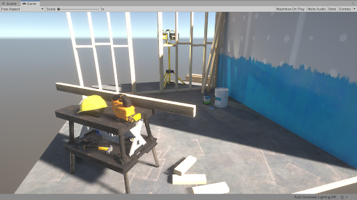
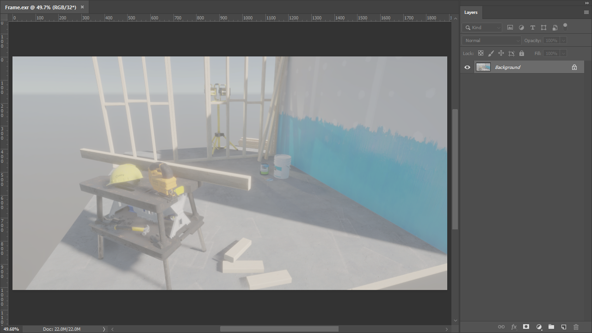
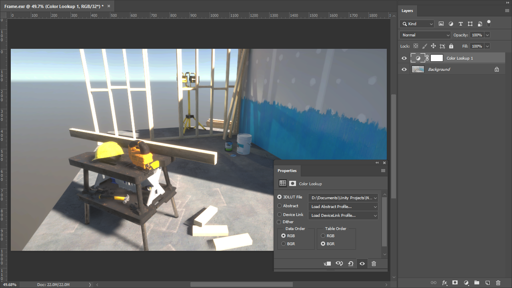
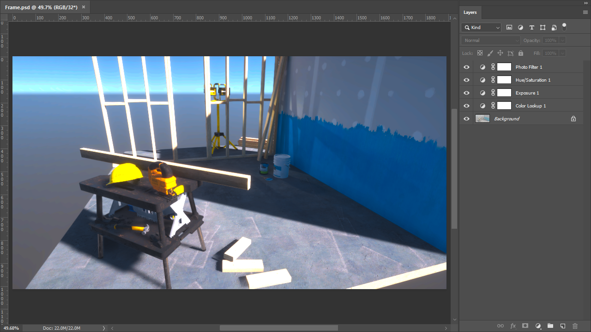

# Create an LUT in Adobe Photoshop

The following process uses Photoshop, but you can apply it to other digital content creation tools such as [DaVinci Resolve](LUT-Authoring-Resolve.md) or Nuke.

## Step 1: Set up the HDRP Asset

Decide on the lookup texture (LUT) size to use for the Project, and set it in your Project's [HDRP Asset](HDRP-Asset.md). To set the LUT size, use the HDRP Asset’s **Grading LUT Size** property. To find this property:

1. Open your HDRP Asset in the Inspector window.
2. Go to **Post-processing** > **Grading LUT Size**

This is a fixed size; if you change it later, you need to rebake all your LUTs. A size of **32** provides enough precision for real-time use.

## Step 2: Render the Camera view to an EXR file

Export the current [Camera](hdrp-camera-component-reference.md)'s view to a log-encoded EXR file. To do this:

1. In the Scene view or Hierarchy, select a GameObject that contains a Camera component.
2. Select **Edit** > **Rendering** > **Render Selected HDRP Camera to Log EXR** **(**or press **Ctrl+Shift+Alt+E)**.
3. Save the EXR file.

After you export the EXR file, transform the data from the format that Unity uses (Alexa LogC El.1000) to Linear RGB space, so that external software can use it. To do this, HDRP provides a set of ready-to-use transform LUTs. To get them:

1. Open the Package Manager window (menu: **Window** > **Package Management** > **Package Manager**).
2. Select **High Definition RP** from the list of packages on the left.
3. In the **Samples** section, select **Import into Project** next to **Additional Post-processing Data**.
4. This imports the LUTs into Assets/HDRP Sample Content/Post-processing/Cube LUTs/.

## Step 3: Set up the EXR file in Photoshop

Import the EXR file into Photoshop. Because it's a raw log-encoded file, it appears washed-out.

Add a non-destructive **Color Lookup** adjustment layer to your image (menu: **Layer** > **New Adjustment Layer** > **Color Lookup…**). Then, in the new layer's **Properties**:

- Set **Data Order** to **RGB**.
- Set **Table Order** to **BGR**.
- In the **3DLUT File** drop-down, select **Load 3D LUT…** and select the Unity Log To Linear file to transform the LUT to a usable color space. This is in your Unity Project folder at Assets/HDRP Sample Content/Post-processing/Cube LUTs/.

## Step 4: Apply color grading

You can now start grading your image. Make sure you only do global color operations through the use of non-destructive adjustment layers. LUTs can't store local operators or any filters that affect neighboring pixels (such as blur), so these create visual artifacts. Place all the adjustment layers on top of the **Color Lookup** layer, unless you intend to grade directly on the Log input.

## Step 5: Export your work as a CUBE file

When you finish grading, export your work as a CUBE file. To do this in Photoshop:

1. Select **File** > **Export** > **Color Lookup Tables** (if you’re using another digital content creation program, see its documentation to learn how to do this).
2. Set the **Grid Point** property to the same value as the **Grading LUT Size** in your Project's [HDRP Asset](HDRP-Asset.md).
3. Save the CUBE file in your Unity Project's Assets folder.

## Step 6: Import and use the CUBE file in your Scene

Unity automatically interprets the CUBE file as a usable Texture3D Asset. You can use this CUBE file in a **Tonemapping** override inside a Volume. To do this:

1. In the Scene or Hierarchy view, select a GameObject that contains a Volume component, and view it in the Inspector.
2. In the Inspector, select **Add Override** > **Post-processing** and choose **Tonemapping**.
3. In the Inspector for **Tonemapping**, enable **Mode** and set it to **External**.
4. Assign your CUBE Texture to the **Lookup Texture** property.
5. Change the **Contribution** to set how much the **Lookup Texture** contributes to the Scene.

You can continue to color grade in Photoshop and override the previously saved CUBE file. Unity automatically updates the grading in the Scene with your changes.
