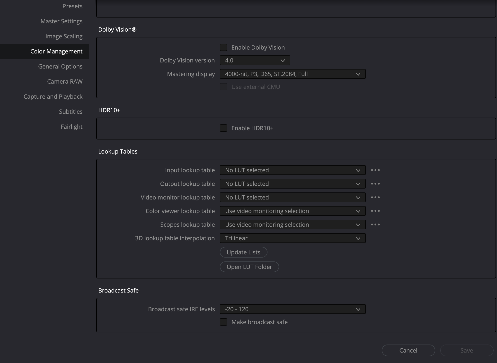
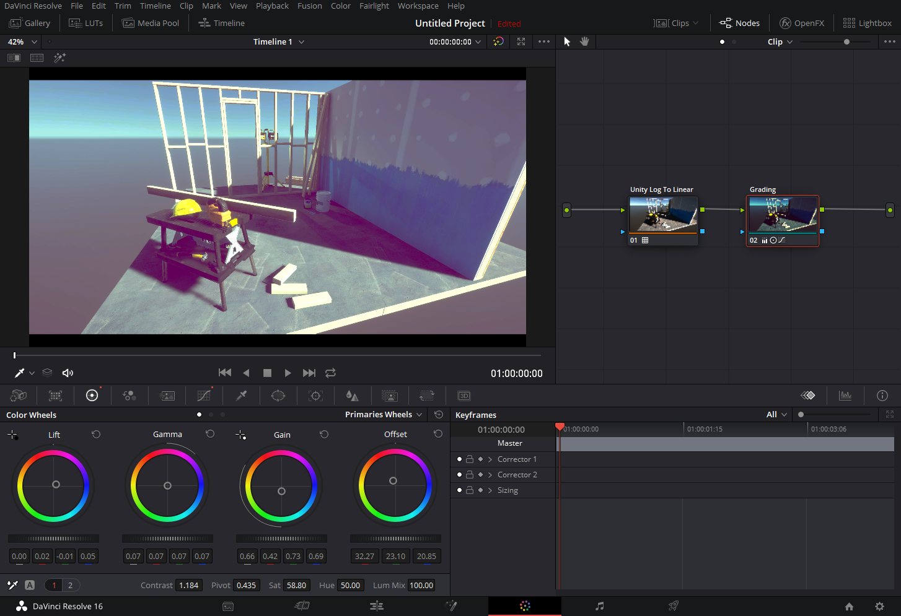
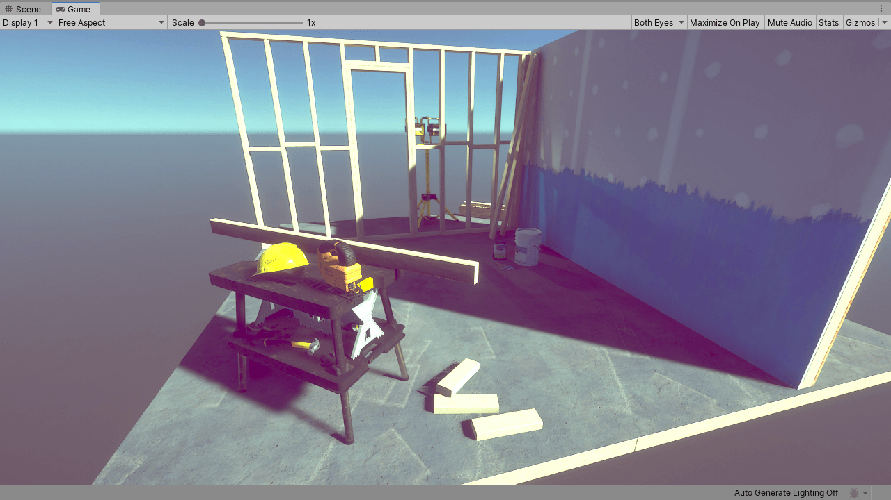

# Create an LUT in DaVinci Resolve

The following process uses DaVinci Resolve, but you can apply it to other digital content creation tools such as [Photoshop](LUT-Authoring-Photoshop.md) or Nuke.

## Step 1: Set up the HDRP Asset

Decide on the lookup texture (LUT) size to use for the Project, and set it in your Project's [HDRP Asset](HDRP-Asset.md). To set the LUT size, use the HDRP Asset’s **Grading LUT Size** property. To find this property:

1. Open your HDRP Asset in the Inspector window.
2. Go to **Post-processing** > **Grading LUT Size**

Resolve only exports LUTs of size 33 so set **Grading LUT Size** to **33** for it to work correctly.

## Step 2: Render the Camera view to an EXR file

Export the current [Camera](hdrp-camera-component-reference.md)'s view to a log-encoded EXR file. To do this:

1. In the Scene view or Hierarchy, select a GameObject that contains a Camera component.
2. Select **Edit** > **Rendering** > **Render Selected HDRP Camera to Log EXR** **(**or press **Ctrl+Shift+Alt+E)**.
3. Save the EXR file.

After you export the EXR file, transform the data from the format that Unity uses (Alexa LogC El.1000) to Linear RGB space, so that external software can use it. To do this, HDRP provides a set of ready-to-use transform LUTs. To get them:

1. Open the Package Manager window (menu: **Window > Package Manager**).
2. Select **High Definition RP** from the list of packages on the left.
3. In the **Samples** section, select **Import into Project** next to **Additional Post-processing Data**.
4. This imports the LUTs into Assets/HDRP Sample Content/Post-processing/Cube LUTs/.

## Step 3: Setting up Resolve

Before you can start color grading in Resolve, you need to set up Resolve to work with the EXR file from Unity. To do this:

1. Create an empty project in Resolve.
2. Open **File** > **Project Settings** and go to the **Color Management** panel.
3. In the **Lookup Table** section, select **Open Lut Folder**. This opens your platform's file explorer at the location that stores LUTs for Resolve.
4. In the file explorer, create a new **Unity** folder and copy all the previously imported LUTs you exported from Unity (see **Step 2**) into it.
5. In Resolve, select **Update Lists**.
6. Set the **3D Video Monitor Lookup Table** to **Linear to sRGB r1**.

**Note**: You only need to do step 1 to 5 once for Resolve in general, and step 6 per-project.

Now import the EXR into Resolve and apply the **Unity Log To Linear r1** LUT to it. To apply the LUT:

1. Right-click on the EXR file in Resolve.
2. In the context menu, select **3D Lut**.
3. Select the **Unity Log To Linear r1** LUT.

## Step 4: Apply color grading

You can now start grading your image. Make sure you only do global color operations because LUTs can't store local operators or any filters that affect neighboring pixels (such as blur or sharpen).

## Step 5: Export your work as a CUBE file

When you finish grading, export your work as a CUBE file. To do this in Resolve:

1. Right-click on the graded clip.
2. Select **Generate 3D LUT (CUBE)** in the menu.
3. Save the CUBE file in your Unity Project's Assets folder.

## Step 6: Import and use the CUBE file in your Scene

Unity automatically interprets the CUBE file as a usable Texture3D Asset. You can use this CUBE file in a **Tonemapping** override inside a Volume. To do this:

1. In the Scene or Hierarchy view, select a GameObject that contains a Volume component, and view it in the Inspector.
2. In the Inspector, select **Add Override** > **Post-processing** and choose **Tonemapping**.
3. In the Inspector for **Tonemapping**, enable **Mode** and set it to **External**.
4. Assign your CUBE Texture to the **Lookup Texture** property.
5. Change the **Contribution** to set how much the **Lookup Texture** contributes to the Scene.

You can continue to color grade in Resolve and override the previously saved CUBE file. Unity automatically updates the grading in the Scene with your changes.
