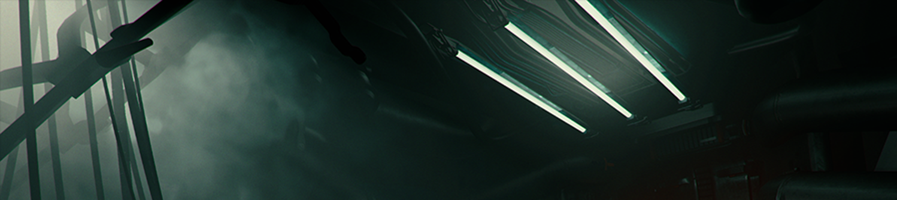

# Create and configure light sources

Use the Light component to create light sources in your [Scene](https://docs.unity3d.com/Manual/CreatingScenes.html). The Light component controls the shape, color, and intensity of the light. It also controls whether or not the Light casts shadows in your Scene, and more advanced settings.

## Create Lights

There are two ways to add Lights to your Scene. You can create a new Light [GameObject](https://docs.unity3d.com/Manual/class-GameObject.html), or you can add a Light component to an existing GameObject.

To create a new Light GameObject:

1. In the Unity Editor, go to **GameObject > Light**
2. Select the Light type you want to add.

Unity creates a new GameObject and attaches a Light component, and another High Definition Render Pipeline (HDRP) component: **HD Additional Light Data**. Unity places the new Light GameObject into your Scene, centered on your current view in the Scene view.

To add a Light component to an existing GameObject:

1. Select the GameObject you want to add a Light.
2.  In the Inspector, click **Add Component**.
3. Go to the **Rendering** section, and click **Light**. This creates a new Light source and attaches it to the currently selected GameObject. It also adds the **HD Additional Light Data** HDRP component.

Alternatively, you can search for "Light" in the **Add Component** window, then click **Light** to add the Light component.

## Configure Lights

To configure the properties of a Light, select a GameObject in your Scene with a Light component attached. See the Light’s properties in the Inspector window.

HDRP includes multiple types of Light. Although HDRP Lights share many properties, each one has its own unique behavior and set of properties. To learn about light component properties, refer to [Light component reference](reference-light-component.md).

For more detailed information on how to configure realistic light fixtures, refer to [Create High-Quality Light Fixtures in Unity](https://pydonzallaz.files.wordpress.com/2019/02/create-high-quality-light-fixtures-in-unity.pdf). For general guidance on light intensities, refer to [Physical light units](Physical-Light-Units.md#light-intensities).

### Animation

To make a Light work with the **Animation window**, when you click on the **Add Property** button, you need to use the properties inside the **HD Additional Light Data** component and not inside the Light component itself. If you edit the properties inside the Light component, this modifies the built-in light values, which HDRP doesn't support. Alternatively, you can use the record button and modify the values directly inside the Inspector.

### Real-time light cookies

HDRP allows you to use a RenderTexture as a light cookie. However, for the sake of performance, if you make any changes to the RenderTexture, HDRP doesn't automatically update the cookie atlas. To notify the system that the RenderTexture content has changed and so make the system upload the change to the cookie atlas, call `IncrementUpdateCount()` on the RenderTexture. If you don't do this, the system doesn't update the cookie.

## Preset
When using a Preset of a Light Component, only a subset of properties are supported. Unsupported properties are hidden.
