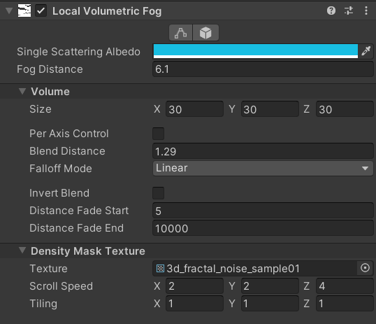
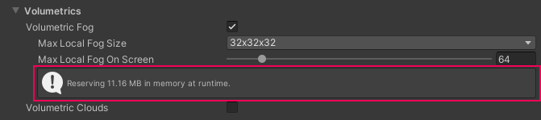

## Local Volumetric Fog

You may want to have fog effects in your Scene that global fog can not produce by itself. In these cases you can use local fog. To add localized fog, use a Local Volumetric Fog component. Local Volumetric Fog is a an additive Volume of fog represented as an oriented bounding box. By default, fog is constant (homogeneous), but you can alter it by assigning a Density Mask 3D texture to the __Texture__ field under the __Density Mask Texture__ section. Currently, HDRP supports 3D textures at a resolution of 32x32x32.

HDRP voxelizes Local Volumetric Fog to enhance performance. This results in two limitations:

- Local Volumetric Fog does not support volumetric shadowing. If you place Local Volumetric Fog between a Light and a surface, the Volume does not decrease the intensity of light that reaches the surface.
- Local Volumetric Fog is voxelized at a very coarse rate, with typically only 64 or 128 slices along the camera's focal axis. This can cause noticeable aliasing at the boundary of the Volume. You can hide the aliasing by using Local Volumetric Fog in conjunction with some global fog, if possible. You can also use a Density Mask and a non-zero Blend Distance to decrease the hardness of the edge.

To create Local Volumetric Fog, right click in the Hierarchy and select __Volume > Local Volumetric Fog__. Alternatively, you can use the menu bar at the top of the screen and navigate to __GameObject > Volume > Local Volumetric Fog__.

# Properties

| Property                     | Description                                                  |
| :--------------------------- | :----------------------------------------------------------- |
| **Single Scattering Albedo** | Sets the fog color. Volumetric Fog tints lighting as the light scatters to appear this color. It only tints lighting emitted by Lights behind or within the fog. This means that it does not tint lighting that reflects off GameObjects behind or within the fog. Reflected lighting gets dimmer (fades to black) as fog density increases. For example, if you shine a Light at a white wall behind fog with red Single Scattering Albedo, the fog looks red. If you shine a Light at a white wall and view it from the other side of the fog, the fog darkens the light but doesn’t tint it red. |
| **Fog Distance**             | Controls the density at the base of the fog and determines how far you can see through the fog in meters. At this distance, the fog has absorbed and out-scattered 63% of background light. |
| **Size**                     | Controls the dimensions of the Volume.                       |
| **Per Axis Control**         | Enable this to control blend distance per axis instead of globally. |
| **Blend Distance**           | Blend Distance creates a fade from the fog level in the Volume to the fog level outside it.  This value indicates the absolute distance from the edge of the Volume bounds, defined by the Size property, where the fade starts. Unity clamps this value between 0 and half of the lowest axis value in the Size property. If you use the **Normal** tab, you can alter a single float value named Blend Distance, which gives a uniform fade in every direction. If you open the **Advanced** tab, you can use two fades per axis, one for each direction. For example, on the X-axis you could have one for left-to-right and one for right-to-left. A value of 0 hides the fade, and a value of 1 creates a fade. |
| **Falloff Mode**             | Controls the falloff function applied to the blending of **Blend Distance**. By default the falloff is linear but you can change it to exponential for a more realistic look. |
| **Invert Blend**             | Reverses the direction of the fade. Setting the Blend Distances on each axis to its maximum possible value preserves the fog at the center of the Volume and fades the edges. Inverting the blend fades the center and preserves the edges instead. |
| **Distance Fade Start**      | Distance from the camera at which the Local Volumetric Fog starts to fade out. This is useful when optimizing a scene with a lot of Local Volumetric Fog and making the more distant ones disappear |
| **Distance Fade End**        | Distance from the camera at which the Local Volumetric Fog has completely faded out. This is useful when optimizing a scene with a lot of Local Volumetric Fog and making the more distant ones disappear |
| **Density Mask Texture**     | Specifies a 3D texture mapped to the interior of the Volume. Local Volumetric Fog only uses the RGB channels of the texture for the fog color and A for the fog density multiplier. A value of 0 in the Texture alpha channel results in a Volume of 0 density, and the value of 1 results in the original constant (homogeneous) volume. |
| **Scroll Speed**             | Specifies the speed (per-axis) at which the Local Volumetric Fog scrolls the texture. If you set every axis to 0, the Local Volumetric Fog does not scroll the texture and the fog is static. |
| **Tiling**                   | Specifies the per-axis tiling rate of the texture. For example, setting the x-axis component to 2 means that the texture repeats 2 times on the x-axis within the interior of the volume. |

## Related Settings in the HDRP Asset

The [HDRP Asset](HDRP-Asset.md) contains the following settings that relate to Local Volumetric Fog:

| Property   | Description  |
|---|---|
| **Max Local Volumetric Fog Size**  | Controls the maximum resolution you can use for the **Density Mask Texture**. This setting can have a high impact on performance. The information box (highlighted in the image below) describes how much memory HDRP allocates for the Local Volumetric Fog system. |
| **Max Local Volumetric Fog On Screen**  | Controls how many Local Volumetric Fog components can appear on-screen at once. This setting has an impact on performance, especially at high values. |

To change these settings, open the HDRP Asset's **Lighting** section and expand the **Volumetrics** drop down.

## Built in Density Mask Texture

HDRP includes 3D Density Mask Textures with different noise values and shapes that you can use in your scene. To use these Textures, import them from the High Definition RP package samples:

1. Open the Package Manager window (menu: **Window** > **Package Manager**).
2. Find the **High Definition RP** package.
3. Expand the **Samples** drop-down.
4. Find the **Local Volumetric Fog 3D Texture Samples** and click on the **Import** button to the right.

## Creating a Density Mask Texture

1. In the image-editing software of your choice, create an RGBA flipbook texture and [import it as a 3D texture](https://docs.unity3d.com/2020.2/Documentation/Manual/class-Texture3D.html). For example, a texture of size 1024x32 describes a 3D Texture of size 32x32x32 with 32 slices laid out one after another.

2. Open a **Local Volumetric Fog** component and in its __Density Mask Texture__ section assign the 3D Texture you imported to the __Texture__ field .
