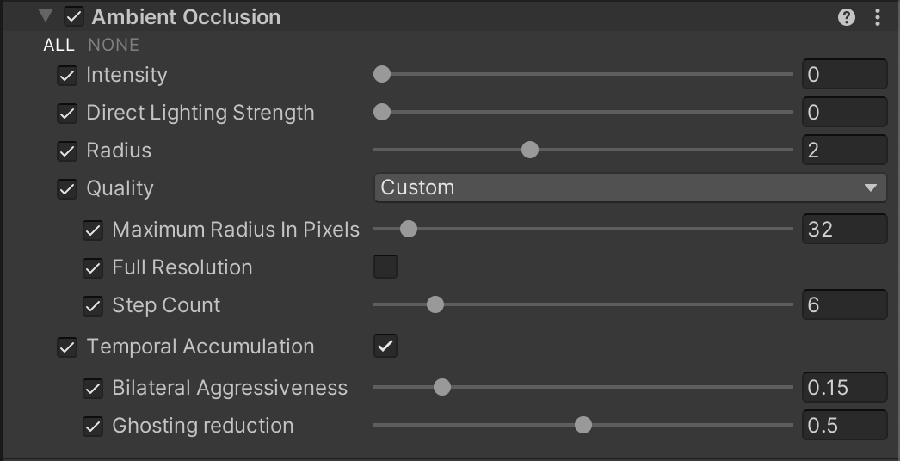
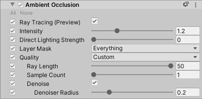

# Ambient Occlusion

The **Ambient Occlusion** override is a real-time, full-screen lighting effect available in the High Definition Render Pipeline (HDRP). This effect approximates [ambient occlusion](https://en.wikipedia.org/wiki/Ambient_occlusion) in the current field of view. It approximates the intensity and position of ambient light on a GameObject’s surface, based on the light in the Scene and the environment around the GameObject. To achieve this, it darkens creases, holes, intersections, and surfaces that are close to one another. In real life, these areas tend to block out, or occlude, ambient light, and therefore appear darker.

For information on how to use a Texture to specify ambient occlusion caused by details present in a GameObject's Material but not on it's surface geometry, see [Ambient Occlusion](Ambient-Occlusion.md).

HDRP implements [ray-traced ambient occlusion](Ray-Traced-Ambient-Occlusion.md) on top of this override. This means that the properties visible in the Inspector change depending on whether or not you enable ray tracing.

## Enabling Ambient Occlusion

[!include]

For this feature:
The property to enable in your HDRP Asset is: **Lighting > Screen Space Ambient Occlusion**.
The property to enable in your Frame Settings is: **Lighting > Screen Space Ambient Occlusion**.

## Using Ambient Occlusion

**Ambient Occlusion** uses the [Volume](Volumes.md) framework, so to enable and modify **Ambient Occlusion** properties, you must add an **Ambient Occlusion** override to a [Volume](Volumes.md) in your Scene. To add **Ambient Occlusion** to a Volume:

1. In the Scene or Hierarchy view, select a GameObject that contains a Volume component to view it in the Inspector.
2. In the Inspector, navigate to **Add Override > Lighting** and click on **Ambient Occlusion**.
   HDRP now applies **Ambient Occlusion** to any Camera this Volume affects.

[!include]

## Properties

[!include]

The properties visible in the Inspector change depending on whether or not you enable ray tracing for this effect:

- To not use ray tracing, disable **Ray Tracing** in the Inspector and see [Screen-space](#screen-space) for the list of properties.
- To use ray tracing, enable **Ray Tracing** in the Inspector and see [Ray-traced](#ray-traced) for the list of properties.

### Screen-space

| **Property**                 | **Description**                                              |
| ---------------------------- | ------------------------------------------------------------ |
| **Ray Tracing** | Indicates whether HDRP uses ray tracing to calculate ambient occlusion. If you enable this property, it completely changes the implementation for this Volume override and exposes a new set of properties to control the ray-traced ambient occlusion. For information on ray-traced ambient occlusion, see [ray-traced ambient occlusion](Ray-Traced-Ambient-Occlusion.md). For information on the properties that control the ray-traced ambient occlusion, see the [Ray-traced](#ray-traced) properties section below. |
| **Intensity**                | Use the slider to guide the intensity of the ambient occlusion. Higher values lead to darker results. HDRP uses this value as an exponent to evaluate a pixel's final value for ambient occlusion. |
| **Direct Lighting Strength** | Use this slider to change how much the occlusion affects direct diffuse lighting. |
| **Radius**                   | Use the slider to set the distance that HDRP searches around a point for occluders. Set a higher value to make ambient occlusion cover larger scale features. Be aware that a higher distance value often produces a lower quality result. **Note:** HDRP clamps the radius in screen space to the value you set in **Maximum Radius in Pixels**. |
| **Quality** | Specifies the preset HDRP uses to populate the values of the following nested properties. The options are: &#8226; **Low**: A preset that emphasizes performance over quality. &#8226; **Medium**: A preset that balances performance and quality. &#8226; **High**: A preset that emphasizes quality over performance. &#8226; **Custom**: Allows you to override each property individually. |
| - **Maximum Radius In Pixels** | Use the slider to set an upper limit, in pixels, for the area that HDRP searches for occluders. The numerical value assumes that you are using a resolution of 1920 x 1080. HDRP scales this value accordingly when you use a different resolution.  Keep this value as low as possible in order to achieve good performance. |
| - **Full Resolution**        | Enable the checkbox to process the ambient occlusion algorithm in full resolution. This improves quality significantly but is a resource-intensive operation and has an impact on performance. Disable the checkbox to process the ambient occlusion algorithm at half the resolution your application runs at. This setting is disabled by default. |
| - **Step Count**             | The number of steps HDRP takes to search for occluders. Increase this value to produce more precise results. This often produces darker results because HDRP finds more occluders. |
| **Temporal Accumulation**    | Indicates whether HDRP accumulates the result of ambient occlusion over time. This leads to better quality, but might result in artifacts like non-instant convergence and ghosting. **Note:** This mode does not produce good results if motion vectors are not available. |
| - **Direction Count**     | Determines how many directions are searched for occlusion, increasing this will impact performance considerably. This property only appears if you disable **Temporal Accumulation**. |
| - **Blur sharpness**     | Determines the sharpness of the non-temporal blur. Higher values preserve sharp features better (with higher risk of noise), lower values have a softer look. This property only appears if you disable **Temporal Accumulation**. |
| - **Bilateral Aggressiveness** | Higher this value, the less lenient with depth differences the spatial filter is and therefore more likely is to reject samples that are at different depth values. Increasing this for could reduce white halos where AO should be around objects. This property only appears if you enable **Temporal Accumulation**. |
| - **Ghosting Reduction**     | Moving this factor closer to 0 will increase the amount of accepted samples during temporal accumulation, increasing the ghosting, but reducing the temporal noise. Moving the value closer to 1 will reduce the ghosting, at expense of more visible temporal noise. This property only appears if you enable **Temporal Accumulation**. |
| - **Bilateral Upsample**     | Enable the checkbox to upsample the low resolution AO through bilateral upsampling. This preserves sharp edges better, however it is slightly more expensive and might result is more visible aliasing. This property only appears if you enable **Temporal Accumulation** and disable **Full Resolution**. |

### Ray-traced

| Property                     | Description                                                  |
| ---------------------------- | ------------------------------------------------------------ |
| **Intensity**                | See **Intensity** in [Screen-space](#screen-space).          |
| **Direct Lighting Strength** | See **Direct Lighting Strenght** in [Screen-space](#screen-space). |
| **LayerMask**                | Defines the layers that HDRP processes this ray-traced effect for. |
| **Quality**                  | Specifies the preset HDRP uses to populate the values of the following nested properties. The options are: &#8226; **Low**: A preset that emphasizes performance over quality. &#8226; **Medium**: A preset that balances performance and quality. &#8226; **High**: A preset that emphasizes quality over performance. &#8226; **Custom**: Allows you to override each property individually. |
| - **Max Ray Length**         | Controls the maximal ray length of the rays that HDRP uses for ray traced ambient occlusion. This allows you to have smaller scale, local, ambient occlusion. |
| - **Sample Count**           | Controls the number of rays that HDRP uses per pixel, per frame. Increasing this value increases execution time linearly. |
| - **Denoise**                | Enables the spatio-temporal filter that HDRP uses to remove noise from the ambient occlusion. |
| - - **Denoiser Radius**      | Controls the radius of the spatio-temporal filter. A higher value reduces noise further. |
| **Occluder Motion Rejection**| When enabled, the occluder's movement should be considered a valid rejection condition. |
| **Receiver Motion Rejection**| When enabled, the receiver's movement should be considered a valid rejection condition. |

## Limitations

### Screen-space ambient occlusion

A screen-space effect only processes what is on the screen at a given point in time. This means that objects outside of the field of view cannot visually occlude objects in the view. You can sometimes see this on the edges of the screen.
When rendering [Reflection Probes](Reflection-Probe.md) screen space ambient occlusion is not supported.
