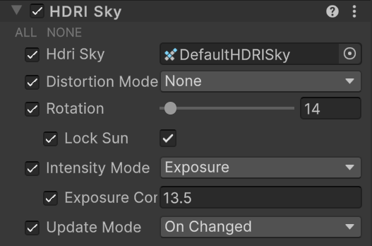

# HDRI Sky

The **HDRI Sky Volume** component override controls settings you can use to set up an HDRI Sky. A High-dynamic-range imaging (HDRI) Sky is a simple sky representation that uses a cubemap texture. With this component, you can define how HDRP updates the indirect lighting the sky generates in the Scene.

Tip: [Unity HDRI Pack](https://assetstore.unity.com/packages/essentials/beta-projects/unity-hdri-pack-72511) is available on the Unity Asset Store and provides 7 pre-converted HDR Cubemaps ready for use within your Project.

## Using HDRI Sky

**HDRI Sky** uses the [Volume](Volumes.md) framework, so to enable and modify **HDRI Sky** properties, you must add an **HDRI Sky** override to a [Volume](Volumes.md) in your Scene. To add **HDRI Sky** to a Volume:

1. In the Scene or Hierarchy view, select a GameObject that contains a Volume component to view it in the Inspector.
2. In the Inspector, go to **Add Override** > **Sky** and select **HDRI Sky**.

After you add an **HDRI Sky** override, you must set the Volume to use **HDRI Sky**. The [Visual Environment](Override-Visual-Environment.md) override controls which type of sky the Volume uses. To set the Volume to use **HDRI Sky**:

1. In the **Visual Environment** override, go to the **Sky** > **Sky Type**
2. Set **Sky Type** to **HDRI Sky**.

HDRP now renders an **HDRI Sky** for any Camera this Volume affects.

[!include]

## Properties

[!include]

<table>
<thead>
  <tr>
    <th><strong>Property</strong></th>
    <th></th>
    <th><strong>Description</strong></th>
  </tr>
</thead>
<tbody>
  <tr>
    <td><strong>HDRI Sky</strong></td>
    <td></td>
    <td>Assign a HDRI Texture that HDRP uses to render the sky.</td>
  </tr>
  <tr>
    <td><strong>Distortion Mode</strong></td>
    <td></td>
    <td>Use the drop-down to select the method that HDRP uses to calculate the sky distortion. &#8226; <strong>None</strong>: No distortion. &#8226; <strong>Procedural</strong>: HDRP distorts the sky using a uniform wind direction. &#8226; <strong>Flowmap</strong>: HDRP distorts the sky with a user provided flowmap.</td>
  </tr>
  <tr>
    <td></td>
    <td><strong>Orientation</strong></td>
    <td>The orientation of the distortion relative to the X world vector (in degrees). This value can be relative to the <strong>Global Wind Orientation</strong> defined in the <strong>Visual Environment</strong>.</td>
  </tr>
  <tr>
    <td></td>
    <td><strong>Speed</strong></td>
    <td>The speed at which HDRP scrolls the distortion texture. This value can be relative to the <strong>Global Wind Speed</strong> defined in the <strong>Visual Environment</strong>.</td>
  </tr>
  <tr>
    <td></td>
    <td><strong>Flowmap</strong></td>
    <td>Assign a flowmap, in LatLong layout, that HDRP uses to distort UVs when rendering the sky. This property only appears when you select <strong>Flowmap</strong> from the <strong>Distortion Mode</strong> drop-down.</td>
  </tr>
  <tr>
    <td></td>
    <td><strong>Upper Hemisphere Only</strong></td>
    <td>Check the box if the flowmap contains distortion for the sky above the horizon only. This property only appears when you select <strong>Flowmap</strong> from the <strong>Distortion Mode</strong> drop-down.</td>
  </tr>
  <tr>
    <td><strong>Intensity Mode</strong></td>
    <td></td>
    <td>Use the drop-down to select the method that HDRP uses to calculate the sky intensity. &#8226; <strong>Exposure</strong>: HDRP calculates intensity from an exposure value in EV100. &#8226; <strong>Multiplier</strong>: HDRP calculates intensity from a flat multiplier. &#8226; <strong>Lux</strong>: HDRP calculates intensity in terms of a target Lux value.</td>
  </tr>
  <tr>
    <td></td>
    <td><strong>Exposure</strong></td>
    <td>Set the amount of light per unit area that HDRP applies to the HDRI Sky cubemap. This property only appears when you select <strong>Exposure</strong> from the <strong>Intensity Mode</strong> drop-down.</td>
  </tr>
  <tr>
    <td></td>
    <td><strong>Multiplier</strong></td>
    <td>Set the multiplier for HDRP to apply to the Scene as environmental light. HDRP multiplies the environment light in your Scene by this value. This property only appears when you select <strong>Multiplier</strong> from the <strong>Intensity Mode</strong> drop-down.</td>
  <tr>
    <td></td>
    <td><strong>Desired Lux Value</strong></td>
    <td>Set an absolute intensity for the HDR Texture you set in <strong>HDRI Sky</strong>, in <a href="https://docs.unity3d.com/Packages/com.unity.render-pipelines.high-definition@13.1/manual/Physical-Light-Units.html#Lux">Lux</a>. This value represents the light received in a direction perpendicular to the ground. This is similar to the Lux unit you use to represent the Sun, so it's complimentary. This property only appears when you select <strong>Lux</strong> from the <strong>Intensity Mode</strong> drop-down.</td>
  </tr>
  <tr>
    <td></td>
    <td><strong>Upper Hemisphere Lux Value</strong></td>
    <td>Displays the relative intensity, in Lux, for the current HDR texture set in <strong>HDRI Sky</strong>. The final multiplier HDRP applies for intensity is <strong>Desired Lux Value</strong> / <strong>Upper Hemisphere Lux Value</strong>. This field is an informative helper. This property only appears when you select <strong>Lux</strong> from the <strong>Intensity Mode</strong> drop-down.</td>
  </tr>
  <tr>
    <td><strong>Rotation</strong></td>
    <td></td>
    <td>Use the slider to set the angle to rotate the cubemap, in degrees.</td>
  </tr>
  <tr>
    <td><strong>Update Mode</strong></td>
    <td></td>
    <td>Use the drop-down to set the rate at which HDRP updates the sky environment (using Ambient and Reflection Probes). &#8226; <strong>On Changed</strong>: HDRP updates the sky environment when one of the sky properties changes. &#8226; <strong>On Demand</strong>: HDRP waits until you manually call for a sky environment update from a script. &#8226; <strong>Realtime</strong>: HDRP updates the sky environment at regular intervals defined by the Update Period.</td>
  </tr>
  <tr>
    <td></td>
    <td><strong>Update Period</strong></td>
    <td>Set the period (in seconds) for HDRP to update the sky environment. Set the value to 0 if you want HDRP to update the sky environment every frame. This property only appears when you set the <strong>Update Mode</strong> to <strong>Realtime</strong>.</td>
  </tr>
</tbody>
</table>

## Advanced Properties

These properties only appear if you enable [more options](More-Options.md) and then enable **Backplate**.

<table>
<thead>
  <tr>
    <th><strong>Property</strong></th>
    <th></th>
    <th></th>
    <th><strong>Description</strong></th>
  </tr>
</thead>
<tbody>
  <tr>
    <td><strong>Backplate</strong></td>
    <td></td>
    <td></td>
    <td>Indicates whether to project the bottom part of the HDRI onto a plane with various shapes such as a Rectangle, Circle, Ellipse, or Infinite plane.</td>
  </tr>
  <tr>
    <td></td>
    <td><strong>Type</strong></td>
    <td></td>
    <td>Specifies the shape of the backplate.  &#8226; <strong>Disc</strong>: Projects the bottom of the HDRI texture onto a disc.  &#8226; <strong>Rectangle</strong>: rojects the bottom of the HDRI texture onto a rectangle.  &#8226; <strong>Ellipse</strong>: Projects the bottom of the HDRI texture onto an ellipse.  &#8226; <strong>Infinite</strong>: Projects the bottom of the HDRI texture onto an infinite plane.</td>
  </tr>
  <tr>
    <td></td>
    <td><strong>Ground Level</strong></td>
    <td></td>
    <td>The height of the ground level in the scene.</td>
  </tr>
  <tr>
    <td></td>
    <td><strong>Scale</strong></td>
    <td></td>
    <td>The scale of the backplate. HDRP uses the X and Y values of this property to scale the backplate (for Ellipse <strong>X</strong> and <strong>Y</strong> must be different).</td>
  </tr>
  <tr>
    <td></td>
    <td><strong>Projection</strong></td>
    <td></td>
    <td>HDRP uses this number to control the projection of the bottom hemisphere of the HDRI on the backplate. Small projection distance implies higher pixels density with more distortion, large projection distance implies less pixels density with less distortion.</td>
  </tr>
  <tr>
    <td></td>
    <td><strong>Rotation</strong></td>
    <td></td>
    <td>The rotation of the physical backplate.</td>
  </tr>
  <tr>
    <td></td>
    <td><strong>Texture Rotation</strong></td>
    <td></td>
    <td>The rotation of the HDRI texture HDRP projects onto the backplate.</td>
  </tr>
  <tr>
    <td></td>
    <td><strong>Texture Offset</strong></td>
    <td></td>
    <td>The offset value to apply to the texture HDRP projects onto the backplate.</td>
  </tr>
  <tr>
    <td></td>
    <td><strong>Blend Amount</strong></td>
    <td></td>
    <td>The percentage of the transition between the backplate and the background HDRI. <strong>0</strong> means no blending, <strong>25</strong> means the blending starts at the end of the boundary of the backplate, <strong>50</strong> means the blending starts from the middle of the backplate and <strong>100</strong> means the transition starts from the center of the backplate with a smoothstep.</td>
  </tr>
  <tr>
    <td></td>
    <td><strong>Point/Spot Shadow</strong></td>
    <td></td>
    <td>Indicates whether the backplate receives shadows from point/spot <a href="https://docs.unity3d.com/Packages/com.unity.render-pipelines.high-definition@13.1/manual/Light-Component.html">Lights</a>.</td>
  </tr>
  <tr>
    <td></td>
    <td><strong>Directional Shadow</strong></td>
    <td></td>
    <td>Indicates whether the backplate receives shadows from the main directional Light.</td>
  </tr>
  <tr>
    <td></td>
    <td><strong>Area Shadow</strong></td>
    <td></td>
    <td>Indicates whether the backplate receives shadows from area Lights.</td>
  </tr>
  <tr>
    <td></td>
    <td><strong>Shadow Tint</strong></td>
    <td></td>
    <td>Specifies the color to tint shadows cast onto the backplate.</td>
  </tr>
  <tr>
    <td></td>
    <td><strong>Reset Color</strong></td>
    <td></td>
    <td>Resets the saved Shadow Tint for the shadow. HDRP calculates a new default shadow tint when the HDRI changes.</td>
  </tr>
</tbody>
</table>

**Note**: To use ambient occlusion in the backplate, increase the value of the **Direct Lighting Strength** property on the [Ambient Occlusion](Override-Ambient-Occlusion.md) component override. As the backplate doesn't have global illumination, it can only get ambient occlusion from direct lighting.

**Limitation**: The backplate only appears in local reflection probes and it doesn't appear in the default sky reflection. This is because the default sky reflection is a cubemap projected at infinity which is incompatible with how Unity renders the backplate.
