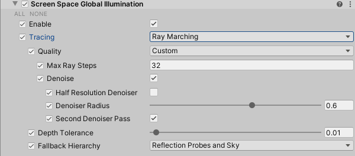
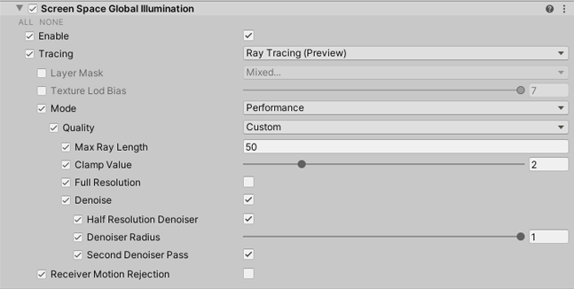

# Screen Space Global Illumination

The **Screen Space Global Illumination** (SSGI) override is a High Definition Render Pipeline (HDRP) feature that uses the depth and color buffer of the screen to calculate diffuse light bounces.

HDRP implements [ray-traced global illumination](Ray-Traced-Global-Illumination.md) (RTGI) on top of this override. This means that the properties visible in the Inspector change depending on whether you enable ray tracing.

SSGI and RTGI replace all [lightmap](https://docs.unity3d.com/Manual/Lightmapping.html) and [Light Probe](https://docs.unity3d.com/Manual/LightProbes.html) data. If you enable this override on a Volume that affects the Camera, Light Probes and the ambient probe stop contributing to lighting for GameObjects.

## Enabling Screen Space Global Illumination
[!include]

To enable SSGI:

1. Open your HDRP Asset in the Inspector.
2. Go to **Lighting** and enable **Screen Space Global Illumination**.
3. Go to **Edit** > **Project Settings** > **Graphics** > **HDRP Global Settings** > **Frame Settings (Default Values)** > **Lighting** and enable **Screen Space Global Illumination**.

## Using Screen Space Global Illumination

HDRP uses the [Volume](Volumes.md) framework to calculate SSGI, so to enable and modify SSGI properties, you must add a **Screen Space Global Illumination** override to a [Volume](Volumes.md) in your Scene. To add **Screen Space Global Illumination** to a Volume:

1. In the Scene or Hierarchy view, select a GameObject that contains a Volume component to view it in the Inspector.
2. In the Inspector, go to **Add Override** > **Lighting** and select **Screen Space Global Illumination**. HDRP now calculates SSGI for any Camera this Volume affects.

[!include]

[!include]

## Properties

[!include]

### Screen-space

<table>
<thead>
  <tr>
    <th><strong>Property</strong></th>
    <th></th>
    <th><strong>Description</strong></th>
  </tr>
</thead>
<tbody>
  <tr>
    <td><strong>Enable </strong></td>
    <td></td>
    <td>Indicates whether HDRP processes SSGI for Cameras in the influence of this effect's Volume.</td>
  </tr>
  <tr>
    <td><strong>Tracing</strong></td>
    <td></td>
    <td>Specifies the method HDRP uses to calculate global illumination. Depending on the option you select, the properties visible in the Inspector change. For more information on what the options do, see <a href="https://docs.unity3d.com/Packages/com.unity.render-pipelines.high-definition@latest/index.html?subfolder=/manual/Override-Screen-Space-GI.html#tracing-modes">Tracing Modes</a>. The options are: • <strong>Ray Marching</strong>: Uses a screen-space ray marching solution to calculate global illumination. For the list of properties this option exposes, see <a href="https://docs.unity3d.com/Packages/com.unity.render-pipelines.high-definition@latest/index.html?subfolder=/manual/Override-Screen-Space-GI.html#screen-space">Screen Space</a>. • <strong>Ray Tracing</strong>: Uses ray tracing to calculate global illumination. For information on ray-traced global illumination, see <a href="https://docs.unity3d.com/Packages/com.unity.render-pipelines.high-definition@latest/index.html?subfolder=/manual/Ray-Traced-Global -Illumination.html">Ray-traced Global Illumination</a>. For the list of properties this option exposes, see <a href="https://docs.unity3d.com/Packages/com.unity.render-pipelines.high-definition@latest/index.html?subfolder=/manual/Override-Screen-Space-GI.html#ray-traced">Ray-traced</a>. • <strong>Mixed</strong>: Uses a combination of ray tracing and ray marching to calculate global illumination. For the list of properties this option exposes, see <a href="https://docs.unity3d.com/Packages/com.unity.render-pipelines.high-definition@latest/index.html?subfolder=/manual/Override-Screen-Space-GI.html#ray-traced">Ray-traced</a>.</td>
  </tr>
  <tr>
    <td><strong>Quality</strong></td>
    <td></td>
    <td>Specifies the overall quality of the effect. The higher the quality, the more resource-intensive the effect is to process.</td>
  </tr>
  <tr>
    <td><strong>Max Ray Steps</strong></td>
    <td></td>
    <td>The number of ray steps to use to calculate SSGI. If you set this to a higher value, the quality of the effect improves, however it's more resource intensive to process.</td>
  </tr>
  <tr>
    <td><strong>Denoise</strong></td>
    <td></td>
    <td>Enables the spatio-temporal filter that HDRP uses to remove noise from the Ray-Traced global illumination.</td>
  </tr>
  <tr>
  <td></td>
    <td><strong>Half Resolution Denoiser</strong></td>
    <td>Enable this feature to evaluate the spatio-temporal filter in half resolution. This decreases the resource intensity of denoising but reduces quality.</td>
  </tr>
  <tr>
  <td></td>
    <td><strong>Denoiser Radius</strong></td>
    <td>Set the radius of the spatio-temporal filter.</td>
  </tr>
  <tr>
  <td></td>
    <td><strong>Second Denoiser Pass</strong></td>
    <td>Enable this feature to process a second denoiser pass. This helps to remove noise from the effect.</td>
  </tr>
  <tr>
    <td><strong>Full Resolution</strong></td>
    <td></td>
    <td>Enable this feature to increase the ray budget to one ray per pixel, per frame. Disable this feature to decrease the ray budget to one ray per four pixels, per frame.</td>
  </tr>
  <tr>
    <td><strong>Depth Tolerance</strong></td>
    <td></td>
    <td>Use the slider to control the tolerance when comparing the depth of the GameObjects on screen and the depth buffer. Because the SSR algorithm can not distinguish thin GameObjects from thick ones, this property helps trace rays behind GameObjects. The algorithm applies this property to every GameObject uniformly.</td>
  </tr>
  <tr>
    <td><strong>Ray Miss</strong></td>
    <td></td>
    <td>Determines what HDRP does when screen space global illumination (SSGI) ray doesn't find an intersection. Choose from one of the following options:  •<strong>Reflection probes</strong>: HDRP uses reflection probes in your scene to calculate the missing SSGI intersection. •<strong>Sky</strong>: HDRP uses the sky defined by the current <a href="https://docs.unity3d.com/Packages/com.unity.render-pipelines.high-definition@latest/index.html?subfolder=/manual/Volumes.html">Volume</a> settings to calculate the missing SSGI intersection. •<strong>Both</strong> : HDRP uses both reflection probes and the sky defined by the current <a href="https://docs.unity3d.com/Packages/com.unity.render-pipelines.high-definition@latest/index.html?subfolder=/manual/Volumes.html">Volume</a> settings to calculate the missing SSGI intersection. •<strong>Nothing</strong>: HDRP doesn't calculate indirect lighting when SSGI doesn't find an intersection.  This property is set to <strong>Both</strong> by default.</td>
  </tr>
</tbody>
</table>

### Ray-traced

<table>
<thead>
  <tr>
    <th><strong>Property</strong></th>
    <th></th>
    <th><strong>Description</strong></th>
  </tr>
</thead>
<tbody>
  <tr>
    <td><strong>Ray Miss</strong></td>
    <td></td>
    <td>Determines what HDRP does when ray-traced global illumination (RTGI) ray doesn't find an intersection. Choose from one of the following options:  •<strong>Reflection probes</strong>: HDRP uses reflection probes in your scene to calculate the last RTGI bounce. •<strong>Sky</strong>: HDRP uses the sky defined by the current <a href="https://docs.unity3d.com/Packages/com.unity.render-pipelines.high-definition@latest/index.html?subfolder=/manual/Volumes.html">Volume</a> settings to calculate the last RTGI bounce. •<strong>Both</strong> : HDRP uses both reflection probes and the sky defined by the current <a href="https://docs.unity3d.com/Packages/com.unity.render-pipelines.high-definition@latest/index.html?subfolder=/manual/Volumes.html">Volume</a> settings to calculate the last RTGI bounce. •<strong>Nothing</strong>: HDRP doesn't calculate indirect lighting when RTGI doesn't find an intersection.  This property is set to <strong>Both</strong> by default.</td>
  </tr>
  <tr>
    <td><strong>Last Bounce</strong></td>
    <td></td>
    <td>Determines what HDRP does when ray-traced global illumination (RTGI) ray lights the last bounce. Choose from one of the following options:  •<strong>Reflection probes</strong>: HDRP uses reflection probes in your scene to calculate the last RTGI bounce. •<strong>Sky</strong>: HDRP uses the sky defined by the current <a href="https://docs.unity3d.com/Packages/com.unity.render-pipelines.high-definition@latest/index.html?subfolder=/manual/Volumes.html">Volume</a> settings to calculate the last RTGI bounce. •<strong>Both</strong> : HDRP uses both reflection probes and the sky defined by the current <a href="https://docs.unity3d.com/Packages/com.unity.render-pipelines.high-definition@latest/index.html?subfolder=/manual/Volumes.html">Volume</a> settings to calculate the last RTGI bounce. •<strong>Nothing</strong>: HDRP doesn't calculate indirect lighting when it evaluates the last bounce.  This property is set to <strong>Both</strong> by default.</td>
  </tr>
  <tr>
    <td><strong>Tracing</strong></td>
    <td></td>
    <td>Specifies the method HDRP uses to calculate global illumination. Depending on the option you select, the properties visible in the Inspector change. For more information on what the options do, see <a href="https://docs.unity3d.com/Packages/com.unity.render-pipelines.high-definition@latest/index.html?subfolder=/manual/Override-Screen-Space-GI.html#tracing-modes">Tracing Modes</a>. The options are: • <strong>Ray Marching</strong>: Uses a screen-space ray marching solution to calculate global illumination. For the list of properties this option exposes, see <a href="https://docs.unity3d.com/Packages/com.unity.render-pipelines.high-definition@latest/index.html?subfolder=/manual/Override-Screen-Space-GI.html#screen-space">Screen Space</a>. • <strong>Ray Tracing</strong>: Uses ray tracing to calculate global illumination. For information on ray-traced reflections, see <a href="https://docs.unity3d.com/Packages/com.unity.render-pipelines.high-definition@latest/index.html?subfolder=/manual/Ray-Traced-Global-Illumination.html">Ray-Traced Global Illumination</a>. For the list of properties this option exposes, see <a href="https://docs.unity3d.com/Packages/com.unity.render-pipelines.high-definition@latest/index.html?subfolder=/manual/Override-Screen-Space-GI.html#ray-traced">Ray-traced</a>. • <strong>Mixed</strong>: Uses a combination of ray tracing and ray marching to calculate global illumination. For the list of properties this option exposes, see <a href="https://docs.unity3d.com/Packages/com.unity.render-pipelines.high-definition@latest/index.html?subfolder=/manual/Override-Screen-Space-GI.html#ray-traced">Ray-traced</a>.</td>
  </tr>
  <tr>
    <td><strong>Layer Mask</strong></td>
    <td></td>
    <td>Defines the layers that HDRP processes this ray-traced effect for.</td>
  </tr>
  <tr>
    <td><strong>Mode</strong></td>
    <td></td>
    <td>Defines if HDRP should evaluate the effect in <strong>Performance</strong> or <strong>Quality</strong> mode. This property only appears if you select set <strong>Supported Ray Tracing Mode</strong> in your HDRP Asset to <strong>Both</strong>.</td>
  </tr>
  <tr>
    <td><strong>Quality</strong></td>
    <td></td>
    <td>Specifies the preset HDRP uses to populate the values of the following nested properties. The options are: • <strong>Low</strong>: A preset that emphasizes performance over quality. • <strong>Medium</strong>: A preset that balances performance and quality. • <strong>High</strong>: A preset that emphasizes quality over performance. • <strong>Custom</strong>: Allows you to override each property individually. This property only appears if you set <strong>Mode</strong> to <strong>Performance</strong>.</td>
  </tr>
  <tr>
    <td><strong>Max Ray Length</strong></td>
    <td></td>
    <td>Controls the maximal length of rays. The higher this value is, the more resource-intensive ray traced global illumination is.</td>
  </tr>
  <tr>
    <td><strong>Clamp Value</strong></td>
    <td></td>
    <td>Set a value to control the threshold that HDRP uses to clamp the pre-exposed value. This reduces the range of values and makes the global illumination more stable to denoise, but reduces quality.</td>
  </tr>
  <tr>
    <td><strong>Full Resolution</strong></td>
    <td></td>
    <td>Enable this feature to increase the ray budget to one ray per pixel, per frame. Disable this feature to decrease the ray budget to one ray per four pixels, per frame. This property only appears if you set <strong>Mode</strong> to <strong>Performance</strong>.</td>
  </tr>
  <tr>
    <td><strong>Sample Count</strong></td>
    <td></td>
    <td>Controls the number of rays per pixel per frame. Increasing this value increases execution time linearly. This property only appears if you set <strong>Mode</strong> to <strong>Quality</strong>.</td>
  </tr>
  <tr>
    <td><strong>Bounce Count</strong></td>
    <td></td>
    <td>Controls the number of bounces that global illumination rays can do. Increasing this value increases execution time exponentially. This property only appears if you set <strong>Mode</strong> to <strong>Quality</strong>.</td>
  </tr>
  <tr>
    <td><strong>Max Mixed Ray Steps</strong></td>
    <td></td>
    <td>Sets the maximum number of iterations that the algorithm can execute before it stops trying to find an intersection with a Mesh. For example, if you set the number of iterations to 1000 and the algorithm only needs 10 to find an intersection, the algorithm terminates after 10 iterations. If you set this value too low, the algorithm may terminate too early and abruptly stop global illumination. This property only appears if you set <strong>Tracing</strong> to <strong>Mixed</strong>.</td>
  </tr>
  <tr>
    <td><strong>Denoise</strong></td>
    <td></td>
    <td>Enable this to enable the spatio-temporal filter that HDRP uses to remove noise from the Ray-Traced global illumination.</td>
  </tr>
  <tr>
    <td></td>
    <td><strong>Half Resolution Denoiser</strong></td>
    <td>Enable this feature to evaluate the spatio-temporal filter in half resolution. This decreases the resource intensity of denoising but reduces quality.</td>
  </tr>
  <tr>
    <td></td>
    <td><strong>Denoiser Radius</strong></td>
    <td>Set the radius of the spatio-temporal filter.</td>
  </tr>
  <tr>
    <td></td>
    <td><strong>Second Denoiser Pass</strong></td>
    <td>Enable this feature to process a second denoiser pass. This helps to remove noise from the effect.</td>
  </tr>
</tbody>
</table>

### Screen-space global illumination Limitation

* SSGI is not compatible with [Reflection Probes](Reflection-Probe.md).
* When you set [Lit Shader mode](Forward-And-Deferred-Rendering.md) to **Deferred** the Ambient Occlusion from Lit Shader will combine with Screen Space Ambient Occlusion and apply to the indirect lighting result where there is no Emissive contribution. This is similar behavior to rendering with Lit Shader mode set to **Forward**. If the Material has an emissive contribution then Ambient Occlusion is set to one.
