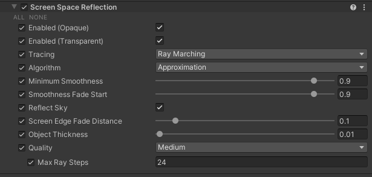
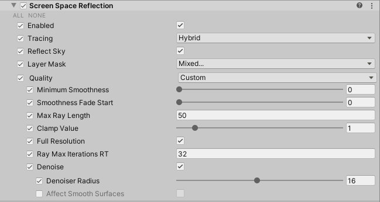
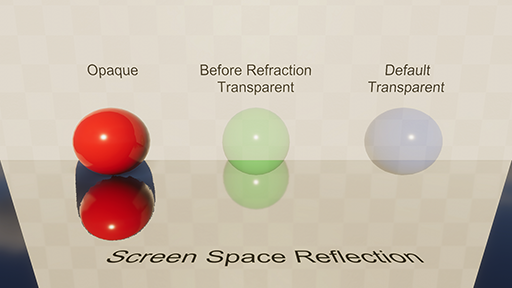

# Screen Space Reflection

The **Screen Space Reflection** (SSR) override is a High Definition Render Pipeline (HDRP) feature that uses the depth and color buffer of the screen to calculate reflections. For information about how SSR works in HDRP, see the [reflection documentation](Reflection-in-HDRP.md#ScreenSpaceReflection).

HDRP implements [ray-traced reflection](Ray-Traced-Reflections.md) on top of this override. This means that the properties visible in the Inspector change depending on whether or not you enable ray tracing.

## Enabling Screen Space Reflection

[!include]

To enable SSR:

1. Open your HDRP Asset in the Inspector.
2. Go to **Lighting** > **Reflections** and enable **Screen Space Reflection**.
3. Go to **Edit** > **Project Settings** > **Graphics** > **HDRP Global Settings** > **Frame Settings (Default Values)** > **Lighting** and enable **Screen Space Reflection**.

## Using Screen Space Reflection

HDRP uses the [Volume](Volumes.md) framework to calculate SSR, so to enable and modify SSR properties, you must add a **Screen Space Reflection** override to a [Volume](Volumes.md) in your Scene. To add **Screen Space Reflection** to a Volume:

1. In the Scene or Hierarchy view, select a GameObject that contains a Volume component to view it in the Inspector.
2. In the Inspector, navigate to **Add Override > Lighting** and click **Screen Space Reflection**.
   HDRP now calculates SSR for any Camera this Volume affects.

[!include]

[!include]

## Properties

[!include]

### Screen-space

<table>
<thead>
  <tr>
    <th><strong>Property</strong></th>
    <th></th>
    <th><strong>Description</strong></th>
  </tr>
</thead>
<tbody>
  <tr>
    <td><strong>Enable (Opaque)</strong></td>
    <td></td>
    <td>Indicates whether HDRP processes SSR on opaque objects for Cameras in the influence of this effect's Volume.</td>
  </tr>
  <tr>
    <td><strong>Enable (Transparent)</strong></td>
    <td></td>
    <td>Indicates whether HDRP processes SSR on transparent objects for Cameras in the influence of this effect's Volume.</td>
  </tr>
  <tr>
    <td><strong>Tracing</strong></td>
    <td></td>
    <td>Specifies the method HDRP uses to calculate reflections. Depending on the option you select, the properties visible in the Inspector change. For more information on what the options do, see <a href="https://docs.unity3d.com/Packages/com.unity.render-pipelines.high-definition@latest/index.html?subfolder=/manual/Override-Screen-Space-Reflection.html#tracing-modes">Tracing Modes</a>. The options are: • <strong>Ray Marching</strong>: Uses a screen-space ray marching solution to calculate reflections. For the list of properties this option exposes, see <a href="https://docs.unity3d.com/Packages/com.unity.render-pipelines.high-definition@latest/index.html?subfolder=/manual/Override-Screen-Space-Reflection.html#screen-space">Screen Space</a>. • <strong>Ray Tracing</strong>: Uses ray tracing to calculate reflections. For information on ray-traced reflections, see <a href="https://docs.unity3d.com/Packages/com.unity.render-pipelines.high-definition@latest/index.html?subfolder=/manual/ay-Traced-Reflections.html">Ray-traced Reflection</a>. For the list of properties this option exposes, see <a href="https://docs.unity3d.com/Packages/com.unity.render-pipelines.high-definition@latest/index.html?subfolder=/manual/Override-Screen-Space-Reflection.html#ray-traced">Ray-traced</a>. • <strong>Mixed</strong>: Uses a combination of ray tracing and ray marching to calculate reflections. For the list of properties this option exposes, see <a href="https://docs.unity3d.com/Packages/com.unity.render-pipelines.high-definition@latest/index.html?subfolder=/manual/Override-Screen-Space-Reflection.html#ray-traced">Ray-traced</a>.</td>
  </tr>
  <tr>
    <td><strong>Algorithm</strong></td>
    <td></td>
    <td>Specifies the algorithm to use for the screen-space reflection effect. The options are: • <strong>Approximation</strong>: Approximates screen-space reflection to quickly calculate a result. This solution is less precise than <strong>PBR Accumulation</strong>, particularly for rough surfaces, but is less resource intensive. • <strong>PBR Accumulation</strong>: Accumulates multiple frames to calculate a more accurate result. You can control the amount of accumulation using <strong>Accumulation Factor</strong>. This solution might produce more ghosting than <strong>Approximation</strong>, due to the accumulation, and is also more resources intensive. HDRP doesn't apply this algorithm to transparent material and instead always uses <strong>Approximation</strong>.</td>
  </tr>
  <tr>
    <td><strong>Minimum Smoothness</strong></td>
    <td></td>
    <td>Use the slider to set the minimum amount of surface smoothness at which HDRP performs SSR tracing. Lower values result in HDRP performing SSR tracing for less smooth GameObjects. If the smoothness value of the pixel is lower than this value, HDRP falls back to the next available reflection method in the <a href="https://docs.unity3d.com/Packages/com.unity.render-pipelines.high-definition@latest/index.html?subfolder=/manual/Reflection-in-HDRP.html#ReflectionHierarchy">Reflection Hierarchy</a>.</td>
  </tr>
  <tr>
    <td><strong>Smoothness Fade Start</strong></td>
    <td></td>
    <td>Use the slider to set the smoothness value at which SSR reflections begin to fade out. Lower values result in HDRP fading out SSR reflections for less smooth GameObjects. The fade is in the range [Minimum Smoothness, Smoothness Fade Start].</td>
  </tr>
  <tr>
    <td><strong>Reflect Sky</strong></td>
    <td></td>
    <td>Indicates whether HDRP should use SSR to handle sky reflection. If you disable this property, pixels that reflect the sky use the next level of the <a href="https://docs.unity3d.com/Packages/com.unity.render-pipelines.high-definition@latest/index.html?subfolder=/manual/Reflection-in-HDRP.html#ReflectionHierarchy">Reflection Hierarchy</a>. <strong>Note</strong>: SSR uses the depth buffer to calculate reflection and HDRP doesn't add transparent GameObjects to the depth buffer. If you enable this property, transparent GameObject that appear over the sky in the color buffer can cause visual artifacts and incorrect looking reflection. This is a common limitation for SSR techniques.</td>
  </tr>
  <tr>
    <td><strong>Screen Edge Fade Distance</strong></td>
    <td></td>
    <td>Use the slider to control the distance at which HDRP fades out screen space reflections when the destination of the ray is near the boundaries of the screen. Increase this value to increase the distance from the screen edge at which HDRP fades out screen space reflections for a ray destination.</td>
  </tr>
  <tr>
    <td><strong>Object Thickness</strong></td>
    <td></td>
    <td>Use the slider to control the thickness of the GameObjects on screen. Because the SSR algorithm can not distinguish thin GameObjects from thick ones, this property helps trace rays behind GameObjects. The algorithm applies this property to every GameObject uniformly.</td>
  </tr>
  <tr>
    <td><strong>Quality</strong></td>
    <td></td>
    <td>Specifies the quality level to use for this effect. Each quality level applies different preset values. Unity also stops you from editing the properties that the preset overrides. If you want to set your own values for every property, select <strong>Custom</strong>.</td>
  </tr>
  <tr>
    <td></td>
    <td><s/trong>Max Ray Steps</strong></td>
    <td>Sets the maximum number of iterations that the algorithm can execute before it stops trying to find an intersection with a Mesh. For example, if you set the number of iterations to 1000 and the algorithm only needs 10 to find an intersection, the algorithm terminates after 10 iterations. If you set this value too low, the algorithm may terminate too early and abruptly stop reflections.</td>
  </tr>
  <tr>
    <td><strong>Accumulation Factor</strong></td>
    <td></td>
    <td>The speed of the accumulation convergence. 0 means no accumulation. 1 means accumulation is very slow which is useful for fixed images. The more accumulation, the more accurate the result but the more ghosting occurs when moving. When using accumulation, it's important to find a balance between convergence quality and the ghosting artifact. Also note that rougher reflective surfaces require more accumulation to produce a converged image without noise. This property only appears if you set <strong>Algorithm</strong> to <strong>PBR Accumulation</strong>.</td>
  </tr>
</tbody>
</table>

### Ray-traced

<table>
<thead>
  <tr>
    <th><strong>Property</strong></th>
    <th></th>
    <th><strong>Description</strong></th>
  </tr>
</thead>
<tbody>
  <tr>
    <td><strong>Tracing</strong></td>
    <td></td>
    <td>Specifies the method HDRP uses to calculate reflections. Depending on the option you select, the properties visible in the Inspector change. For more information on what the options do, see <a href="https://docs.unity3d.com/Packages/com.unity.render-pipelines.high-definition@latest/index.html?subfolder=/manual/Override-Screen-Space-Reflection.html#tracing-modes">Tracing Modes</a>. The options are: • <strong>Ray Marching</strong>: Uses a screen-space ray marching solution to calculate reflections. For the list of properties this option exposes, see <a href="https://docs.unity3d.com/Packages/com.unity.render-pipelines.high-definition@latest/index.html?subfolder=/manual/Override-Screen-Space-Reflection.html#screen-space">Screen Space</a>. • <strong>Ray Tracing</strong>: Uses ray tracing to calculate reflections. For information on ray-traced reflections, see <a href="https://docs.unity3d.com/Packages/com.unity.render-pipelines.high-definition@latest/index.html?subfolder=/manual/Ray-Traced-Reflections.html">Ray-Traced Reflections</a>. For the list of properties this option exposes, see <a href="https://docs.unity3d.com/Packages/com.unity.render-pipelines.high-definition@latest/index.html?subfolder=/manual/Override-Screen-Space-Reflection.html#ray-traced">Ray-traced</a>. • <strong>Mixed</strong>: Uses a combination of ray tracing and ray marching to calculate reflections. For the list of properties this option exposes, see <a href="https://docs.unity3d.com/Packages/com.unity.render-pipelines.high-definition@latest/index.html?subfolder=/manual/Override-Screen-Space-Reflection.html#ray-traced">Ray-traced</a>.</td>
  </tr>
  <tr>
    <td><strong>Ray Miss</strong></td>
    <td></td>
    <td>Determines what HDRP does when ray-traced reflections (RTR) doesn't find an intersection. Choose from one of the following options:  •<strong>Reflection probes</strong>: HDRP uses reflection probes in your scene to calculate the last RTR bounce. •<strong>Sky</strong>: HDRP uses the sky defined by the current <a href="https://docs.unity3d.com/Packages/com.unity.render-pipelines.high-definition@latest/index.html?subfolder=/manual/Volumes.html">Volume</a> settings to calculate the last RTR bounce. •<strong>Both</strong> : HDRP uses both reflection probes and the sky defined by the current <a href="https://docs.unity3d.com/Packages/com.unity.render-pipelines.high-definition@latest/index.html?subfolder=/manual/Volumes.html">Volume</a> settings to calculate the last RTR bounce. •<strong>Nothing</strong>: HDRP doesn't calculate indirect lighting when RTR doesn't find an intersection.  This property is set to <strong>Both</strong> by default</td>
  </tr>
  <tr>
    <td><strong>Last Bounce</strong></td>
    <td></td>
    <td>Determines what HDRP does when ray-traced reflections (RTR) lights the last bounce. Choose from one of the following options:  •<strong>Reflection probes</strong>: HDRP uses reflection probes in your scene to calculate the last RTR bounce. •<strong>Sky</strong>: HDRP uses the sky defined by the current <a href="https://docs.unity3d.com/Packages/com.unity.render-pipelines.high-definition@latest/index.html?subfolder=/manual/Volumes.html">Volume</a> settings to calculate the last RTR bounce. •<strong>Both</strong>:&nbsp;&nbsp;HDRP uses both reflection probes and the sky defined by the current [<a href="https://docs.unity3d.com/Packages/com.unity.render-pipelines.high-definition@latest/index.html?subfolder=/manual/Volumes.html">Volume</a> settings to calculate the last RTR bounce. •<strong>Nothing</strong>: HDRP doesn't calculate indirect lighting when it evaluates the last bounce.  This property is set to <strong>Both</strong> by default.</td>
  </tr>
  <tr>
    <td><strong>LayerMask</strong></td>
    <td></td>
    <td>Defines the layers that HDRP processes this ray-traced effect for.</td>
  </tr>
  <tr>
    <td><strong>Mode</strong></td>
    <td></td>
    <td>Defines if HDRP should evaluate the effect in <strong>Performance</strong> or <strong>Quality</strong> mode. This property only appears if you select set <strong>Supported Ray Tracing Mode</strong> in your HDRP Asset to <strong>Both</strong>.</td>
  </tr>
  <tr>
    <td><strong>Quality</strong></td>
    <td></td>
    <td>Specifies the preset HDRP uses to populate the values of the following nested properties. The options are: • <strong>Low</strong>: A preset that emphasizes performance over quality. • <strong>Medium</strong>: A preset that balances performance and quality. • <strong>High</strong>: A preset that emphasizes quality over performance. • <strong>Custom</strong>: Allows you to override each property individually. This property only appears if you set <strong>Mode</strong> to <strong>Performance</strong>.</td>
  </tr>
  <tr>
    <td><strong>Minimum Smoothness</strong></td>
    <td></td>
    <td>See <strong>Minimum Smoothness</strong> in <a href="https://docs.unity3d.com/Packages/com.unity.render-pipelines.high-definition@latest/index.html?subfolder=/manual/Override-Screen-Space-Reflection.html#screen-space">Screen Space</a>.</td>
  </tr>
  <tr>
    <td><strong>Smoothness Fade Start</strong></td>
    <td></td>
    <td>See <strong>Smoothness Fade Start</strong> in <a href="https://docs.unity3d.com/Packages/com.unity.render-pipelines.high-definition@latest/index.html?subfolder=/manual/Override-Screen-Space-Reflection.html#screen-space">Screen Space</a>.</td>
  </tr>
  <tr>
    <td><strong>Max Ray Length</strong></td>
    <td></td>
    <td>Controls the maximum length of reflection rays. The higher this value is, the more resource-intensive ray-traced reflection is if a ray doesn't find an intersection.</td>
  </tr>
  <tr>
    <td><strong>Clamp Value</strong></td>
    <td></td>
    <td>Controls the threshold that HDRP uses to clamp the pre-exposed value. This reduces the range of values and makes the reflections more stable to denoise, but reduces quality.</td>
  </tr>
  <tr>
    <td><strong>Full Resolution</strong></td>
    <td></td>
    <td>Enable this feature to increase the ray budget to one ray per pixel, per frame. Disable this feature to decrease the ray budget to one ray per four pixels, per frame. This property only appears if you set <strong>Mode</strong> to <strong>Performance</strong>.</td>
  </tr>
  <tr>
    <td><strong>Sample Count</strong></td>
    <td></td>
    <td>Controls the number of rays per pixel per frame. Increasing this value increases execution time linearly. This property only appears if you set <strong>Mode</strong> to <strong>Quality</strong>.</td>
  </tr>
  <tr>
    <td><strong>Bounce Count</strong></td>
    <td></td>
    <td>Controls the number of bounces that reflection rays can do. Increasing this value increases execution time exponentially. This property only appears if you set <strong>Mode</strong> to <strong>Quality</strong>.</td>
  </tr>
  <tr>
    <td><strong>Max Mixed Ray Steps</strong></td>
    <td></td>
    <td>Sets the maximum number of iterations that the algorithm can execute before it stops trying to find an intersection with a Mesh. For example, if you set the number of iterations to 1000 and the algorithm only needs 10 to find an intersection, the algorithm terminates after 10 iterations. If you set this value too low, the algorithm may terminate too early and abruptly stop reflections. This property only appears if you set <strong>Tracing</strong> to <strong>Mixed</strong>.</td>
  </tr>
  <tr>
    <td><strong>Denoise</strong></td>
    <td></td>
    <td>Enables the spatio-temporal filter that HDRP uses to remove noise from the reflections.</td>
  </tr>
  <tr>
    <td></td>
    <td><strong>Denoiser Radius</strong></td>
    <td>Controls the radius of the spatio-temporal filter. Increasing this value results in a more blurry result and a higher execution time.</td>
  </tr>
  <tr>
    <td></td>
    <td><strong>Affects Smooth Surfaces</strong></td>
    <td>Indicates whether the denoiser affects perfectly smooth surfaces (surfaces with a <strong>Smoothness</strong> of 1.0) or not.</td>
  </tr>
</tbody>
</table>

## Limitations

### Screen-space reflection

To calculate SSR, HDRP reads a color buffer with a blurred mipmap generated during the previous frame.

The color buffer only includes transparent GameObjects that use the **BeforeRefraction** [Rendering Pass](Surface-Type.md). However, HDRP incorrectly reflects a transparent GameObject using the depth of the surface behind it, even if you enable **Depth Write** in the GameObject's Material properties. This is because HDRP calculates SSR before it adds the depth of transparent GameObjects to the depth buffer.

If a transparent material has **Receive SSR Transparent** enabled, HDRP always uses the **Approximation** algorithm to calculate SSR, even you select **PBR Accumulation**.

When a transparent material has rendering pass set to **Low Resolution**, then **Receive SSR Transparent** can't be selected.

### Ray-traced reflection

Currently, ray tracing in HDRP doesn't support [decals](decal.md). This means that, when you use ray-traced reflection, decals don't appear in reflective surfaces.

If a transparent material has **Receive SSR Transparent** enabled, HDRP will evaluate the reflections as smooth.
