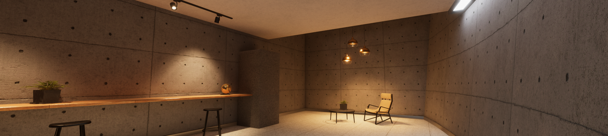
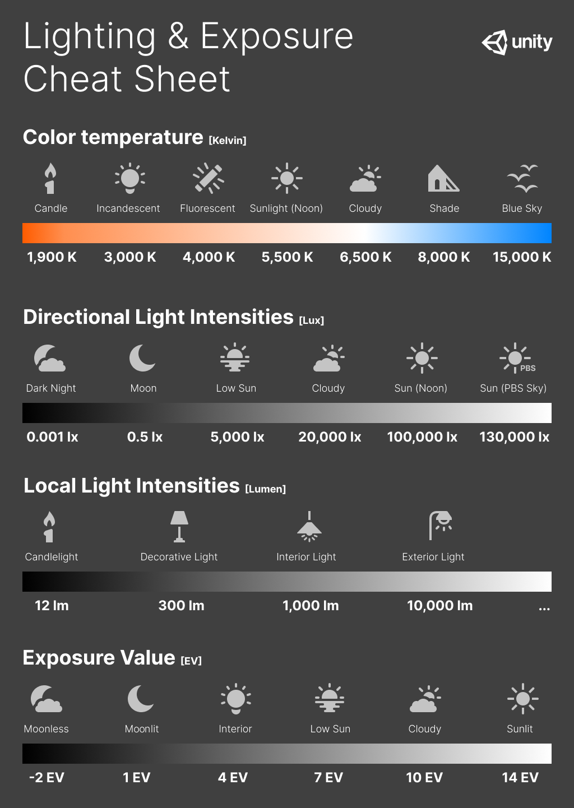

# Understand physical light units

HDRP uses Physical Light Units (PLU) for its lighting. These units are based on real-life light measurements, like those you see on light bulb packaging or a photographic light meter. Note that for lights to behave properly when using PLU, you need to respect HDRP unit convention (1 Unity unit equals 1 meter).

## Units

#### Candela:

The base unit of [luminous intensity](Glossary.md#LuminousIntensity) in the International System of Units. For reference, a common wax candle emits light with a luminous intensity of roughly 1 candela.

#### Lumen:

The unit of [luminous flux](Glossary.md#LuminousFlux). Describes the total amount of visible light that a light source emits in all directions. When you use this unit, the amount of visible light is independent of the source's size meaning the illumination level of a Scene does not change depending on the size of a light source. However, highlights that a light source produces dim as the area of the light source increases. This is because the same power is spread across a larger area.

A light source that emits 1 [candela](#Candela) of [luminous intensity](Glossary.md#LuminousIntensity) from an area of 1 steradian has a luminous flux of 1 lumen.

#### Lux (lumen per square meter):

The unit of [illuminance](Glossary.md#Illuminance). A light source that emits 1 lumen of [luminous flux](Glossary.md#LuminousFlux) onto an area of 1 square meter has an illuminance of 1 lux.

#### Nits (candela per square meter):

The unit of luminance. Describes the surface power of a visible light source. When you use this unit, the overall power of a light source depends the size of the light source, meaning the illumination level of a Scene changes depending on the size of the light source.  Highlights that a light source produces conserve their intensity regardless of the size of the surface.

A light source that emits 1 candela of [luminous intensity](Glossary.md#LuminousIntensity) onto an area of 1 square meter has a luminance of 1 candela per square meter.

#### Exposure value (EV):

A value that represents a combination of a camera's shutter speed and f-number. It is essentially a measurement of exposure such that all combinations of shutter speed and f-number that yield the same level of exposure have the same EV. HDRP Lights can use **EV100**, which is EV with a 100 International Standards Organisation (ISO) film.

## Light intensities

### Natural

Light measurements from natural sources in different conditions:

| Illuminance (lux) | Natural light level                               |
| ----------------- | ------------------------------------------------- |
| 120 000           | Very bright sunlight.                             |
| 110 000           | Bright sunlight.                                  |
| 20 000            | Blue sky at midday.                               |
| 1 000 - 2 000     | Overcast sky at midday.                           |
| < 1               | Moonlight with a clear night sky.                 |
| 0.002             | Starry night without moonlight. Includes airglow. |

### Artificial

Approximate light measurements from artificial sources:

| Luminous flux (lumen) | Source                                                       |
| --------------------- | ------------------------------------------------------------ |
| 12.57                 | Candle light.                                                |
| < 100                 | Small decorative light, such as a small LED lamp.            |
| 200 - 300             | Decorative lamp, such as a lamp that does not provide the main lighting for a bright room. |
| 400 - 800             | Ceiling lamp for a regular room.                             |
| 800 - 1 200           | Ceiling lamp for a large brightly lit room.                  |
| 1 000 - 40 000        | Bright street light.                                         |

### Indoor

Architects use these approximate values as a guide when designing rooms and buildings for functional use:

| Illuminance (lux) | Room type                  |
| ----------------- | -------------------------- |
| 150 - 300         | Bedroom.                   |
| 300 - 500         | Classroom.                 |
| 300 - 750         | Kitchen.                   |
| 300 - 500         | Kitchen Counter or Office. |
| 100 - 300         | Bathroom.                  |
| 750 lux - 1 000   | Supermarket.               |
| 30                | City street at night.      |

For more examples of indoor light levels see Archtoolbox’s web page on [Recommended Lighting Levels in Buildings](https://www.archtoolbox.com/materials-systems/electrical/recommended-lighting-levels-in-buildings.html).

### Lighting and exposure diagram

The following cheat sheet contains the color temperature values and light intensities of common real-world [Light](Light-Component.md) sources. It also contains [Exposure](Override-Exposure.md) values for different illumination scenarios.

