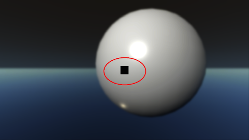
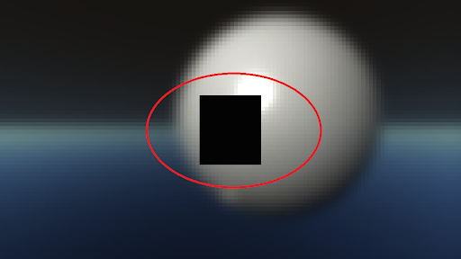

# Understand Not a Number (NAN) and Infinite (Inf) values

Not a Number (NaN) and Infinite (Inf) values occur when shader operations produce an undefined result. Visually, they appear as black or white pixels.

Example operations that can lead to a NaN or Inf are:

- Performing a square root (sqrt) or logarithm (log/log2) on any negative number produces a NaN.
- Performing a modulo operation, A % B, where A is infinite or B is 0 produces a NaN.
- Dividing any number by 0 produces an Inf (for example, normalizing a vector with a length of 0).

Aside from shader operations, uninitialized memory can also contain or produce NaNs or Infs. On some platforms, the pixel values on newly created [Render Textures](https://docs.unity3d.com/Manual/class-RenderTexture.html) aren't initialized with a value of 0. This means that if you access new Render Textures before writing to or clearing them, they might generate a Nan or Inf. To avoid this, always either clear your Render Textures before you use them, or write to every value you want to read from before you read from them.

## Propagating NaNs or Infs

Any operation that has a NaN or an Inf as an operand also produces a Nan or Inf as a result. This is important in the High Definition Render Pipeline (HDRP), because any filtering or blur HDRP performs that involves Nan or Inf values spreads the invalid values further.

A commonly reported issue in HDRP is that [bloom](Post-Processing-Bloom.md) generates a black screen. The bloom effect doesn't produce NaNs and Infs itself, but it spreads a Nan or Inf generated elsewhere across the screen. This happens because to calculate bloom, HDRP downsamples the scene color and then upsamples it back to the desired resolution. If there is a single Nan or Inf on the screen, the downsample process spreads the invalid value until it covers the whole texture. This means the subsequent upsampling contains only NaN values, which leads to the full screen being black.

For example, see a NaN caused by a material issue that spreads to the whole scene when HDRP calculates bloom:

A similar issue occurs when HDRP generates color pyramids for use by features such as [screen-space reflection](Override-Screen-Space-Reflection.md), [screen-space refraction](Override-Screen-Space-Refraction.md), and distortion.

If you disable bloom and the screen stops being black, the cause of the black screen is likely because a single Nan or Inf pixel is present, but not really visible, and bloom propagated it across the whole screen. It's **not** because bloom created the invalid values.

## Fix NaNs and Infs

The best way to stop bloom or other HDRP features from propagating Nan or Inf values is to fix the source of the Nan or Inf values. For information on how to do this, see [finding NaNs and Infs](#finding-nans-and-infs).

If you are unable to fix the source of the Nan or Inf values, [HDRP Cameras](hdrp-camera-component-reference.md) include a feature which replaces NaN and Inf values with a black pixel. This stops effects like bloom from propagating Nan or Inf values, but is a fairly resource intensive process. To enable this feature, select a Camera and, in the Inspector, enable the **Stop NaNs** checkbox.

**Note**: Only enable this feature if you are unable to fix the root cause of the Nan or Inf values.

### Finding NaNs and Infs

To find the root cause of a Nan or Inf, HDRP includes a debug mode which displays pixels that contain NaNs or Infs in a recognizable color. To use this debug mode:

1. Open the Rendering Debugger window (menu: **Window > Analysis > Rendering Debugger**).
2. Go to **Rendering** and set **Fullscreen Debug Mode** to **NanTracker**.

This helps you to see if there are actually NaNs or Infs on screen and which material causes them. However, if you need more information, such as which particular draw call causes the issue, you can use frame debugging tools such as [RenderDoc](https://renderdoc.org/). For information on how to use RenderDoc to capture frames in Unity, see [RenderDoc integration](https://docs.unity3d.com/Manual/RenderDocIntegration.html).

A common situation that leads to NaNs is when a mesh is imported with ill-defined normals, like normals equal to the zero vector.
To find these normals, you can use one of the normal visualization modes in the [Material panel](rendering-debugger-window-reference.md#material-panel) of the Rendering Debugger.

#### RenderDoc

After you capture a frame, RenderDoc can display pixels with a Nan or Inf value as pure red, which makes Nan or Inf values easier to see than the standard white or black pixels that HDRP renders for invalid values. To do this:

1. In the Texture Viewer, open the **Overlay** drop-down.
2. Select **Nan or Inf/-ve Display**.

If the Nan or Inf values are still difficult to find:

1. Look at the bloom dispatches to see where bloom propagates the Nan or Inf pixels from.
2. Pinpoint the exact pixel or pixels responsible.

In the example images under [Propagating NaNs/Infs](#propagating-nans-or-infs), you can see by how bloom expands the Nan or Inf values that the source is around the center of the screen, on the sphere's Material.

After you find which Materials or shaders produce the NaNs and Infs, you can debug them to find out which operation causes the invalid values.
