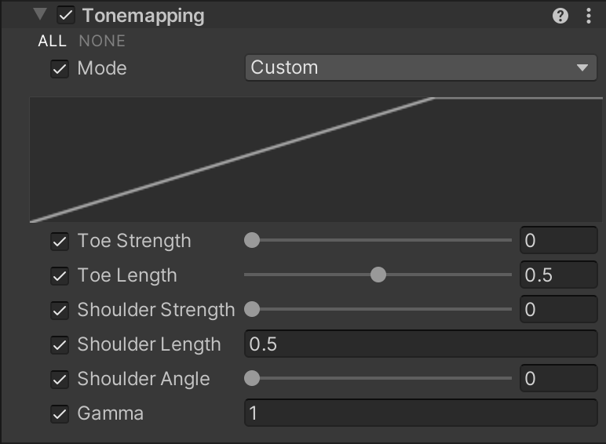

# Tonemapping

Tonemapping is the process of remapping HDR values of an image in a range suitable to display on screen.

## Using Tonemapping

**Tonemapping** uses the [Volume](Volumes.md) framework, so to enable and modify **Tonemapping** properties, you must add a **Tonemapping** override to a [Volume](Volumes.md) in your Scene. To add **Tonemapping** to a Volume:

1. In the Scene or Hierarchy view, select a GameObject that contains a Volume component to view it in the Inspector.
2. In the Inspector, go to **Add Override** > **Post-processing** and select **Tonemapping**. HDRP now applies **Tonemapping** to any Camera this Volume affects.

[!include]

## Properties

| **Property**          | **Description**                                              |
| --------------------- | ------------------------------------------------------------ |
| **Mode**              | Use the drop-down to select a tonemapping algorithm to use for color grading. The options are: &#8226; **None**: Use this option if you don't want to apply tonemapping. &#8226; **Neutral**: Use this option if you only want range-remapping with minimal impact on color hue & saturation. It's a good starting point for extensive color grading. &#8226; **ACES**: Use this option to apply a close approximation of the reference ACES tonemapper for a more filmic look. It's more contrasted than Neutral and has an effect on actual color hue & saturation. Note that if you use this tonemapper all the grading operations will be done in the ACES color spaces for optimal precision and results. &#8226; **Custom**: Use this option if you want to specify the tonemapping settings yourself. Selecting this mode exposes properties that allow you to customize the tonemapping curve. &#8226; **External**: Use this option if you want to specify your own lookup table. |
| **Toe Strength**      | Use the slider to set the strength of the transition between the curve's toe and the curve's mid-section. A value of 0 results in no transition and a value of 1 results in a hard transition. This property only appears when you select **Custom** from the **Mode** drop-down. |
| **Toe Length**        | Use the slider to set the length of the curve's toe. Higher values result in longer toes and so contain more of the dynamic range.  This property only appears when you select **Custom** from the **Mode** drop-down. |
| **Shoulder Strength** | Use the slider to set the strength of the transition between the curve's midsection and the curve's shoulder. A value of 0 results in no transition and a value of 1 results in a hard transition. This property only appears when you select **Custom** from the **Mode** drop-down. |
| **Shoulder Length**   | Set the amount of f-stops to add to the dynamic range of the curve. This is how much of the highlights that the curve takes into account. This property only appears when you select **Custom** from the **Mode** drop-down. |
| **Shoulder Angle**    | Use the slider to set how much overshoot to add to the curve's shoulder. This property only appears when you select **Custom** from the **Mode** drop-down. |
| **Gamma**             | Set a gamma correction to the entire curve. This property only appears when you select **Custom** from the **Mode** drop-down. |
| **Lookup Texture**    | Assign a log-encoded Texture that this effect applies as a custom lookup table. This property only appears when you select **External** from the **Mode** drop-down. |
| **Contribution**      | Use the slider to set the overall contribution that the lookup **Texture** has to the color grading effect. This property only appears when you select **External** from the **Mode** drop-down. |
