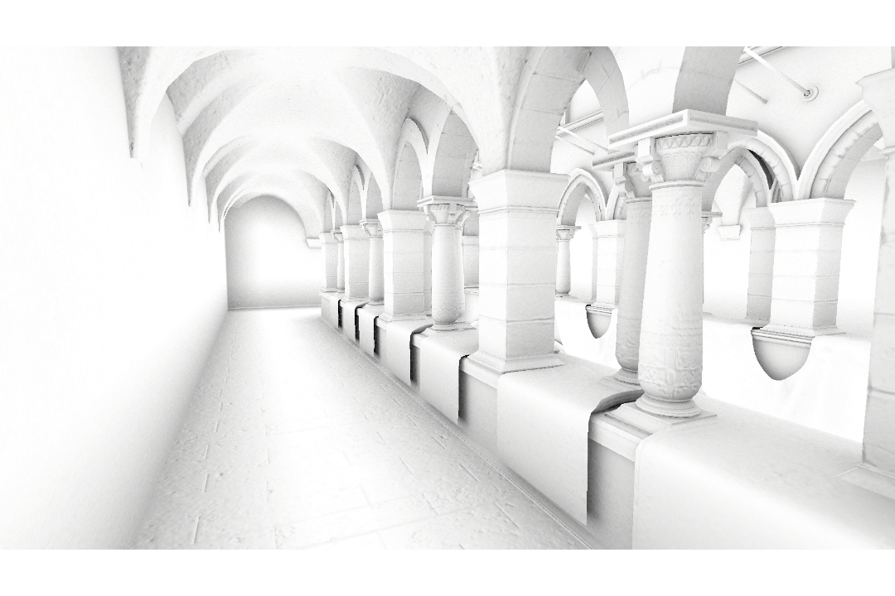

# Ray-traced ambient occlusion

Ray-Traced Ambient Occlusion is a ray tracing feature in the High Definition Render Pipeline (HDRP). It is an alternative to HDRP's s [screen space ambient occlusion](Override-Ambient-Occlusion.md), with a more accurate ray-traced solution that can use off-screen data.

**Screen space ambient occlusion**

**Ray-traced ambient occlusion**

For information about ray tracing in HDRP, and how to set up your HDRP Project to support ray tracing, see [Getting started with ray tracing](Ray-Tracing-Getting-Started.md).

To troubleshoot this effect, HDRP provides an Ambient Occlusion [Debug Mode](Ray-Tracing-Debug.md) and a Ray Tracing Acceleration Structure [Debug Mode](Ray-Tracing-Debug.md) in Lighting Full Screen Debug Mode.

## Use ray-traced ambient occlusion

Because this feature is an alternative to the [Ambient Occlusion](Override-Ambient-Occlusion.md) Volume Override, the initial setup is very similar.  To setup ray traced ambient occlusion, first follow the [Enabling Ambient Occlusion](Override-Ambient-Occlusion.md#enable-screen-space-ambient-occlusion) and [Using Ambient Occlusion](Override-Ambient-Occlusion.md#use-screen-space-ambient-occlusion) steps. After you setup the Ambient Occlusion override, to make it use ray tracing:

1. In the Frame Settings for your Cameras, enable **Ray Tracing**.
2. Select the [Ambient Occlusion](Override-Ambient-Occlusion.md) override and, in the Inspector, enable **Ray Tracing**. If you do not see a **Ray Tracing** option, make sure your HDRP Project supports ray tracing. For information on setting up ray tracing in HDRP, see [Getting started with ray tracing](Ray-Tracing-Getting-Started.md).

## Properties

HDRP implements ray-traced ambient occlusion on top of the Ambient Occlusion override. For information on the properties that control this effect, see [Ambient occlusion reference](reference-ambient-occlusion.md).
