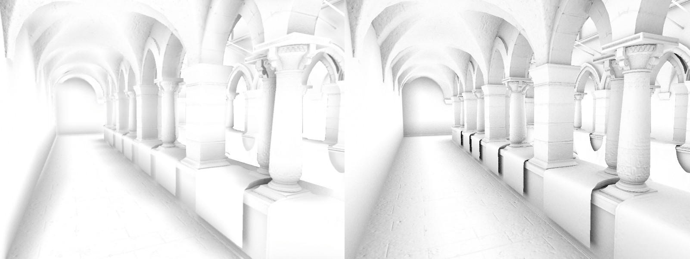

# Ray-traced ambient occlusion

Ray-traced ambient occlusion (RTAO) is an alternative to [screen space ambient occlusion](Override-Ambient-Occlusion.md) that's more accurate because it uses off-screen data.

 
A single-channel occlusion texture of a gothic corridor. The screen space ambient occlusion texture on the left has fewer details and lighter shadows than the ray-traced ambient occlusion texture on the right.

Follow these steps:

1. [Enable screen space ambient occlusion](Override-Ambient-Occlusion.md#enable-screen-space-ambient-occlusion).

1. [Set up ray tracing](Ray-Tracing-Getting-Started.md) in your HDRP project.

1. Select the GameObject with the volume override you created in step 1.

1. In the Inspector window of the **Screen Space Ambient Occlusion** override, enable **Ray Tracing**.

To control the effect, refer to the **Ray-traced** properties on the [Ambient occlusion reference](reference-ambient-occlusion.md) page.

To troubleshoot ray-traced ambient occlusion, HDRP provides an Ambient Occlusion [Debug Mode](Ray-Tracing-Debug.md) and a Ray Tracing Acceleration Structure [Debug Mode](Ray-Tracing-Debug.md) in Lighting Full Screen Debug Mode.

## Additional resources

- [Assign an ambient occlusion texture](Ambient-Occlusion.md) for each GameObject.
- [Screen space ambient occlusion (SSAO)](Override-Ambient-Occlusion.md), which uses information from the whole screen.
