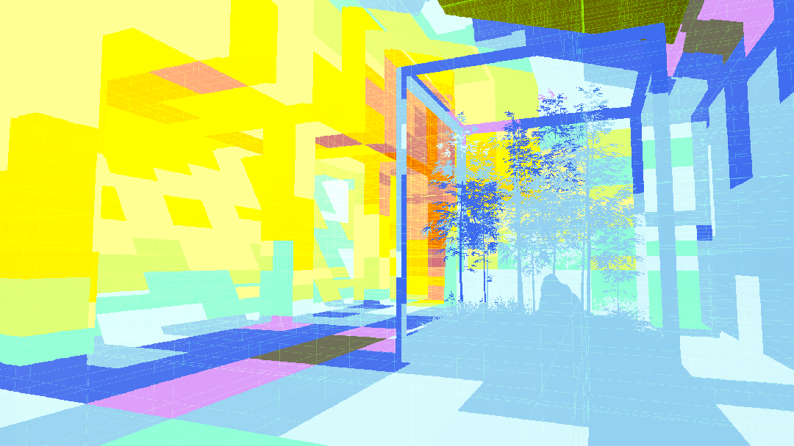
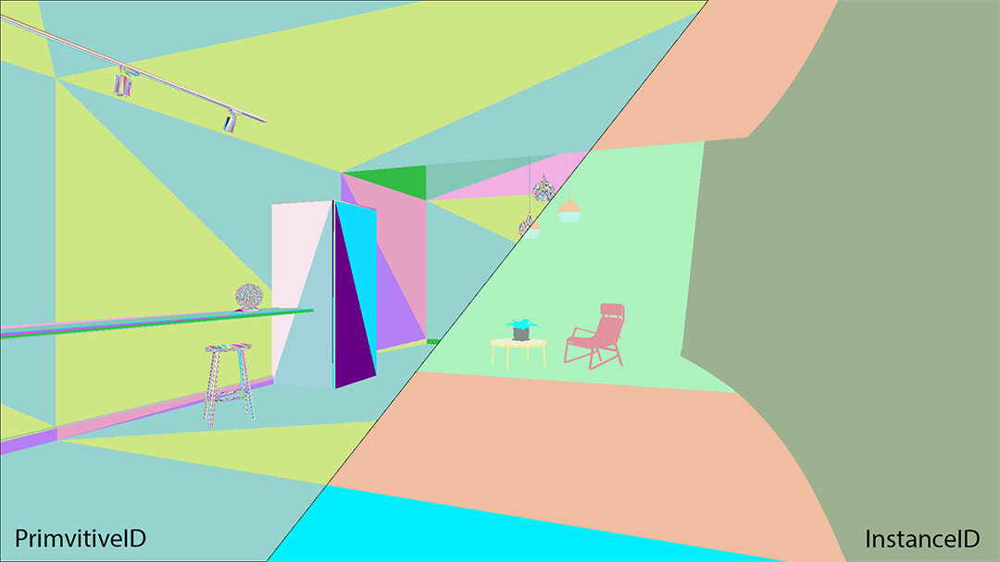

# Debug ray-traced effects

The High Definition Render Pipeline (HDRP) includes the [Rendering Debugger window](use-the-rendering-debugger.md), which you can use to debug and understand ray-traced effect in HDRP. To debug raytraced effects:

1. Open the debug menu, select **Window > Analysis > Rendering Debugger**.
2. Select the **Lighting** panel.
3. Use the **Fullscreen Debug Mode** drop-down menu to select which ray tracing effect to debug.

**Light Cluster Debug Mode**: The color shows the number of lights in each cell of the cluster.

**Ray Tracing Acceleration Structure Debug Mode**: This debug mode displays the GameObjects HDRP uses to compute specific ray traced effects.

## Debug modes

| **Fullscreen Debug Mode** | **Description** |
|---|---|
| **Screen Space Ambient Occlusion** | When Ray-Traced Ambient Occlusion is active, this displays the screen space buffer that holds the ambient occlusion. |
| **Screen Space Reflection** | When Ray-Traced Reflections are active, this displays the ray-traced reflections. |
| **Transparent Screen Space Reflection** | When Ray-Traced Reflections are active, this displays the ray-traced reflections on transparent objects. |
| **Contact Shadows** | When Ray-Traced Contact Shadows are active, this displays the ray-traced contact shadows. |
| **Screen Space Shadows** | When screen space shadows are active, this displays the set of screen space shadows. If you select this option, Unity exposes the Screen Space Shadow Index slider that allows you to change the currently active shadows. Area lights shadows take two channels. |
| **Screen Space Global Illumination** | When Ray-Traced Global Illumination is active, this displays a screen space buffer that holds the indirect diffuse lighting. |
| **Recursive Ray-Tracing** | When Recursive Ray Tracing is active, this displays the pixels that have been evaluated using the effect. |
| **Ray-Traced Subsurface Scattering** | When Ray-Traced Subsurface Scattering is active, this displays the subsurface lighting value for the pixels that have been evaluated using the technique. |
| **Light Cluster** | This displays the light cluster with the color that varies by the number of the lights in each cell. The red color indicates that the number of lights is over 12 or equal to the maximum number of lights per cell.<ul><li>**Light Category**: Use the drop-down to visualize the number of the lights in the selected light category.</li></ul> |
| **Ray Tracing Acceleration Structure** | This mode displays the GameObjects included in the ray tracing acceleration structure for the following effects:<ul><li>Shadows</li><li>Ambient Occlusion</li><li>Global Illumination</li><li>Reflections</li><li>Recursive Rendering</li><li>Path Tracer</li></ul>HDRP only builds the acceleration structure when you activate the effect you select in this mode, otherwise the debug view is black. This mode has the following visualization options:<ul><li>InstanceID: Assigns a color randomly based on the GameObject's InstanceID.</li><li>PrimitiveID: Assigns a color randomly based on the GameObject's PrimitiveID.</li></ul> |
