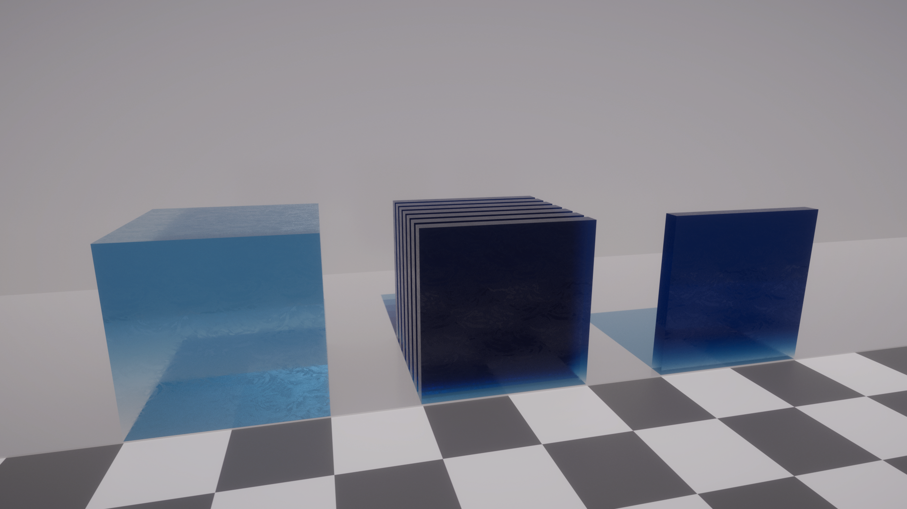

# Path tracing

Path tracing is a ray tracing algorithm that sends rays from the Camera and, when a ray hits a reflective or refractive surface, recurses the process until it reaches a light source. The series of rays from the Camera to the Light form a path.

It enables HDRP to compute various effects (such as hard or soft shadows, mirror or glossy reflections and refractions, and indirect illumination) in a single unified process.

A notable downside to path tracing is noise. Noise vanishes as more paths accumulate and converges toward a clean image. For more information about path tracing limitations in HDRP, see [Unsupported features of path tracing](Ray-Tracing-Getting-Started.md#unsupported-features-of-path-tracing).

Noisy image with **Maximum Samples** set to 1

Clean image with **Maximum Samples** set to 256

The current implementation for path tracing in the High Definition Render Pipeline (HDRP) accumulates paths for every pixel up to a maximum count unless the Camera moves. If the Camera moves, HDRP restarts the path accumulation. Path tracing supports Lit, LayeredLit, Stacklit, AxF, and Unlit materials, and area, point, directional, and environment lights.

## Setting up path tracing

Path tracing shares the general requirements and setup as other ray tracing effects, so for information on hardware requirements and set up, see [getting started with ray tracing](Ray-Tracing-Getting-Started.md). You must carry out this setup before you can add path tracing to your Scene.

## Adding path tracing to a Scene

Path tracing uses the [Volume](Volumes.md) framework, so to enable this feature, and modify its properties, you must add a Path Tracing override to a [Volume](Volumes.md) in your Scene. To do this:

1. In the Scene or Hierarchy view, select a GameObject that contains a Volume component to view it in the Inspector.
2. In the Inspector, select Add Override > Ray Tracing > Path Tracing.
3. In the Inspector for the Path Tracing Volume Override, check the Enable option. If you don't see the Enable option, make sure your HDRP Project supports ray tracing. For information on setting up ray tracing in HDRP, see [getting started with ray tracing](Ray-Tracing-Getting-Started.md). This switches HDRP to path-traced rendering and you should initially see a noisy image that converges towards a clean result.
4. If the image doesn't converge over time, select the drop-down next to the effect toggle and enable Always Refresh.

## Properties

| Property              | Description                                                  |
| --------------------- | ------------------------------------------------------------ |
| **Maximum Samples**   | Set the number of frames to accumulate for the final image. There is a progress bar at the bottom of the Scene view which indicates the current accumulation with respect to this value. |
| **Minimum Depth**     | Set the minimum number of light bounces in each path.        |
| **Maximum Depth**     | Set the maximum number of light bounces in each path. You can not set this to be lower than Minimum Depth.  **Note**: You can set this and Minimum Depth to 1 if you only want to direct lighting. You can set them both to 2 if you only want to visualize indirect lighting (which is only visible on the second bounce). |
| **Maximum Intensity** | Set a value to clamp the intensity of the light value each bounce returns. This avoids bright, isolated pixels in the final result. **Note**: This property can makes the final image dimmer, so if the result looks dark, increase the value of this property. |

**Minimum Depth** set to 1, **Maximum Depth** set to 2: direct and indirect lighting (1 bounce)

**Minimum Depth** set to 1, **Maximum Depth** set to 1: direct lighting only

**Minimum Depth** set to 2, **Maximum Depth** set to 2: indirect lighting only (1 bounce)

## How path tracing affects Material properties

Path tracing changes how the following Material properties behave in your scene:

- [How transmissive objects absorb light](#surface-types)
- [How light refracts in transmissive objects](#refraction-models)
- [Subsurface scattering](#subsurface-scattering)

This is because path tracing in HDRP implements more precise light transport simulations than rasterization. To do this, path tracing computes all lighting effects and how light interacts with Materials at the same time. This changes the appearance of Materials in path-traced scenes. For example, in the images below, the Material appears darker.

The images below display the difference between transparent, double-sided materials in a rasterized and a path-traced scene:

GameObjects without path tracing (rasterized).

GameObjects with path tracing enabled.

## Path tracing and double-sided materials

When you use path tracing, the **Double-Sided** property (menu: **Inspector** > **Surface Options** > **Double-Sided**) allows transparent materials to accumulate correctly. If the you disable **Double-sided** property, rays which exit the GameObject will not behave correctly.

The following images display the same GameObjects with a single-sided Material and a double-sided material:

GameObjects with a single-sided Material and path tracing enabled

GameObjects with a double-sided Material and path tracing enabled

## How path tracing affects refraction models

Path tracing changes the way refraction models on a Lit Material behave.

To change the refraction model a Lit Material uses, in the **Transparency Inputs** section, select a model from the **Refraction model** dropdown, displayed in the following image:

The following table describes how each refraction model behaves when you enable path tracing:

| **Refraction model**   | **Path tracing behavior**                                    | **Compatible Surface sides**                                 |
| ---------------------- | ------------------------------------------------------------ | ------------------------------------------------------------ |
| **Box** and **Sphere** | A surface type that represents thick objects like a paperweight or a crystal ball. When you enable path tracing, the **Box** and **Sphere** models behave in the same way. Rays can intersect the GameObjects in the scene and HDRP doesb't need to approximate transparent surfaces | This refraction model is compatible with a double-sided Material that has its **Normal mode** set to **None**. |
| **Thin**               | A thin surface type with [infinitesimal](<https://en.wikipedia.org/wiki/Infinitesimal>) thickness. Select this for thin, window-like surfaces. When you enable path tracing, the behavior of the **Thin** refraction model behaves the same as in rasterization. | This refraction model is compatible with a double-sided Material that has its **Normal mode** set to  **Flip** or **Mirror**. |
| **None**               | A thin, refractive surface hardcoded to be smooth to simulate alpha blending. When you enable path tracing, the behavior of the **None** refraction model behaves the same as in rasterization. | This refraction model is compatible with a double-sided Material that has its **Normal mode** set to  **Flip** or **Mirror**. |

From left to right, a GameObject with **Sphere**, **Box,** and **Thin** mode without path tracing (rasterized).

From left to right, a GameObject with **Sphere**, **Box,** and **Thin** mode with path tracing enabled.

### Path tracing and subsurface scattering

For [subsurface scattering's](Subsurface-Scattering.md) **Transmission** property (A) to work correctly with path tracing, you need to do the following:

1. Open the **Surface Options** window.
2. Enable the **Double-Sided** property (B).

The following example images display a sheet of fabric lit from below by a point light. The first image shows a single-sided surface, and the second shows a double-sided surface:

A single-sided surface with Transmission disabled.

A double-sided surface with Transmission enabled.

### Hair

Path tracing can easily compute the complex multiple scattering events that occur within a head of hair, crucial for producing the volumetric look of lighter colored hair.

The [Hair Master Stack](master-stack-hair.md) allows the choice between an **Approximate** and **Physical** material mode and parameterization. Currently, it's required for a Hair Material to be configured with the **Physical** mode to participate in path tracing. The reason for this is due to the physically-based parameterization of the model (and the model itself) which produces far more accurate results in a path traced setting. Moreover, the **Approximate** material mode is a non energy-conserving model, better suited for performant rasterization after careful artist tuning.

Representing hair strand geometry is traditionally done via ray-aligned "ribbons", or tubes. Currently, the acceleration structure isn't equipped to handle ray-aligned ribbons, so hair must be represented with tube geometry to achieve a good result.

The path traced **Physical** hair mode shares the exact same meaning for its parameters as its rasterized counterpart. However, the underlying model for path tracing differs: it performs a much more rigorous evaluation of the scattering within the fiber, while the rasterized version is only an approximated version of this result. Additionally, path tracing a volume of densely packed hair fibers allows you to compute the complex multiple scattering "for free", whereas in rasterizing we again must approximate this.

You can read more about the parameterization details of the **Physical** hair mode [here](master-stack-hair.md).

## Limitations

This section contains information on the limitations of HDRP's path tracing implementation. Mainly, this is a list of features that HDRP supports in its rasterized render pipeline, but not in its path-traced render pipeline.

### Unsupported features of path tracing

Currently, you can only use HDR path tracing on platforms that use DX12.

HDRP path tracing in Unity 2020.2 has the following limitations:

- If a Mesh in your scene has a Material assigned that does not have the `HDRenderPipeline` tag, the mesh will not appear in your scene. For more information, see [Ray tracing and Meshes](Ray-Tracing-Getting-Started.md#RayTracingMeshes).
- Path tracing in HDRP doesn't support the following:
  - 3D Text and TextMeshPro.
  - Shader Graph nodes that use derivatives (for example, a normal map that derives from a texture).
  - Shader Graphs that use [Custom Interpolators](../../com.unity.shadergraph/Documentation~/Custom-Interpolators.md).
  - Decals.
  - Tessellation.
  - Tube and Disc-shaped Area Lights.
  - Translucent Opaque Materials.
  - Several of HDRP's Materials. This includes Eye, Hair, and Decal.
  - Per-pixel displacement (parallax occlusion mapping, height map, depth offset).
  - MSAA.
  - [Graphics.DrawMesh](https://docs.unity3d.com/ScriptReference/Graphics.DrawMesh.html).
  - [Streaming Virtual Texturing](https://docs.unity3d.com/Documentation/Manual/svt-streaming-virtual-texturing.html).

### Unsupported shader graph nodes for path tracing

When building your custom shaders using shader graph, some nodes are incompatible with ray/path tracing. You need either to avoid using them or provide an alternative behavior using the [ray tracing shader node](SGNode-Raytracing-Quality). Here is the list of the incompatible nodes:
- DDX, DDY, DDXY, NormalFromHeight and HDSceneColor nodes.
- All the nodes under Inputs > Geometry (Position, View Direction, Normal, etc.) in View Space mode.
Furthermore, Shader Graphs that use [Custom Interpolators](../../com.unity.shadergraph/Documentation~/Custom-Interpolators.md) aren't supported in ray/path tracing.

### Unsupported features of ray tracing

For information about unsupported features of ray tracing in general, see [Ray tracing limitations](Ray-Tracing-Getting-Started.md#limitations).
