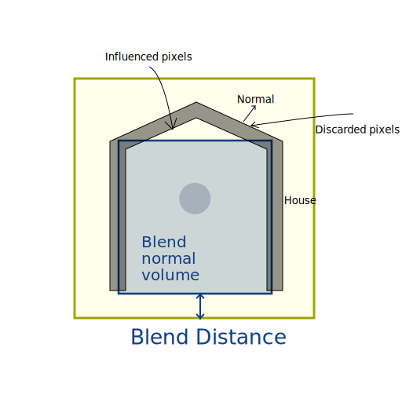

# Use Reflection probes

[Reflection Probes](Reflection-Probe.md) and [Planar Reflection Probes](Planar-Reflection-Probe.md) provide indirect specular lighting.

A Reflection Probe captures its surroundings whereas a Planar Reflection Probe only captures one direction.

For more information on probes and how they work, see [Reflection Probes](Reflection-Probes-Intro.md).

## Create a reflection probe

To create a **Reflection Probe** in the Unity Editor, select **GameObject > Light > Reflection Probe** or **Planar Reflection Probe**.

You can customize the behavior of a Reflection Probe in the Inspector. Both types of HDRP Reflection Probe are separate components, but share many of the same properties. For information on each Reflection Probe’s properties, see the [Reflection Probe](Reflection-Probe.md) and [Planar Reflection Probe](Planar-Reflection-Probe.md) documentation.

To make sure HDRP does not apply post-processing effects twice, once in a Reflection Probe's capture and once in a Camera's capture of the reflection, HDRP does not apply post-processing to the Reflection Probe capture.

## Control the influence of a probe

The influence of a probe determines which pixels it affects and by how much.

Use the following tools to control the influence of a reflection probe on a pixel:

* [Influence volume](#use-an-influence-volume): The probe affects any pixel inside this volume.
* [Blend distance](#blend-influence): The probe affects pixels near the border of the Influence volume less.
* [Blend normal distance](#blend-normal-influence): The probe doesn't affect pixels near the border with an invalid normal.

### Use an influence volume

Use this volume to include or exclude pixels from the probe's influence.

**Note**: When a pixel is inside an influence volume, the probe still processes it even if the specular value the probe provides isn't significant. This is important to handle the performance of probes.

### Blend influence

Unity linearly weights the specular lighting value the probe provides between the influence volume and the blend volume.
Use blending to create smooth transitions at the border of the probe's influence, or when probes overlap.

### Blend normal influence

Sometimes, a probe can influence a pixel that isn't consistent with the scene layout.

For example, when a light ray can't reach a pixel due to occlusion, but the pixel is inside the influence volume.

You can set a blend normal distance similarly to a blend distance. The probe doesn't influence pixels that are inside the influence volume, but outside of the blend normal distance, if their normal points away from the probe.

