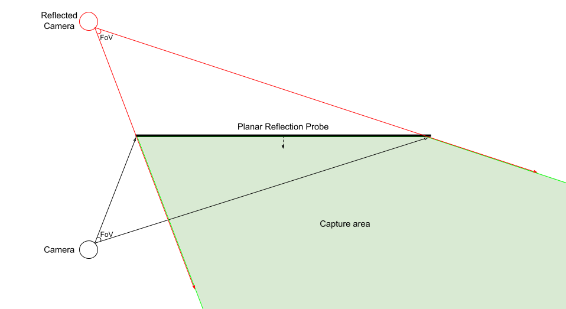

# Understand reflection Probes

A Reflection Probe acts in a similar way to a **Camera**. Each Reflection Probe captures a view of its surroundings and stores the results. Materials with reflective surfaces can use these results to produce accurate reflections of their surroundings that change as the Camera’s viewing angle changes. The view the Reflection Probe takes and the format of the result depends on the type of Reflection Probe.

The High Definition Render Pipeline (HDRP) allows you to use two different Reflection Probes:

- [Reflection Probes](Reflection-Probe.md) captures a view of its surroundings in all directions and stores the result as a cubemap, similar to the Reflection Probe in built-in render pipeline.
- [Planar Reflection Probes](Planar-Reflection-Probe.md) captures a view in a direction calculated from a reflection of the Camera’s position and rotation, then stores the result in a 2D RenderTexture. By default, the reflected Camera calculates its field of view by setting the center of its projection to the Probe’s **Mirror Position**, and then expands it until it includes the Probe’s **Influence Volume**, as shown here:

For more information about how to use the reflection probe, see [Use reflection probes](Reflection-Probe-Usage.md).

For information about the reflection probe component properties, refer to [Reflection probe reference](Reflection-Probe.md)

## Limitations
- HDRP does not support Reflection Probe presets. 