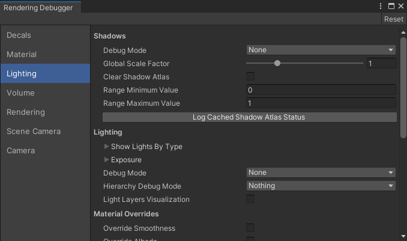

# Rendering Debugger

The **Rendering Debugger** is a specific window for the Scriptable Render Pipeline that contains debugging and visualization tools. You can use these tools to understand and solve any issues you might encounter. It contains graphics-related tools but you can extend it to include tools for any other field, such as animation. The **Rendering Debugger** separates debug items into the following sections:

* [Decals](#DecalsPanel)
* [Display Stats](#StatsPanel)
* [Material](#MaterialPanel)
* [Lighting](#LightingPanel)
* [Volume](#VolumePanel)
* [Rendering](#RenderingPanel)
* [Camera](#CameraPanel)

The Rendering Debugger

## Using the Rendering Debugger

The Rendering Debugger window is available in the following modes:

* The Editor.
* The Play mode.
* At runtime in the standalone Unity Player, on any device. The window is only available in **Development Builds**.

To open the Rendering Debugger in the Editor:

* Enable **Runtime Debug Shaders** in **HDRP Global Settings** (in the menu: **Edit** > **Project Settings** > **Graphics** > **HDRP Settings**).

* Select **Window** > **Analysis** > **Rendering Debugger**.

To open the window in the Play mode, or at runtime in a Development Build, use the keyboard shortcut Ctrl+Backspace (Ctrl+Delete on macOS) or press L3 and R3 (Left Stick and Right Stick) on a controller.

You can display read-only items, such as the FPS counter, independently of the **Rendering Debugger** window. When you disable the **Rendering Debugger** window, they're still visible in the top right corner of the screen. Use this functionality to track particular values without cluttering the screen.

You can disable the runtime UI entirely by using the [`enableRuntimeUI`](https://docs.unity3d.com/Packages/com.unity.render-pipelines.core@latest/api/UnityEngine.Rendering.DebugManager.html#UnityEngine_Rendering_DebugManager_enableRuntimeUI) property.

### Navigation at runtime

To change the current active item:

* **Keyboard**: Use the arrow keys.
* **Xbox controller**: Use the Directional pad (D-Pad).
* **PlayStation controller**: Use the Directional buttons.

To change the current tab:

* **Keyboard**: Use the Page up and Page down keys (Fn + Up and Fn + Down keys respectively for MacOS).
* **Xbox controller**: Use the Left Bumper and Right Bumper.
* **PlayStation controller**: Use the L1 button and R1 button.

To display the current active item independently of the debug window:

* **Keyboard**: Press the right Shift key.
* **Xbox controller**: Press the X button.
* **PlayStation controller**: Press the Square button.

## Decals panel

The **Decals** panel has tools that you can use to debug [decals](Decal-Shader.md) in your project.

| **Debug Option**  | **Description**                                              |
| ----------------- | ------------------------------------------------------------ |
| **Display Atlas** | Enable the checkbox to display the decal atlas for a Camera in the top left of that Camera's view. |
| **Mip Level**     | Use the slider to select the mip level for the decal atlas. The higher the mip level, the blurrier the decal atlas. |

## Display Stats panel

The **display stats** panel is only visible in play mode. You can use it to debug performance issues in your project.

<table>
  <thead>
    <tr>
      <th colspan="1"><strong>Debug Option</strong></th>
      <th colspan="2"><strong>Description</strong></th>
    </tr>
  </thead>
  <tbody>
    <tr>
      <td rowspan="1"><strong>Frame Rate</strong></td>
      <td colspan="2">Displays the frame rate in frames per second for the current camera view.</td>
    </tr>
    <tr>
      <td rowspan="1"><strong>Frame Time</strong></td>
      <td colspan="2">Displays the total frame time for the current camera view.</td>
    </tr>
    <tr>
      <td rowspan="1"><strong>RT Mode</strong></td>
      <td colspan="2">If you enable ray tracing, it displays the ray tracing Tier used during rendering.</td>
    </tr>
    <tr>
      <td rowspan="11"><strong>Count Rays</strong></td>
      <td colspan="2">If you enable ray tracing, enable the checkbox to count the number of traced rays per effect (in MRays / frame).</td>
    </tr>
    <tr>
      <td><strong>Ambient Occlusion</strong></td>
      <td>The number of rays that were traced for Ambient Occlusion (AO) computations, when you enable RT AO.</td>
    </tr>
    <tr>
      <td><strong>Shadows Directional</strong></td>
      <td>The number of rays that were traced for directional lights, when you enable RT shadows.</td>
    </tr>
    <tr>
      <td><strong>Shadows Area</strong></td>
      <td>The number of rays that were traced towards area lights, when you enable RT shadows.</td>
    <tr>
      <td><strong>Shadows Point/Spot</strong></td>
      <td>The number of rays that were traced towards punctual (point/spot) lights, when you enable RT shadows.</td>
    </tr>
    <tr>
      <td><strong>Reflection Forward</strong></td>
      <td>The number of rays that were traced for reflection computations using forward shading.</td>
    </tr>
    <tr>
      <td><strong>Reflection Deferred</strong></td>
      <td>TThe number of rays that were traced for reflection computations using deferred shading.</td>
    <tr>
      <td><strong>Diffuse GI Forward</strong></td>
      <td>The number of rays that were traced for diffuse Global Illumination (GI) computations using forward shading.</td>
    </tr>
    <tr>
      <td><strong>Diffuse GI Deferred</strong></td>
      <td>The number of rays that were traced for diffuse Global Illumination (GI) computations using deferred shading.</td>
    </tr>
    <tr>
      <td><strong>Recursive</strong></td>
      <td>The number of rays that were traced for diffuse Global Illumination (GI) computations when you enable recursive RT.</td>
    </tr>
    <tr>
      <td><strong>Total</strong></td>
      <td>The total number of rays that were traced.</td>
    </tr>
        <tr>
      <td rowspan="1"><strong>Debug XR Layout</strong></td>
      <td colspan="2">Enable to display XR passes debug informations.  This mode is only available in the editor and development builds.</td>
    </tr>
  </tbody>
</table>

## Material panel

The **Material** panel has tools that you can use to visualize different Material properties.

<table>
  <thead>
    <tr>
      <th colspan="1"><strong>Debug Option</strong></th>
      <th colspan="2"><strong>Description</strong></th>
    </tr>
  </thead>
  <tbody>
    <tr>
      <td rowspan="1"><strong>Common Material Property</strong></td>
      <td colspan="2">Use the drop-down to select a Material property to visualize on every GameObject on screen. All HDRP Materials share the properties available.</td>
    </tr>
    <tr>
      <td rowspan="1"><strong>Material</strong></td>
      <td colspan="2">Use the drop-down to select a Material property to visualize on every GameObject on screen using a specific Shader. The properties available depend on the HDRP Material type you select in the drop-down.</td>
    </tr>
    <tr>
      <td rowspan="1"><strong>Engine</strong></td>
      <td colspan="2">Use the drop-down to select a Material property to visualize on every GameObject on a screen that uses a specific Shader. The properties available are the same as <Strong>Material</Strong> but are in the form that the lighting engine uses them (for example, <Strong>Smoothness</Strong> is <Strong>Perceptual Roughness</Strong>).</td>
    </tr>
        <tr>
      <td rowspan="1"><strong>Attributes</strong></td>
      <td colspan="2">Use the drop-down to select a 3D GameObject attribute, like Texture Coordinates or Vertex Color, to visualize on screen.</td>
    </tr>
    </tr>
        <tr>
      <td rowspan="1"><strong>Properties</strong></td>
      <td colspan="2">Use the drop-down to select a property that the debugger uses to highlight GameObjects on screen. The debugger highlights GameObjects that use a Material with the property that you select.</td>
    </tr>
    </tr>
        <tr>
      <td rowspan="1"><strong>GBuffer</strong></td>
      <td colspan="2">Use the drop-down to select a property to visualize from the GBuffer for deferred Materials.</td>
    </tr>
    <tr>
      <td rowspan="5"><strong>Material Validator</strong></td>
      <td colspan="2">Use the drop-down to select properties to display validation colors for: <ul> <li><strong>Diffuse Color</strong>: Select this option to check if the diffuse colors in your Scene adheres to an acceptable <a href="https://docs.unity3d.com/Packages/com.unity.render-pipelines.high-definition@latest/index.html?subfolder=/manual/Glossary.html#PhysicallyBasedRendering">PBR</a> range. If the Material color is out of this range, the debugger displays it in the <strong>Too High Color</strong> color if it's above the range, or in the <strong>Too Low Color</strong> if it's below the range.</li>
      <li><strong>Metal or SpecularColor</strong>: Select this option to check if a pixel contains a metallic or specular color that adheres to an acceptable PBR range. If it doesn't, the debugger highlights it in the <strong>Not A Pure Metal Color</strong>. For information about the acceptable PBR ranges in Unity, see the <a href="https://docs.unity3d.com/Manual/StandardShaderMaterialCharts.html">Material Charts documentation</a>.</li></ul></td>
    </tr>
    <tr>
      <td><strong>Too High Color</strong></td>
      <td>Use the color picker to select the color that the debugger displays when a Material's diffuse color is above the acceptable PBR range. This property only appears when you select <strong>Diffuse Color</strong> or <strong>Metal or SpecularColor</strong> from the <strong>Material Validator</strong> drop-down.</td>
    </tr>
    <tr>
      <td><strong>Too Low Color</strong></td>
      <td>Use the color picker to select the color that the debugger displays when a Material's diffuse color is below the acceptable PBR range. This property only appears when you select <strong>Diffuse Color</strong> or <strong>Metal or SpecularColor</strong> from the <strong>Material Validator</strong> drop-down.</td>
    </tr>
    <tr>
      <td><strong>Not A Pure Metal Color</strong></td>
      <td>Use the color picker to select the color that the debugger displays if a pixel defined as metallic has a non-zero albedo value. The debugger only highlights these pixels if you enable the <strong>True Metals</strong> checkbox. This property only appears when you select <strong>Diffuse Color</strong> or <strong>Metal or SpecularColor</strong> from the <strong>Material Validator</strong> drop-down.</td>
    <tr>
      <td><strong>Pure Metals</strong></td>
      <td>Enable the checkbox to make the debugger highlight any pixels which Unity defines as metallic, but which have a non-zero albedo value. The debugger uses the <strong>Not A Pure Metal Color</strong> to highlight these pixels. This property only appears when you select <strong>Diffuse Color</strong> or <strong>Metal or SpecularColor</strong> from the <strong>Material Validator</strong> drop-down.</td>
    </tr>
    <tr>
      <td rowspan="1"><strong>Override Global Material Texture Mip Bias</strong></td>
      <td colspan="2">Enable the checkbox to override the mipmap level bias of texture samplers in material shaders. Use the <strong>Debug Global Material Texture Mip Bias Value</strong> to control the mipmap level bias override. When using this feature, be aware of the following:
      <ul>
      <li>It only affects gbuffer, forward opaque, transparency and decal passes.</li>
      <li>It doesn't affect virtual texturing sampling.</li>
      <li>It doesn't affect custom passes.</li>
      </ul></td>
    </tr>
    <tr>
      <td rowspan="1"><strong>Debug Global Material Texture Mip Bias Value</strong></td>
      <td colspan="2">Use the slider to control the amount of mip bias of texture samplers in material shaders.</td>
    </tr>
  </tbody>
</table>

If the geometry or the shading normal is denormalized, the view renders the target pixel red.

## Lighting panel

The **Lighting** panel has tools that you can use to visualize various components of the lighting system in your Scene, like, shadowing and direct/indirect lighting.

<table>
  <thead>
    <tr>
      <th colspan="1"><strong>Shadow Debug Option</strong></th>
      <th colspan="2"><strong>Description</strong></th>
    </tr>
  </thead>
  <tbody>
    <tr>
      <td rowspan="3"><strong>Debug Mode</strong></td>
      <td colspan="2">Use the drop-down to select which shadow debug information to overlay on the screen: 
      <ul>
      <li><strong>None</strong>: Select this mode to remove the shadow debug information from the screen.</li>
      <li><strong>VisualizePunctualLightAtlas</strong>: Select this mode to overlay the shadow atlas for <a href="https://docs.unity3d.com/Packages/com.unity.render-pipelines.high-definition@latest/index.html?subfolder=/manual/Glossary.html#PunctualLight">Punctual Lights</a> in your Scene.</li>
      <li><strong>VisualizeDirectionalLightAtlas</strong>: Select this mode to overlay the shadow atlas for Directional Lights in your Scene.</li>
      <li><strong>VisualizeAreaLightAtlas</strong>: Select this mode to overlay the shadow atlas for area Lights in your Scene.</li>
      <li><strong>VisualizeShadowMap</strong>: Select this mode to overlay a single shadow map for a Light in your Scene.</li>
      <li><strong>SingleShadow</strong>: Select this mode to replace the Scene's lighting with a single Light. To select which Light to isolate, see <strong>Use Selection</strong> or <strong>Shadow Map Index</strong>.</li>
      </ul></td>
    </tr>
    <tr>
      <td><strong>Use Selection</strong></td>
      <td>Enable the checkbox to display the shadow map for the Light you select in the Scene. This property only appears when you select <Strong>VisualizeShadowMap</Strong> or <Strong>SingleShadow</Strong> from the <Strong>Shadow Debug Mode</Strong> drop-down.</td>
    </tr>
    <tr>
      <td><strong>Shadow Map Index</strong></td>
      <td>Use the slider to select the index of the shadow map to view. To use this property correctly, you must have at least one <a href="https://docs.unity3d.com/Packages/com.unity.render-pipelines.high-definition@latest/index.html?subfolder=/manual/Light-Component.html">Light</a> in your Scene that uses shadow maps.</td>
    </tr>
    <tr>
      <td rowspan="1"><strong>Global Scale Factor</strong></td>
      <td colspan="2">Use the slider to set the global scale that HDRP applies to the shadow rendering resolution.</td>
    </tr>
    <tr>
      <td rowspan="1"><strong>Clear Shadow Atlas</strong></td>
      <td colspan="2">Enable the checkbox to clear the shadow atlas every frame.</td>
    </tr>
    <tr>
      <td rowspan="1"><strong>Range Minimum Value</strong></td>
      <td colspan="2">Set the minimum shadow value to display in the various shadow debug overlays.</td>
    </tr>
    <tr>
      <td rowspan="1"><strong>Range Maximum Value</strong></td>
      <td colspan="2">Set the maximum shadow value to display in the various shadow debug overlays.</td>
    </tr>
    <tr>
      <td rowspan="1"><strong>Log Cached Shadow Atlas Status</strong></td>
      <td colspan="2">Set the maximum shadow value to display in the various shadow debug overlays.</td>
    </tr>
  </tbody>
</table>

<table>
<thead>
<tr>
<th colspan="1"><strong>Lighting Debug Option</strong></th>
<th colspan="2"><strong>Description</strong></th>
</tr>
</thead>
<tbody><tr>
<td rowspan="5"><strong>Show Lights By Type</strong></td>
<td colspan="2">Allows the user to enable or disable lights in the scene based on their type.</td>
</tr>
<tr>
<td><strong>Directional Lights</strong></td>
<td>Enable the checkbox to see Directional Lights in your Scene. Disable this checkbox to remove Directional Lights from your Scene&#39;s lighting.</td>
</tr>
<tr>
<td><strong>Punctual Lights</strong></td>
<td>Enable the checkbox to see <a href="https://docs.unity3d.com/Packages/com.unity.render-pipelines.high-definition@latest/index.html?subfolder=/manual/Glossary.html#PunctualLight">Punctual Lights</a> in your Scene. Disable this checkbox to remove Punctual Lights from your Scene&#39;s lighting.</td>
</tr>
<tr>
<td><strong>Area Lights</strong></td>
<td>Enable the checkbox to see Area Lights in your Scene. Disable this checkbox to remove Aera Lights from your Scene&#39;s lighting.</td>
</tr>
<tr>
<td><strong>Reflection Probes</strong></td>
<td>Enable the checkbox to see Reflection Probes in your Scene. Disable this checkbox to remove Reflection Probes from your Scene&#39;s lighting.</td>
</tr>
<tr>
<td rowspan="7"><strong>Exposure</strong></td>
<td colspan="2">Allows you to select an <a href="https://docs.unity3d.com/Packages/com.unity.render-pipelines.high-definition@latest/index.html?subfolder=/manual/Override-Exposure.html">Exposure</a> debug mode to use.</td>
</tr>
<tr>
<td><strong>Debug Mode</strong></td>
<td>Use the drop-down to select a debug mode. See <a href="https://docs.unity3d.com/Packages/com.unity.render-pipelines.high-definition@latest/index.html?subfolder=/manual/Override-Exposure.html#exposure-debug-modes">Exposure</a> documentation for more information.</td>
</tr>
<tr>
<td><strong>Show Tonemap curve</strong></td>
<td>Enable the checkbox to overlay the tonemap curve to the histogram debug view. This property only appears when you select <strong>HistogramView</strong> from <strong>Debug Mode</strong>.</td>
</tr>
<tr>
<td><strong>Center Around Exposure</strong></td>
<td>Enable the checkbox to center the histogram around the current exposure value. This property only appears when you select <strong>HistogramView</strong> from <strong>Debug Mode</strong>.</td>
</tr>
<tr>
<td><strong>Display RGB Histogram</strong></td>
<td>Enable the checkbox to display the Final Image Histogram as an RGB histogram instead of just luminance. This property only appears when you select <strong>FinalImageHistogramView</strong> from <strong>Debug Mode</strong>.</td>
</tr>
<tr>
<td><strong>Display Mask Only</strong></td>
<td>Enable the checkbox to display only the metering mask in the picture-in-picture. When disabled, the mask displays after weighting the scene color instead.  This property only appears when you select <strong>MeteringWeighted</strong> from <strong>Debug Mode</strong>.</td>
</tr>
<tr>
<td><strong>Debug Exposure Compensation</strong></td>
<td>Set an additional exposure compensation for debug purposes.</td>
</tr>
<tr>
<td><strong>Debug Mode</strong></td>
<td colspan="2">Use the drop-down to select a lighting mode to debug. For example, you can visualize diffuse lighting, specular lighting, direct diffuse lighting, direct specular lighting, indirect diffuse lighting, indirect specular lighting, emissive lighting and Directional Light shadow cascades.</td>
</tr>
<tr>
<td><strong>Hierarchy Debug Mode</strong></td>
<td colspan="2">Use the drop-down to select a light type to display the direct lighting for or a Reflection Probe type to display the indirect lighting for.</td>
</tr>
<tr>
<td rowspan="5"><strong>Light Layers Visualization</strong></td>
<td colspan="2">Enable the checkbox to visualize light layers of objects in your Scene.</td>
</tr>
<tr>
<td><strong>Use Selected Light</strong></td>
<td>Enable the checkbox to visualize objects affected by the selected light.</td>
</tr>
<tr>
<td><strong>Switch to Light&#39;s Shadow Layers</strong></td>
<td>Enable the checkbox to visualize objects casting shadows for the selected light.</td>
</tr>
<tr>
<td><strong>Filter Layers</strong></td>
<td>Use the drop-down to filter light layers that you want to visialize. Objects having a matching layer will be displayed in a specific color.</td>
</tr>
<tr>
<td><strong>Layers Color</strong></td>
<td>Use the color pickers to select the display color of each light layer.</td>
</tr>
</tbody></table>

<table>
<thead>
<tr>
<th colspan="1"><strong>Material Overrides</strong></th>
<th colspan="2"><strong>Description</strong></th>
</tr>
</thead>
<tbody>
<tr>
<td rowspan="2"><strong>Override Smoothness</strong></td>
<td colspan="2">Enable the checkbox to override the smoothness for the entire Scene.</td>
</tr>
<tr>
<td><strong>Smoothness</strong></td>
<td>Use the slider to set the smoothness override value that HDRP uses for the entire Scene.</td>
</tr>
<tr>
<td rowspan="2"><strong>Override Albedo</strong></td>
<td colspan="2">Enable the checkbox to override the albedo for the entire Scene.</td>
</tr>
<tr>
<td><strong>Albedo</strong></td>
<td>Use the color picker to set the albedo color that HDRP uses for the entire Scene.</td>
</tr>
<tr>
<td><strong>Override Normal</strong></td>
<td colspan="2">Enable the checkbox to override the normals for the entire Scene with object normals for lighting debug.</td>
</tr>
<tr>
<td rowspan="2"><strong>Override Specular Color</strong></td>
<td colspan="2">Enable the checkbox to override the specular color for the entire Scene.</td>
</tr>
<tr>
<td><strong>Specular Color</strong></td>
<td>Use the color picker to set the specular color that HDRP uses for the entire Scene.</td>
</tr>
<tr>
<td rowspan="2"><strong>Override Ambient Occlusion</strong></td>
<td colspan="2">Enable the checkbox to override the ambient occlusion for the entire Scene.</td>
</tr>
<tr>
<td><strong>Ambient Occlusion</strong></td>
<td>Use the slider to set the Ambient Occlusion override value that HDRP uses for the entire Scene.</td>
</tr>
<tr>
<td rowspan="2"><strong>Override Emissive Color</strong></td>
<td colspan="2">Enable the checkbox to override the emissive color for the entire Scene.</td>
</tr>
<tr>
<td><strong>Emissive Color</strong></td>
<td>Use the color picker to set the emissive color that HDRP uses for the entire Scene.</td>
</tr>
</tbody>
</table>

<table>
<thead>
<tr>
<th colspan="1"><strong>Debug Option</strong></th>
<th colspan="2"><strong>Description</strong></th>
</tr>
</thead>
<tbody>
<tr>
<td><strong>Fullscreen Debug Mode</strong></td>
<td colspan="2">Use the drop-down to select a fullscreen lighting effect to debug. For example, you can visualize <a href="https://docs.unity3d.com/Packages/com.unity.render-pipelines.high-definition@latest/index.html?subfolder=/manual/Override-Contact-Shadows.html">Contact Shadows</a>, the depth pyramid, and indirect diffuse lighting.</td>
</tr>
<tr>
<td rowspan="4"><strong>Tile/Cluster Debug</strong></td>
<td colspan="2">Use the drop-down to select an internal HDRP lighting structure to visualize on screen.
<ul>
<li><strong>None</strong>: Select this option to disable this debug feature.</li>
<li><strong>Tile</strong>: Select this option to display an overlay of each lighting tile, and the number of lights in them.</li>
<li><strong>Cluster</strong>: Select this option to display an overlay of each lighting cluster that intersects opaque geometry, and the number of lights in them.</li>
<li><strong>Material Feature Variants</strong>: Select this option to display the index of the lighting Shader variant that HDRP uses for a tile. You can find variant descriptions in the lit.hlsl file.</li>
</ul></td>
</tr>
<tr>
<td><strong>Tile/Cluster Debug By Category</strong></td>
<td>Use the drop-down to select the Light type that you want to display the Tile/Cluster debug information for. The options include <a href="https://docs.unity3d.com/Packages/com.unity.render-pipelines.high-definition@latest/index.html?subfolder=/manual/Light-Component.html">Light Types</a>, <a href="https://docs.unity3d.com/Packages/com.unity.render-pipelines.high-definition@latest/index.html?subfolder=/manual/Decal-Projector.html">Decals</a>, and <a href="https://docs.unity3d.com/Packages/com.unity.render-pipelines.high-definition@latest/index.html?subfolder=/manual/Local-Volumetric-Fog.html">Local Volumetric Fog</a>. This property only appears when you select <strong>Tile</strong> or <strong>Cluster</strong> from the <strong>Tile/Cluster Debug</strong> drop-down.</td>
</tr>
<tr>
<td><strong>Cluster Debug Mode</strong></td>
<td>Use the drop-down to select the visualization mode for the cluster. The options are:  <strong>VisualizeOpaque</strong>: displays cluster information on opaque geometry.  <strong>VisualizeSlice</strong>: Displays cluster information at a set distance from the camera. This property only appears when you select <strong>Cluster</strong> from the <strong>Tile/Cluster Debug</strong> drop-down..</td>
</tr>
<tr>
<td><strong>Cluster Distance</strong></td>
<td>Use this slider to set the distance from the camera at which to display the cluster slice. This property only appears when you select <strong>VisualizeSlice</strong> from the <strong>Cluster Debug Mode</strong> drop-down.</td>
</tr>
<tr>
<td rowspan=2><strong>Display Sky Reflection</strong></td>
<td colspan="2">Enable the checkbox to display an overlay of the cube map that the current sky generates and HDRP uses for lighting.</td>
</tr>
<tr>
<td><strong>Sky Reflection Mipmap</strong></td>
<td>Use the slider to set the mipmap level of the sky reflection cubemap. Use this to view the sky reflection cubemap's different mipmap levels. This property only appears when you enable the <strong>Display Sky Reflection</strong> checkbox.</td>
</tr>
<tr>
<td rowspan="3"><strong>Display Light Volumes</strong></td>
<td colspan="2">Enable the checkbox to display an overlay of all light bounding volumes.</td>
</tr>
<tr>
<td><strong>Light Volume Debug Type</strong></td>
<td>Use the drop-down to select the method HDRP uses to display the light volumes.
<ul>
<li><strong>Gradient</strong>: Select this option to display the light volumes as a gradient.</li>
<li><strong>ColorAndEdge</strong>: Select this option to display the light volumes as a plain color (a different color for each Light Type) with a red border for readability. This property only appears when you enable the <strong>Display Light Volumes</strong> checkbox.
</ul></td>
</tr>
<tr>
<td><strong>Max Debug Light Count</strong></td>
<td>Use the slider to rescale the gradient. Lower this value to make the screen turn red faster. Use this property to change the maximum acceptable number of lights for your application and still see areas in red. This property only appears when you set the <strong>Display Light Volumes</strong> mode to <strong>Gradient</strong>.</td>
</tr>
<tr>
<td rowspan="3"><strong>Display Cookie Atlas</strong></td>
<td colspan="2">Enable the checkbox to display an overlay of the cookie atlas.</td>
</tr>
<tr>
<td><strong>Mip Level</strong></td>
<td>Use the slider to set the mipmap level of the cookie atlas. This property only appears when you enable the <strong>Display Cookie Atlas</strong> checkbox.</td>
</tr>
<tr>
<td><strong>Clear Cookie Atlas</strong></td>
<td>Enable the checkbox to clear the cookie atlas at each frame. This property only appears when you enable the <strong>Display Cookie Atlas</strong> checkbox.</td>
</tr>
<tr>
<td rowspan="3"><strong>Display Planar Reflection Atlas</strong></td>
<td colspan="2">Enable the checkbox to display an overlay of the planar reflection atlas.</td>
</tr>
<tr>
<td><strong>Mip Level</strong></td>
<td>Use the slider to set the mipmap level of the planar reflection atlas. This property only appears when you enable the <strong>Display Planar Reflection Atlas</strong> checkbox.</td>
</tr>
<tr>
<td><strong>Clear Planar Atlas</strong></td>
<td>Enable the checkbox to clear the planar reflection atlas at each frame. This property only appears when you enable the <strong>Display Planar Reflection Atlas</strong> checkbox.</td>
</tr>
<tr>
<td><strong>Debug Overlay Screen Ratio</strong></td>
<td colspan="2">Set the size of the debug overlay textures with a ratio of the screen size. The default value is 0.33 which is 33% of the screen size.</td>
</tr>
</tbody>
</table>

## Volume panel

The **Volume** panel has tools that you can use to visualize the Volume Components affecting a camera.

| **Debug Option**       | **Description**                                      |
| ---------------------- | ---------------------------------------------------- |
| **Component**          | Use the drop-down to select which volume component to visualize. |
| **Camera**             | Use the drop-down to select which camera to use as volume anchor. |
| **Parameter**          | List of parameters for the selected component. |
| **Interpolated Value** | Current value affecting the choosen camera for each parameter. |
| **Other columns**      | Each one of the remaining columns display the parameter values of a volume affecting the selected **Camera**. They're sorted from left to right by decreasing influence. |

## Rendering panel

The **Rendering** panel has tools that you can use to visualize various HDRP rendering features.

<table>
<thead>
<tr>
<th colspan="1"><strong>Debug Option</strong></th>
<th colspan="2"><strong>Description</strong></th>
</tr>
</thead>
<tbody>
<tr>
<td rowspan="10"><strong>Fullscreen Debug Mode</strong></td>
<td colspan="2">Use the drop-down to select a rendering mode to display as an overlay on the screen.</td>
</tr>
<tr>
<td><strong>Motion Vectors</strong></td>
<td>Select this option to display motion vectors. Note that object motion vectors aren't visible in the Scene view.</td>
</tr>
<tr>
<td><strong>NaN Tracker</strong></td>
<td>Select this option to display an overlay that highlights <a href="https://en.wikipedia.org/wiki/NaN">NaN</a> values.</td>
</tr>
<tr>
<td><strong>ColorLog</strong></td>
<td>Select this option to display how the raw, log-encoded buffer looks before color grading takes place.</td>
</tr>
<tr>
<td><strong>DepthOfFieldCoc</strong></td>
<td>Select this option to display the circle of confusion for the depth of field effect. The circle of confusion displays how much the depth of field effect blurs a given pixel/area.</td>
</tr>
<tr>
<td><strong>Quad Overdraw</strong></td>
<td>Select this option to display an overlay that highlights gpu quads running multiple fragment shaders. This is mainly caused by small or thin triangles. Use LODs to reduce the amount of overdraw when objects are far away. (This mode is currently not supported on Metal and PS4).</td>
</tr>
<tr>
<td><strong>Vertex Density</strong></td>
<td>Select this option to display an overlay that highlights pixels running multiple vertex shaders. A vertex can be run multiple times when part of different triangles. This helps finding models that need LODs. (This mode is currently not supported on Metal).</td>
</tr>
<tr>
<td><strong>TransparencyOverdraw</strong></td>
<td>Select this option to view the number of transparent pixels that draw over one another. This represents the amount of on-screen overlapping of transparent pixel. This is useful to see the amount of pixel overdraw for transparent GameObjects from different points of view in the Scene. This debug option displays each pixel as a heat map going from black (which represents no transparent pixels) through blue to red (at which there are <strong>Max Pixel Cost</strong> number of transparent pixels).</td>
</tr>
<tr>
<td><strong>RequestedVirtualTextureTiles</strong></td>
<td>Select this option to display what texture tile each pixel uses. Pixels that this debug view renders with the same color request the same texture tile to be streamed into video memory by the streaming virtual texturing system. This debug view is useful to see which areas of the screen use textures that the virtual texturing system steams into video memory. It can help to identify issues with the virtual texture streaming system.</td>
</tr>
<tr>
<td><strong>Max Pixel Cost</strong></td>
<td>The scale of the transparency overdraw heat map. For example, a value of 10 displays a red pixel if 10 transparent pixels overlap. Any number of overdraw above this value also displays as red. This property only appears if you set <strong>Fullscreen Debug Mode</strong> to <strong>TransparencyOverdraw</strong>.</td>
</tr>
<tr>
<td rowspan="8"><strong>MipMaps</strong></td>
<td colspan="2">Use the drop-down to select a mipmap streaming property to debug.</td>
</tr>
<tr>
<td><strong>None</strong></td>
<td>Select this option to disable this debug feature.</td>
</tr>
<tr>
<td><strong>MipRatio</strong></td>
<td>Select this option to display a heat map of pixel to texel ratio. A blue tint represents areas with too little Texture detail (the Texture is too small). A bed tint represents areas with too much Texture detail (the Texture is too large for the screen area). If the debugger displays the original color for a pixel, this means that the level of detail is just right.</td>
</tr>
<tr>
<td><strong>MipCount</strong></td>
<td>Select this option to display mip count as grayscale from black to white as the number of mips increases (for up to 14 mips, or 16K size). Red inidates Textures with more than 14 mips. Magenta indicates Textures with 0 mips or that the Shader doesn't support mip count.</td>
</tr>
<tr>
<td><strong>MipCountReduction</strong></td>
<td>Select this option to display the difference between the current mip count and the original mip count as a green scale. A brighter green represents a larger reduction (that mip streaming saves more Texture memory). Magenta means that the debugger doesn't know the original mip count.</td>
</tr>
<tr>
<td><strong>StreamingMipBudget</strong></td>
<td>Select this option to display the mip status due to streaming budget. Green means that streaming Textures saves some memory. Red means that mip levels are lower than is optimal, due to full Texture memory budget. White means that streaming Textures saves no memory.</td>
</tr>
<tr>
<td><strong>StreamingMip</strong></td>
<td>Select this option to display the same information as <strong>StreamingMipBudget</strong>, but to apply the colors to the original Textures.</td>
</tr>
<tr>
<td><strong>Terrain Texture</strong></td>
<td>Use the drop-down to select the terrain Texture to debug the mipmap for. This property only appears when you select an option other than <strong>None</strong> from the <strong>MipMaps</strong> drop-down.</td>
</tr>
</tbody>
</table>

| **Color Picker**      | **Description**                                              |
| --------------------- | ------------------------------------------------------------ |
| **Debug Mode**        | Use the drop-down to select the format of the color picker display. |
| **Font Color**        | Use the color picker to select a color for the font that the Color Picker uses for its display. |

The **Color Picker** works with whichever debug mode HDRP displays at the time. This means that you can see the values of various components of the rendering like Albedo or Diffuse Lighting. By default, this displays the value of the main High Dynamic Range (HDR) color buffer.

<table>
<thead>
<tr>
<th colspan="1"><strong>Debug Option</strong></th>
<th colspan="2"><strong>Description</strong></th>
</tr>
</thead>
<tbody>
<tr>
<td rowspan="5"><strong>False Color Mode</strong></td>
<td colspan="2">Enable the checkbox to define intensity ranges that the debugger uses to display a color temperature gradient for the current frame. The color temperature gradient goes from blue, to green, to yellow, to red.</td>
</tr>
<tr>
<td><strong>Range Threshold 0</strong></td>
<td>Set the first split for the intensity range. This property only appears when you enable the <strong>False Color Mode</strong> checkbox.</td>
</tr>
<tr>
<td><strong>Range Threshold 1</strong></td>
<td>Set the second split for the intensity range. This property only appears when you enable the <strong>False Color Mode</strong> checkbox.</td>
</tr>
<tr>
<td><strong>Range Threshold 2</strong></td>
<td>Set the third split for the intensity range. This property only appears when you enable the <strong>False Color Mode</strong> checkbox.</td>
</tr>
<tr>
<td><strong>Range Threshold 3</strong></td>
<td>Set the final split for the intensity range. This property only appears when you enable the <strong>False Color Mode</strong> checkbox.</td>
</tr>
<tr>
<td><strong>MSAA Samples</strong></td>
<td colspan="2">Use the drop-down to select the number of samples the debugger uses for <a href="Anti-Aliasing.md#MSAA">MSAA</a>.</td>
</tr>
<tr>
<td><strong>Freeze Camera for Culling</strong></td>
<td colspan="2">Use the drop-down to select a Camera to freeze to check its culling. To check if the Camera's culling works correctly, freeze the Camera and move occluders around it.</td>
</tr>
</tbody>
</table>

| **Debug Option**  | **Description**                                              |
| ----------------- | ------------------------------------------------------------ |
| **Clear Render Targets at creation**  | Enable the checkbox to make the Render Graph system clear render targets the first time it uses them |
| **Disable Pass Culling**              | Enable the checkbox to render passes which have no impact on the final render. |
| **Immediate Mode**                    | Enable the checkbox to make the Render Graph system evaluate passes immediately after it creates them. |
| **Log Frame Information**             | Press the button to log in the Console informations about the passes rendered during a frame. |
| **Log Resources**                     | Press the button to log in the Console the list of resources used when rendering a frame. |

The **NVIDIA device debug view** is a panel that displays a list of the current feature states of NVIDIA Deep Learning Super Sampling (DLSS). Each row represents an active screen in which DLSS is running.

| **Information**          | **Description**    |
| ------------------------ | ------------------ |
| **NVUnityPlugin Version**| Displays the current internal version id of the NVIDIA Unity Plugin that interacts with DLSS. |
| **NGX API Version**      | Displays the actual version which DLSS operates on. |
| **Device Status**        | Displays the current status of the NVIDIA driver. If an internal error occurred when initializing the driver, Unity displays the error here. |
| **DLSS Supported**       | Displays **True** if your project supports DLSS at runtime. Otherwise, displays **False**. |
| **DLSS Slot ID**         | Displays an internal ID for the particular DLSS view being displayed. |
| **Status**               | Displays whether the view is **valid** or **invalid**. A view is invalid if there is an internal error, or if the Scriptable Render Pipeline passes incorrect parameters. |
| **Input resolution**     | Displays the current input resolution. Unity calculates this from the screen percentage specified for dynamic resolution scaling. |
| **Output resolution**    | Displays the target resolution for this particular DLSS view. |
| **Quality**              | Displays the quality selected for this particular DLSS view.  |

## Camera panels

In the **Rendering Debugger**, each active Camera in the Scene has its own debug window. Use the Camera's debug window to temporarily change that Camera's [Frame Settings](Frame-Settings.md) without altering the Camera data in the Scene. The Camera window helps you to understand why a specific feature doesn't work correctly. You can access all the information that HDRP uses the render the Camera you select.

**Note**: The Camera debug window is only available for Cameras, not Reflection Probes.

The following columns are available for each Frame Setting:

| **Column**     | **Description**                                              |
| -------------- | ------------------------------------------------------------ |
| **Debug**      | Displays Frame Setting values you can modify for the selected Camera. You can use these to temporarily alter the Camera’s Frame Settings for debugging purposes. You can't enable Frame Setting features that your HDRP Asset doesn't support. |
| **Sanitized**  | Displays the Frame Setting values that the selected Camera uses after Unity checks to see if your HDRP Asset supports them. |
| **Overridden** | Displays the Frame Setting values that the selected Camera overrides. If you don't check the **Custom Frame Settings** checkbox, check it and don't override any settings, this column is identical to the **Default** column. |
| **Default**    | Displays the default Frame Setting values in your current [HDRP Asset](HDRP-Asset.md). |

Unity processes **Sanitized**, **Overridden**, and **Default** in a specific order:

1. It checks the **Default** Frame Settings
2. It checks the selected Camera’s **Overridden** Frame Settings.
3. It checks whether the HDRP Asset supports the selected Camera’s Frame Settings
4. It displays that result in the **Sanitized** column.

### Interpreting the Camera window

- In the image above, **Ray Tracing** is disabled at the **Sanitized** step, but enabled at the **Default** and **Overridden** steps. This means that, although **Ray Tracing** is enabled in the Frame Settings this Camera uses, it's not enabled in the HDRP Asset’s **Render Pipeline Supported Features**.
- Also in the image above, **Decals** is disabled at the **Overridden** step, but enabled at the **Default** step. This means that **Decals** is enabled in the default Camera Frame Settings but disabled for that specific Camera’s **Custom Frame Settings**.
