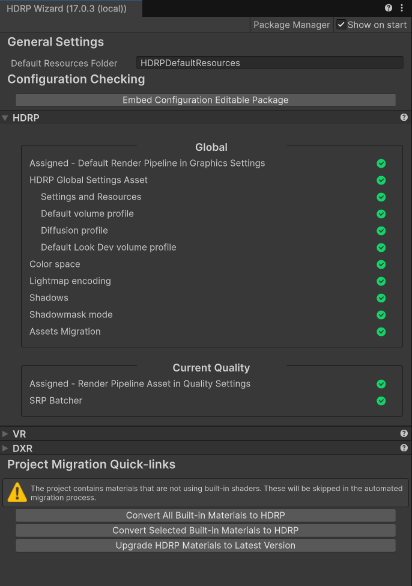
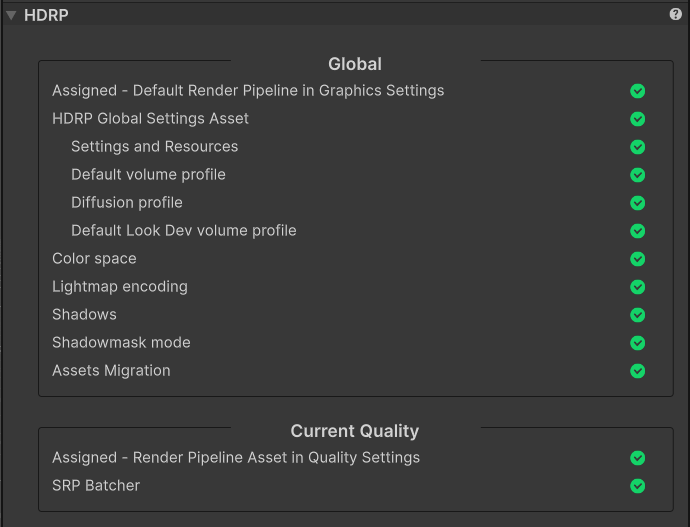
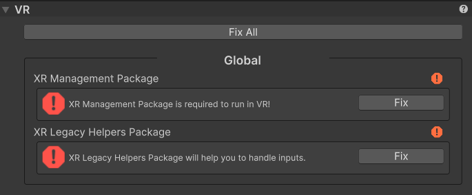
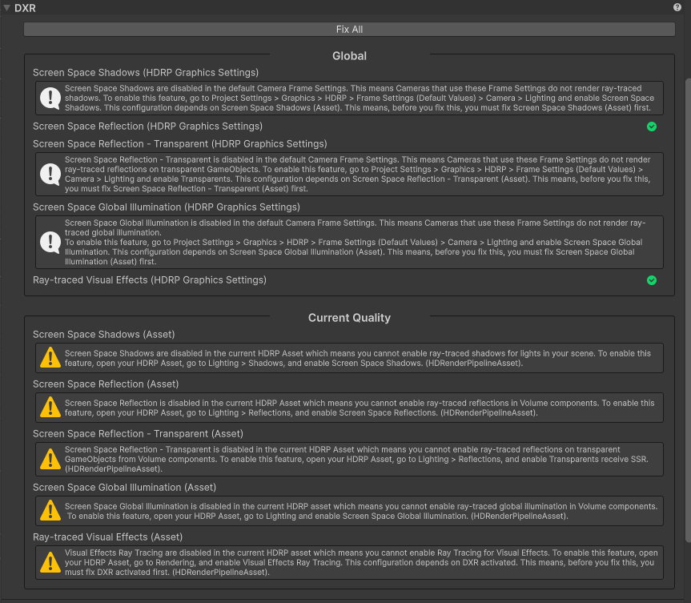

# High Definition Render Pipeline Wizard reference

The High Definition Render Pipeline (HDRP) includes the **HDRP Wizard** to help you configure your Unity Project so that it's compatible with HDRP.

To open the **Render Pipeline Wizard**, go to **Window > Rendering** and select **HDRP Wizard**.

## Packages

At the top of the window, there is an information text that shows you the currently installed version of HDRP. The **Package Manager** button provides a shortcut to the HDRP package in the Package Manager window.

## General Settings

| **Property**                 | **Description**                                              |
| ---------------------------- | ------------------------------------------------------------ |
| **Default Resources Folder** | Set the folder name that the Render Pipeline Wizard uses when it loads or creates resources. |

## Configuration Checking

Select the **Embed Configuration Editable Package** button to create a local instance of the [High Definition Render Pipeline Config package](configure-a-project-using-the-hdrp-config-package.md) in the `LocalPackage` folder of your HDRP Project. If the package is already installed, information about its location is displayed below.

Your Unity Project must adhere to all the configuration tests in this section for HDRP to work correctly. If a test fails, a message explains the issue and you can click a button to fix it. This helps you to quickly fix any major issues with your HDRP Project. The Render Pipeline Wizard can load or create any resources that are missing by placing new resources in the folder set as the **Default Resources Folder**.

There are three sections that you can use to set up your HDRP Project for different use cases.
* [HDRP](#HDRPTab): Use this section to set up a default HDRP Project.
* [VR](#VRTab): Use this section to set up your HDRP Project and enable support for virtual reality.
* [DXR](#DXRTab): Use this tab to set up your HDRP Project and enable support for ray tracing.

Each configuration is separated into two scopes:

- **Global:** Changes the configuration settings in the Unity Editor, [HDRP graphics settings](Default-Settings-Window.md), or [HDRP Asset](HDRP-Asset.md)
- **Current Quality:** Changes the configuration settings in the [HDRP Asset](HDRP-Asset.md) set in [Quality settings](quality-settings.md). If no asset is assigned in the **Quality** settings, this mode uses the [HDRP Asset](HDRP-Asset.md) set in the [Graphics settings window](Default-Settings-Window.md).

### HDRP

This section provides you with configuration options to help you make your Unity Project use HDRP.

#### Global
| **Configuration Option**         | **Description**                                              |
| -------------------------------- | ------------------------------------------------------------ |
| **Assigned - Default Render Pipeline in Graphics Settings** | Checks to make sure you have assigned an [HDRP Asset](HDRP-Asset.md) as the **Default Render Pipeline** (menu: **Edit** &gt; **Project Settings** &gt; **Graphics**). Select the **Fix** button to open a dialog that allows you to either assign an existing HDRP Asset or create and assign a new one. |
| **Global Settings Asset**          | Checks that the current project has a valid instance of a **HDRenderPipelineGlobalSettings** asset referenced in the Graphics Settings (menu: **Edit** &gt; **Project Settings** &gt; **Graphics** &gt; **HDRP**). Select the **Fix** button to find and assign an available **HDRenderPipelineGlobalSettings** asset. If there isn't one available, Unity creates an **HDRenderPipelineGlobalSettings** asset in the **Default Resources Folder**. |
| **Settings and Resources**         | Checks that all the **IRenderPipelineGraphicsSettings** and **IRenderPipelineResources** that belong to HDRP are valid and available in the **HDRenderPipelineGlobalSettings** asset |
| **Default Volume Profile**         | Checks to make sure you have assigned a **Default Volume Profile Asset** in **Edit** &gt; **Project Settings** &gt; **Graphics** &gt; **HDRP** that's not the one included in the **High Definition RP** package. This check only needs to pass if you want to modify the **Default Volume Profile Asset**. Select the **Fix** button to copy the **Default Volume Profile Asset** from the **High Definition RP** package into the **Default Resource Folder** and assign it. |
| **Diffusion Profile**              | Checks to make sure that your HDRP Asset references a [**Diffusion Profile**](diffusion-profile-reference.md) Asset. Select the **Fix** button to reload the runtime resources for the HDRP Asset. |
| **Default LookDev Volume Profile** | Checks to make sure you have assigned a **LookDev Volume Profile Asset** in **Edit** &gt; **Project Settings** &gt; **Graphics** &gt; **HDRP** that's not the one included in the **High Definition RP** package. This check only needs to pass if you want to use LookDev and modify the profile used in it. Select the **Fix** button to copy the **LookDev Volume Profile Asset** from the **High Definition RP** package into the **Default Resource Folder** and assign it. |
| **Color Space**                    | Checks to make sure **Color Space** is set to **Linear**. HDRP only supports **Linear Color Space** because it gives more physically accurate results than **Gamma**. Select the **Fix** button to set the **Color Space** to **Linear**. |
| **Lightmap Encoding**              | Checks to make sure **Lightmap Encoding** is set to **High Quality**, which is the only mode that HDRP supports.  Select the **Fix** button to make Unity encode lightmaps in **High Quality** mode. This fixes lightmaps for all platforms. |
| **Shadows**                        | Checks to make sure **Shadow Quality** is set to **All**. Unity hides this option when you install HDRP, and automatically sets it to **All**.  Select the **Fix** button to set **Shadow Quality** to **All**. |
| **Shadowmask Mode**                | Checks to make sure **Shadowmask Mode** is set to **Distance Shadowmask** at the Project level. This allows you to change the **Shadowmask Mode** on a per-[Light](Light-Component.md) level.  Select the **Fix** button to set the **Shadowmask Mode** to **Distance Shadowmask**. |
| **Assets Migration**               | Checks to make sure all **HDRenderPipelineAsset** used in quality levels have been upgraded to the current version of the High Definition Render Pipeline.  Select the **Fix** button to upgrade any assets that require it. Assets that are migrated will be logged in the console. You will need to save your project to save the changes. |

#### Current Quality

| **Configuration Option** | **Description**                                              |
| ------------------------ | ------------------------------------------------------------ |
| **Assigned - Quality**   | Checks to make sure you have assigned either an [HDRP Asset](HDRP-Asset.md) or null to the **Quality Settings** field corresponding to the currently used quality (menu: **Edit** &gt; **Project Settings** &gt; **Quality**). If the value is null, all **Current Quality** related configuration will be the one from the [HDRP Asset](HDRP-Asset.md) used in **Global**. Select the **Fix** button to nullify the field. |
| **SRP Batcher**          | Checks to make sure that [Scriptable Render Pipeline Batcher](xref:um-srp-batcher) is enabled. Select the **Fix** button to enable it in the used HDRP Asset. |

### HDRP + VR

This section provides extra configuration options to help you set up your HDRP Project to support virtual reality. If you can't find an option in this section of the documentation, refer to the [HDRP section](#HDRPTab) options. This is only supported on Windows OS. You can adjust the extra configuration options in the  **Global** scope.

<table>
<thead>
  <tr>
    <th><strong>Configuration Option</strong></th>
    <th></th>
    <th><strong>Description</strong></th>
  </tr>
</thead>
<tbody>
  <tr>
    <td><strong>Legacy VR System</strong></td>
    <td></td>
    <td>Checks that <strong>Virtual Reality Supported</strong> is disabled. This is the deprecated system.  Select the <strong>Fix</strong> button to disable <strong>Virtual Reality Supported</strong>.</td>
  </tr>
  <tr>
    <td><strong>XR Management Package</strong></td>
    <td></td>
    <td>Checks that the <strong>XR Management Package</strong> is installed. Select the <strong>Fix</strong> button to install it.</td>
  </tr>
  <tr>
    <td></td>
    <td><strong>Oculus Plugin</strong></td>
    <td>The wizard can't check this directly. This option gives information on the procedure to follow to check it. To install the plugin manually, go to <strong>Edit</strong> &gt; <strong>Project Settings</strong> &gt; <strong>XR Plugin Manager</strong></td>
  </tr>
  <tr>
    <td></td>
    <td><strong>Single-Pass Instancing</strong></td>
    <td>The wizard can't check this directly. This option gives information on the procedure to follow to check it. Go to <strong>Edit</strong> &gt; <strong>Project Settings</strong> &gt; <strong>XR Plugin Manager</strong> &gt; <strong>Oculus</strong> and make sure <strong>Stereo Rendering Mode</strong> uses <strong>Single-Pass Instancing</strong></td>
  </tr>
  <tr>
    <td><strong>XR Legacy Helpers Package</strong></td>
    <td></td>
    <td>Checks that the <strong>XR Legacy Helpers Package</strong> is installed. It's required to handle inputs with the <strong>TrackedPoseDriver</strong> component. Select the <strong>Fix</strong> button to install it.</td>
  </tr>
</tbody>
</table>

### HDRP + DXR

This section provides extra configuration options to help you set up your HDRP Project to support ray tracing. If you can't find an option in this section of the documentation, refer to the [HDRP tab](#HDRPTab) options. This is only supported on Windows OS.

**Note**: Every **Fix** will be disabled if your hardware or OS doesn't support DXR.

#### Global

| **Configuration Option**          | **Description**                                             |
| -------------------------------- | ------------------------------------------------------------ |
| **Auto Graphics API**            | Checks that **Auto Graphics API** is disabled in your [Player settings](xref:um-class-player-settings) for the current platform. DXR requires **Direct3D 12**.  Select the **Fix** button to disable **Auto Graphics API**. |
| **Direct3D 12**                  | Checks that **Direct3D 12** is the first Graphic API set in Player Settings for the current platform.  Select the **Fix** button to make Unity use **Direct3D 12**. |
| **Static Batching** | **Static Batching** isn't supported while using DXR. Select the **Fix** button to deactivate it. |
| **Architecture 64 bits** | DXR only supports 64-bit architecture. Select the **Fix** button to change the target architecture to 64-bit. |
| **DXR Resources** | Checks that your HDRP Asset references an **HD Render Pipeline RayTracing Resources** asset.  Select the **Fix** button to reload the ray tracing resources for the HDRP Asset. |
| **Screen Space Shadow (HDRP Default Settings)** | Checks to make sure that your [Default Settings](Default-Settings-Window.md) have the **Screen Space Shadows** [Frame Setting](Frame-Settings.md) enabled by default for Cameras. Select the **Fix** button to enable the **Screen Space Shadows** Frame Setting. **Note**: This configuration option depends on **Screen Space Shadows (Asset)**. This means, before you fix this, you must fix **Screen Space Shadows (Asset)** first. |
| **Screen Space Reflection (HDRP Default Settings)** | Checks to make sure that your [Default Settings](Default-Settings-Window.md) have the **Screen Space Reflections** [Frame Setting](Frame-Settings.md) enabled by default for Cameras. Select the **Fix** button to enable the **Screen Space Reflections** Frame Setting. **Note**: This configuration option depends on **Screen Space Reflection (Asset)**. This means, before you fix this, you must fix **Screen Space Reflection (Asset)** first. |
| **Screen Space Reflection - Transparents (HDRP Default Settings)** | Checks to make sure that your [Default Settings](Default-Settings-Window.md) have the **Transparents** [Frame Setting](Frame-Settings.md) enabled by default for Cameras. Select the **Fix** button to enable the **Screen Space Reflections** Frame Setting. **Note**: This configuration option depends on **Screen Space Reflection - Transparents (Asset)**. This means, before you fix this, you must fix **Screen Space Reflection - Transparents (Asset)** first. |
| **Screen Space Global Illumination (HDRP Frame Settings)** | Checks to make sure that your [Default Settings](Default-Settings-Window.md) have the **Screen Space Global Illumination** [Frame Setting](Frame-Settings.md) enabled by default for Cameras. Select the **Fix** button to enable the **Screen Space Global Illumination** Frame Setting. **Note**: This configuration option depends on **Screen Space Global Illumination (Asset)**. This means, before you fix this, you must fix **Screen Space Global Illumination (Asset)** first. |
| **DXR Shader Config** | Checks to make sure that the **ShaderConfig.cs.hlsl**, in the **High Definition RP Config** package referenced in your project, has **SHADEROPTIONS_RAYTRACING** set to **1**.  Select the **Fix** button to create a local copy of the **High Definition RP Config** package and, set **SHADEROPTIONS_RAYTRACING** to **1** in the **ShaderConfig.cs.hlsl**. |

#### Current Quality

| **Configuration Option**                           | **Description**                                              |
| -------------------------------------------------- | ------------------------------------------------------------ |
| **DXR Activated**                                  | Checks that **DXR Activated** is enabled in the current [HDRP Asset](HDRP-Asset.md).  Select the **Fix** button to enable **DXR Activated**. |
| **Screen Space Shadows (Asset)**                   | Checks that **Screen Space Shadows** is enabled in the current [HDRP Asset](HDRP-Asset.md).  Select the **Fix** button to enable **Screen Space Shadows**. |
| **Screen Space Reflection (Asset)**                | Checks that **Screen Space Reflection** is enabled in the current [HDRP Asset](HDRP-Asset.md).  Select the **Fix** button to enable **Screen Space Reflection**. |
| **Screen Space Reflection - Transparents (Asset)** | Checks that **Transparents** is enabled in the current [HDRP Asset](HDRP-Asset.md).  Select the **Fix** button to enable **Transparents**. |
| **Screen Space Global Illumination (Asset)**       | Checks that **Screen Space Global Illumination** is enabled in the current [HDRP Asset](HDRP-Asset.md).  Select the **Fix** button to enable **Screen Space Global Illumination**. |

