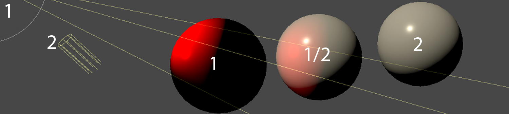
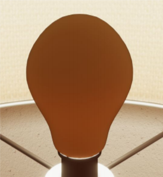
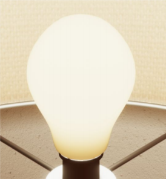

# Use light rendering layers

The High Definition Render Pipeline (HDRP) allows you to use Rendering Layers, which are [LayerMasks](https://docs.unity3d.com/ScriptReference/LayerMask.html) to make Lights or effects only affect specific Renderers.

A Renderer can support up to 32 rendering layers, but all HDRP effects using Rendering Layers only support the first 16 layers.
On the image below, you can see usage of Rendering Layers with Lights to only affect some of the meshes.

Rendering Layers are also supported on decal projectors, and can be sampled from the ShaderGraph to implement custom effects.

## Configure Rendering Layers

To create and name Rendering Layers:

- Go to **Edit** > **Project Settings** > **Tags and Layers**.  
- Go to the **Rendering Layers** section.
- Open the foldout **Rendering Layer Names**.

To use Rendering Layers with Lights:
- Go to **Edit** > **Project Settings** > **Graphics** > **Pipeline Specific Settings** > **HDRP**.
- In the **Frame Settings (Default Values)** section, open the **Lighting** dropdown.
- Enable **Light Layers**.
- Open the [HDRP Asset](HDRP-Asset.md).
- Go to the **Lighting** section.
- Enable **Light Layers**.

To enable and use Rendering Layers with decal projectors, refer to the [Decal Layers Documentation](use-decals.md#decal-layers).

To access the Rendering Layer Mask buffer from the ShaderGraph, go to the **Lighting** section of your Project’s [HDRP Asset](HDRP-Asset.md) and enable the **Rendering Layer Mask Buffer** checkbox.
You can then use the **HD Sample Buffer** node and set **RenderingLayerMask** as the source buffer to sample the layer mask buffer per pixel.

## Use a light's rendering layer mask

After you enable Light Layers, you can then use them to decouple Meshes from certain Lights in your Scene. To do this:

1. Click on a Light in the Hierarchy or the Scene view to view it in the Inspector.
2. Enable [additional properties](https://docs.unity3d.com/Packages/com.unity.render-pipelines.core@17.2/manual/advanced-properties.html) in the **General** section to expose the **Rendering Layer Mask** property.
3. Use the **Rendering Layer Mask** property drop-down to select which Light Layers this Light affects.
4. Click on a Mesh Renderer or Terrain in the Hierarchy or the Scene view to view it in the Inspector.
5. Use the **Rendering Layer Mask** drop-down (See [MeshRenderer](https://docs.unity3d.com/Manual/class-MeshRenderer.html) for GameObjects or [OtherSettings](https://docs.unity3d.com/Manual/terrain-OtherSettings.html) for Terrain) to select which Light Layers affect this Mesh Renderer or Terrain. When you enable Light Layers, a Light only affects a Mesh Renderer or Terrain if they both use a matching Light Layer.

## Use a light's shadow layers

When using Light Layers, Meshes only cast shadows for [Lights](Light-Component.md) on the same Rendering Layer as them. This is because HDRP synchronizes Light Rendering Layers and shadow Rendering Layers by default, so every Mesh that receives light, also casts shadows for it. To make a Mesh cast shadows without the Light also affecting its lighting, you must decouple the shadow Rendering Layers from that Light's Rendering Layers.

To do this:

1. Click on a Light in the Hierarchy or the Scene view to view it in the Inspector.
2. Go to the **Shadows** section and enable the **Custom Shadow Layers** checkbox.

You can now use the **Shadow Layers** drop-down in the **Shadows** section to set the Rendering Layers that the Light uses for shadowing. You can also still use the **Rendering Layer Mask** drop-down in the **General** section to set the Rendering Layers that the Light uses for lighting.

## Rename a rendering layers

By default, in the UI for Lights, Decals, Mesh Renderers or Terrain, Rendering Layers are named **Layer 0-15**. To more easily differentiate between them, you can give each Layer a specific name. To do this, go to **Edit** > **Project Settings** > **Tags and Layers**, then go to **Rendering Layer Names**. Here you can set the name of each Light Layer individually.

## Example scenario for Light Layers

Using [cookies](https://docs.unity3d.com/Manual/Cookies.html) for light fixtures can sometimes have a negative visual effect on a bulb, such as self-shadowing or transmission contribution. You can use Light Layers to make a bulb Mesh not receive any light from the Light’s cookie, and instead receive light from a separate small Point Light.

 
The Light cookie incorrectly affects the transmission of this bulb’s geometry.

 
Assigning the bulb’s Mesh Renderer to a specific Rendering Layer means that the Light cookie no longer affects the bulb’s Mesh Renderer.

 
To restore the transmission effect, create a Point Light and assign it to the same Rendering Layer as the bulb’s Mesh Renderer. Now this Point Light only affects the bulb’s Mesh Renderer and does not contribute to the rest of the Scene Lighting.

## Additional resources

- [Pierre Donzallaz - Expert guide: Create High-Quality  Light Fixtures in Unity](https://pydonzallaz.files.wordpress.com/2019/02/create-high-quality-light-fixtures-in-unity.pdf)

