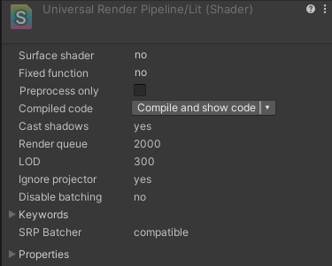

# Check whether a GameObject is compatible with the SRP Batcher

## GameObject compatibility

In any given scene, some GameObjects are compatible with the SRP Batcher, and some aren't. Compatible GameObjects use the SRP Batcher code path, and non-compatible GameObjects use the standard SRP code path. For more information, see [How the SRP Batcher works](#how-the-srp-batcher-works).

A GameObject must meet the following requirements to be compatible with the SRP Batcher code path:

* The GameObject must contain either a mesh or a skinned mesh. It can't be a particle.
* The GameObject mustn't use [MaterialPropertyBlocks](https://docs.unity3d.com/6000.0/Documentation/ScriptReference/MaterialPropertyBlock).
* The shader that the GameObject uses must be compatible with the SRP Batcher. For more information, see [Shader compatibility](#shader-compatibility).

## Shader compatibility

All lit and unlit shaders in the Universal Render Pipeline (URP) and the High Definition Render Pipeline (HDRP) fit this requirement (except for the particle versions of these shaders).

For a custom shader to be compatible with the SRP Batcher it must meet the following requirements:

* The shader must declare all built-in engine properties in a single constant buffer named `UnityPerDraw`. For example, `unity_ObjectToWorld`, or `unity_SHAr`.
* The shader must declare all material properties in a single constant buffer named `UnityPerMaterial`.

You can check the compatibility status of a shader in the Inspector panel.

