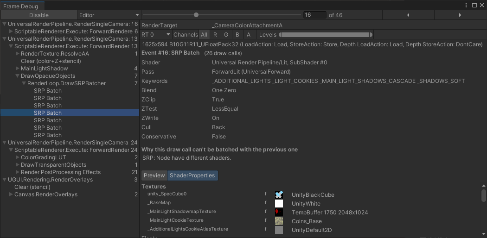

# Troubleshoot the SRP Batcher

You can check the status of SRP batches in the [Frame Debugger](https://docs.unity3d.com/6000.0/Documentation/Manual/FrameDebugger) window. Each SRP Batch displays how many draw calls Unity used, which keywords Unity attached to the shader, and the reason why Unity didn't batch that draw call with the previous one.

To check the status of SRP Batcher batches:

1. In the Editor, open the Frame Debugger (menu: **Window** > **Analysis** > **Frame Debugger**).
2. In the Frame Debugger, go to **Render Camera** > **Render Opaques**.
3. Expand the **RenderLoopNewBatcher. Draw** list.
4. Select on the **SRP Batch** you want to inspect.

In the example below, the reason is: **Nodes have different shaders**. This means that the shader for that SRP batch is different to the one in the previous SRP batch. Because the SRP Batcher used a different shader, the SRP Batcher created a new batch. If several SRP batches have a low number of draw calls, it often means the project uses too many shader variants.

If you write your own Scriptable Render Pipeline, instead of using either the Universal Render Pipeline or the High Definition Render Pipeline, try to write a generic multi-purpose shader with a minimal number of keywords. This is optimal because you can use as many material properties as you want.