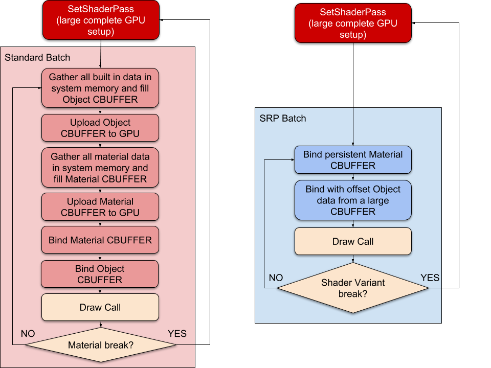
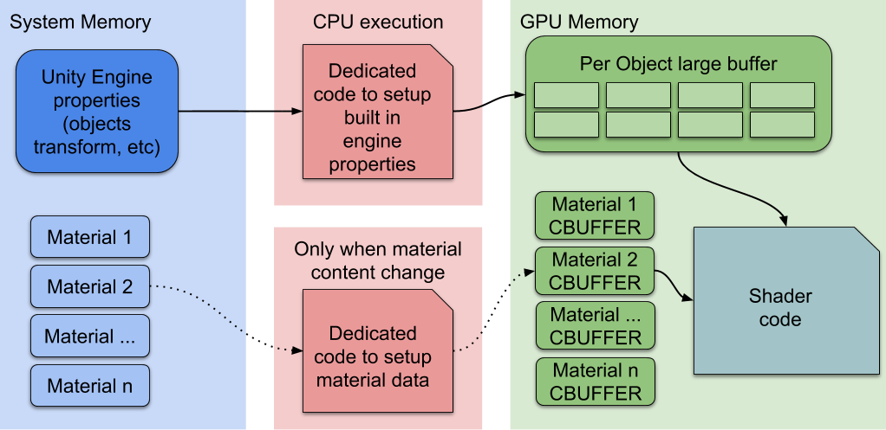

# Scriptable Render Pipeline Batcher

The Scriptable Render Pipeline (SRP) Batcher is a [draw call optimization](reduce-draw-calls-landing-hdrp.md) that significantly improves performance for applications that use an SRP. The SRP Batcher reduces the CPU time Unity requires to prepare and dispatch draw calls for materials that use the same shader variant.

## Requirements and compatibility

This section includes information about the render pipeline compatibility of the SRP Batcher.

### Render pipeline compatibility

| **Feature**     | **Universal Render Pipeline (URP)** | **High Definition Render Pipeline (HDRP)** | **Custom Scriptable Render Pipeline (SRP)** | **Built-in Render Pipeline** | 
| --------------- | ---------------------------- | ----------------------------------- | ------------------------------------------ | ------------------------------------------- |
| **SRP Batcher** | Yes                                 | Yes                                        | Yes                                         | No                           | 

## How the SRP Batcher works

The traditional way to optimize draw calls is to reduce the number of them. Instead, the SRP Batcher reduces render-state changes between draw calls. To do this, the SRP Batcher combines a sequence of `bind` and `draw` GPU commands. Each sequence of commands is called an SRP batch.

To achieve optimal performance for your rendering, each SRP batch should contain as many `bind` and `draw` commands as possible. To achieve this, use as few shader variants as possible. You can still use as many different materials with the same shader as you want.

When Unity detects a new material during the render loop, the CPU collects all properties and binds them to the GPU in constant buffers. The number of GPU buffers depends on how the shader declares its constant buffers.

The SRP Batcher is a low-level render loop that makes material data persist in GPU memory. If the material content doesn't change, theSRP Batcher doesn't make any render-state changes. Instead, the SRP Batcher uses a dedicated code path to update the Unity Engine properties in a large GPU buffer, like this:

Here, the CPU only handles the Unity Engine properties, labeled **Per Object large buffer** in the above diagram. All materials have persistent constant buffers located in GPU memory, which are ready to use. This speeds up rendering because:

* All material content now persists in GPU memory.
* Dedicated code manages a large per-object GPU constant buffer for all per-object properties.

