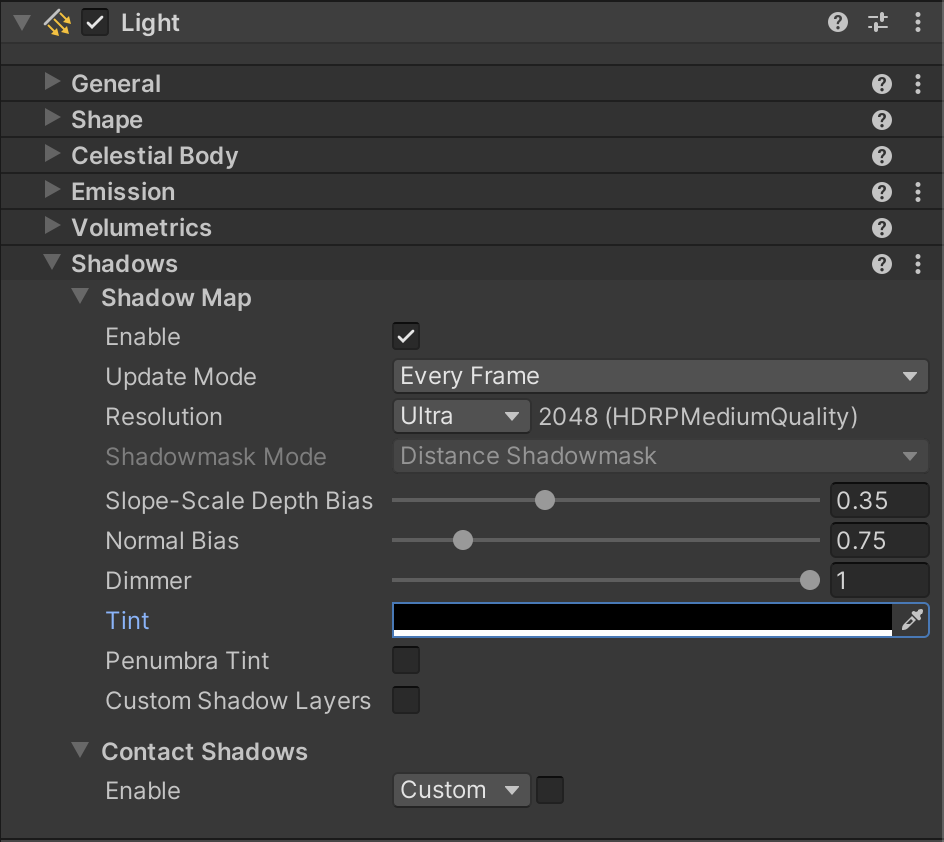

# Control shadow resolution and quality 

You can use the following features to control the quality and resolution size of shadows in a scene: 

- [Shadow map resolution](#Shadowmapresolution)
- [Shadow atlases](#Shadowatlases)
- [Shadow bias](#Shadowbias)
- [Shadow filtering](#ShadowFiltering)

## Shadow map resolution

The resolution of a Light’s shadow map determines the size of its shadow maps. The larger the shadow map, the more precise the shadows can be, and the better the High Definition Render Pipeline (HDRP) can capture small details in the shadow casting geometry. Rendering shadow maps at higher resolutions make them look sharper.

Set the resolution of a specific Light’s shadow map in the **Shadows** section of the Light component.

The number of shadow maps HDRP renders per Light depends on the **Type** of the Light:

- A Spot Light renders one shadow map.
- A Point Light renders six shadow maps (the number of faces in a cubemap).
- An Area Light renders one shadow map.
- A Directional Light renders one shadow map per cascade. Set the cascade count of Directional Lights from the [HD Shadow Settings](Override-Shadows.md) of your Scene’s [Volumes](understand-volumes.md). The default value is four cascades.

HDRP can perform a dynamic rescale of shadow maps to maximize space usage in shadow atlases, but also to reduce the performance impact of lights that occupy a small part of the screen. To do this, HDRP scales down a light's shadow map resolution depending on the size of the screen area the light covers. The smaller the area on the screen, the more HDRP scales the resolution down from the value set on the [Light component](Light-Component.md).

To enable this feature:

1. Open your Unity Project’s [HDRP Asset](HDRP-Asset.md) in the Inspector window.
2. Go to **Lighting** > **Shadows**.
3. Go to either **Punctual Light Shadows** or **Area Light Shadows**.
4. Go to **Light Atlas** and enable **Dynamic Rescale**.

**Note**: HDRP doesn't support dynamic rescale for cached shadow maps.

## Shadow atlases

HDRP renders all real-time shadows for a frame using a shadow map atlas for all [punctual light](Glossary.md#PunctualLight) shadows, an atlas for area lights and another one for Directional Light shadows.

Set the size of these atlases in your Unity Project’s [HDRP Asset](HDRP-Asset.md). The atlas size determines the maximum resolution of shadows in your Scene.

For example, the default size of an atlas is 4096 x 4096, which can fit:

- Sixteen shadow maps of 1024 x 1024 pixels.
- Two shadow maps of 2048 x 2048 plus four shadow maps of 1024 x 1024 plus eight shadow maps of 512 x 512 plus 32 shadow maps of 256 x 256.

### Preserve shadow atlas placement

If you disable a Light or change its **Update Mode** to **Every Frame**, the cached shadow manager unreserves the Light's shadow map's space in the cached shadow atlas and HDRP begins to render the Light's shadow map to the normal shadow atlases every frame. If the cached shadow manager needs to allocate space on the atlas for another Light, it can overwrite the space currently taken up by the original Light's shadow map.

If you want to temporarily set a Light's **Update Mode** to **Every Frame** and want to set it back to **On Enable** or **On Demand** later, you can preserve the Light's shadow map placement in its atlas. This is useful, for example, if you want HDRP to cache a far away Light's shadow map, but update it every frame when it gets close to the [Camera](hdrp-camera-component-reference.md). To do this:

1. Select a Light in your scene to view it in the Inspector window.
2. Go to **HDAdditionalLightData** and open the More menu (&#8942;)
3. Select **Edit Script**
4. Enable **preserveCachedShadow** and set it to **True**. HDRP preserves the Light's shadow map's space in its shadow atlas.

**Note**: Even if you enable **preserveCachedShadow**, if you destroy the Light, it loses its placement in the shadow atlas.

### Control the maximum number of shadows on screen

In addition to the atlases, you can also set the maximum number of shadow maps HDRP can render in a single frame. To do this, open your Unity Project’s HDRP Asset, navigate to the **Shadows** section, and enter a **Max Shadows on Screen** value. If the number of shadow maps on screen is higher than this limit, HDRP doesn't render them.

## Shadow Bias

Shadow maps are textures projected from the point of view of the Light. HDRP uses a bias in the projection so that the shadow casting geometry doesn't shadow itself.

In HDRP, each individual Light component controls its own shadow biasing using the following parameters:

- **Near Plane**
- **Slope-Scale Depth Bias**
- **Normal Bias**

Find these settings under the **Shadows** section. If some property fields are missing, enable [additional properties](expose-all-additional-properties.md) to display them. For details on how each property controls the shadow biasing, see the [Light documentation](Light-Component.md).

Using high shadow bias values may result in light "leaking" through Meshes. This is where there is a visible gap between the shadow and its caster and leads to shadow shapes that don't accurately represent their casters.

## Shadow filtering

After HDRP captures a shadow map, it processes filtering on the map to decrease the aliasing effect that occurs on low resolution shadow maps. Different filters affect the perceived sharpness of shadows.

To change which shadow filter quality to use, change the **Filtering Quality** property in your Unity Project’s [HDRP Asset](HDRP-Asset.md). Higher quality have impact on GPU performance.
There are currently three filter quality presets for directional and punctual lights. For information on the available filter qualities, see the [Filtering Qualities table](HDRP-Asset.md#filtering-quality).

### Customise shadow caching
HDRP caches shadow maps for Punctual Lights into one atlas, Area Lights into another, and Directional Lights into the same atlas as non-cached Directional Lights. You can change the resolution of the first two cached shadow atlases independently of one another. To do this:

1. Open your Unity Project’s [HDRP Asset](HDRP-Asset.md) in the Inspector window.
2. For Punctual lights, go to **Lighting > Shadows > Punctual Light Shadows**. For Area lights, go to **Lighting > Shadows > Area Light Shadows**.
3. Set **Cached Shadow Atlas Resolution** to the value you want. To help with shadow atlas organisation, try to keep the resolution of individual shadow maps as a multiple of 64. For the most optimal organisation, set the same resolution to as many shadow maps as possible.

If the shadow atlas is full when a Light requests a spot, the cached shadow manager doesn't add the Light's shadow map and so the Light doesn't cast shadows. This means that it's important to manage the space you have available. To check if a Light can fit in the shadow atlas, you can use the `HDCachedShadowManager.instance.WouldFitInAtlas` helper function. To see if a Light already has a place in the atlas or if it's waiting for one, go to **Window** > **Rendering** > **Light Explorer** > **Shadows Fit Atlas**.

After a Scene loads with the Lights you have already placed, if you add a new Light with cached shadows to the Scene, HDRP tries to place it to fill the holes in the atlas. However, depending on the order of insertion, the atlas may be fragmented and the holes available aren't enough to place the Light's shadow map in. In this case, you can defragment the atlas to allow for additional Lights. To do this, pass the target atlas into the following function: `HDCachedShadowManager.instance.DefragAtlas`

**Note**: This causes HDRP to mark all the shadow maps in the atlas as dirty which means HDRP renders them the moment their parent Light becomes visible.

It's possible to check if a Light's shadow maps have a place in the cached shadow atlas by using `HDCachedShadowManager.instance.LightHasBeenPlacedInAtlas`. It's also possible to check if a Light's shadow maps have been placed and rendered at least once with `HDCachedShadowManager.instance.LightHasBeenPlaceAndRenderedAtLeastOnce`.

### Mixed Cached Shadow Maps

In HDRP it's possible to cache only some of the shadow map. To do this:

1. Select a Light in your scene to view it in the Inspector window.
2. Go to **Light** > **Shadows**
3. Enable **Always draw dynamic**.
4. Enable **Static Shadow Caster** for all Renderers to cache shadows for.

**Note**: For Directional Lights, you need to enable the feature on the HDRP asset: **Lighting** > **Shadows** > **Directional Light Shadows** > **Allow Mixed Cached Shadows**.

With this set up, HDRP renders static shadow casters into the shadow map depending on the Light's Update Mode, but it renders dynamic shadow casters into their respective shadow maps each frame. If you set the Update Mode to **OnEnable**, HDRP only renders static shadow casters when you enable the Light component. If the Update Mode is to **OnDemand**, HDRP only renders static shadow casters when you explicitly request an update.

This setup is particularly useful if your environment consists of mostly static GameObjects and the lights don't move, but there are few dynamic GameObjects that you want the static lights to cast shadows for. In such scenarios, setting the light to have a mixed cached shadow map greatly improves performance both on the CPU and GPU.

**Note**: If you set up a shadow to be mixed cached, HDRP performs a blit from the cached shadow map to the dynamic atlas. This is important to keep in mind both for the extra runtime cost of the blit in itself, but also that, in terms of memory, a single shadow map requires space in both atlases.

**Note**: If a Light with mixed cached shadows moves and you don't update the cached counterpart, the result looks wrong. In such cases either enable the Light's **Update on light movement** option or set the Light's update mode to **OnDemand** and make sure to trigger an update when you move the Light.

### View Dependent Update

Anything that's view-dependent is likely to create problems with cached shadow maps because HDRP doesn't automatically update them as the main view moves. An example of this is tessellation. Tessellation factor is view-dependent, so the geometry that the main camera sees might not match the geometry that HDRP rendered into the cached shadow map. If this visibly occurs, trigger a request for HDRP to update the Light's shadow map. To do this, make sure you set the Light's **Update Mode** to **On Demand** and call `RequestShadowMapRendering`.

Another example is when multiple views are available. The light will be updated only for a single view therefore causing the other views to have incorrect results. To avoid a common scenario in which the described artifact will occur, HDRP won't mark a shadow request as completed when performed from reflection probes with view dependent shadows and waiting until a non-reflection camera triggers a shadow update.

#### Directional Light Update

The shadow cascades of a directional light are always view dependent. This means that camera movement that changes view direction or moves outside of the area in which the cached cascades were captured will lead to artifacts if the cached shadows are not updated. These artifacts can manifest as incorrect shadows around the camera or at the edges of cascades.

Because of this it is advisable to use **Update Mode** with **On Demand** and call `RequestShadowMapRendering` frequently if the main camera is moved to avoid artifacts.

### Notes

While you are in the Unity Editor, HDRP updates shadow maps whenever you modify the Light that casts them. In a built application, HDRP refreshes cached shadow maps when you change different properties on the Light or when you call one of the following functions:

- `SetShadowResolution()`
- `SetShadowResolutionLevel()`
- `SetShadowResolutionOverride()`
- `SetShadowUpdateMode()` or `shadowUpdateMode`. In this case, HDRP only refreshes the cached shadow maps if the mode changes between Every Frame and not Every Frame.

