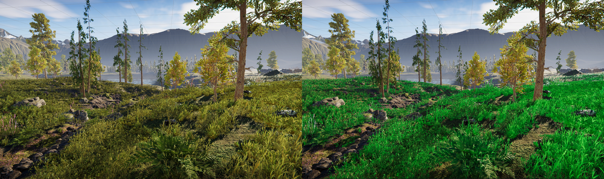

# Subsurface Scattering

__Subsurface Scattering__ handles light that penetrates and moves within the area under a surface. Use it to make organic materials, like skin, look smooth and natural rather than rough and plastic-like. HDRP implements subsurface scattering using a screen-space blur technique.

Subsurface scattering also handles the light that penetrates GameObjects from behind and makes those GameObjects look transparent. For certain types of objects, the screen-space blur effect may not make a large visual difference. Therefore, HDRP implements two material types:

* __Subsurface Scattering__ implements both the screen-space blur effect and transmission (you can disable the latter).
* __Translucent__ only models transmission.

## Enable Subsurface Scattering

To enable subsurface scattering in your [HDRP Asset](HDRP-Asset.md):

1. In the HDRP Asset’s Inspector window, go to the __Material__ section and enable the __Subsurface Scattering__ checkbox.
2. When you enable the __Subsurface Scattering__ checkbox, HDRP displays the __High Quality__ option. You can Enable this option to increase the sample count and reduce the amount of visual noise the blur pass can cause by under sampling. Note that this is around two and a half times more resource intensive than the default quality.
3. Go to **Edit > Project Settings > HDRP Default Settings** and, in the **Default Frame Settings** section, under the __Lighting__ subsection, enable __Subsurface Scattering__ and __Transmission__.

HDRP stores most subsurface scattering settings in a [Diffusion Profile](Diffusion-Profile.md). HDRP supports up to 15 custom Diffusion Profiles in view at the same time, but you can override which Diffusion Profiles HDRP uses and thus use as many Diffusion Profiles as you want throughout your project. To do this, use the [Diffusion Profile Override](Override-Diffusion-Profile.md) in the [Volume](Volumes.md) system. This [override](Volume-Components.md) lets you specify 15 custom Diffusion Profiles which HDRP can use for a Camera within the override's Volume.

For information on how to create and use a Diffusion Profile, see the [Diffusion Profile documentation](Diffusion-Profile.md)

## Add subsurface scattering to a Material

To add subsurface scattering to a Material:

1. Open the Material in the Inspector.
2. In the **Surface Options** section, set the Material’s __Material Type__ to __Subsurface Scattering__ or __Translucent__, depending on the effect you want.
3. In the Surface Inputs section, select [Diffusion Profile](Diffusion-Profile.md) and assign a diffusion profile.
4. If a warning box appears below the Diffusion Profile property, select **Fix**.

The following image displays grass in an environment scene. In the left image the grass renders correctly. The grass in the right image has the bright green tint that HDRP applies to a Material that doesn't have a valid diffusion profile:

The Material appears bright green in the following cases:

- The Material doesn't have a diffusion profile assigned.

- The Diffusion profile assigned in the Material is not included in a [Diffusion Profile List](Diffusion-Profile.md)

### Customizing Subsurface Scattering

When you select __Subsurface Scattering__ or __Translucent__ from the __Material Type__ drop-down, Unity exposes several new properties in the Material UI. For information on how to use these properties to customize the behavior of the subsurface scattering effect, see the [Material Type documentation](Material-Type.md) and the [Diffusion Profile documentation](Diffusion-Profile.md).

Materials and Shader Graphs that use subsurface scattering do not use the Metallic property. This creates available space in the GBuffer to store all data related to subsurface scattering.

You can learn more about HDRP’s subsurface scattering implementation in our [Efficient Screen-Space Subsurface Scattering](http://advances.realtimerendering.com/s2018/Efficient%20screen%20space%20subsurface%20scattering%20Siggraph%202018.pdf) presentation.
