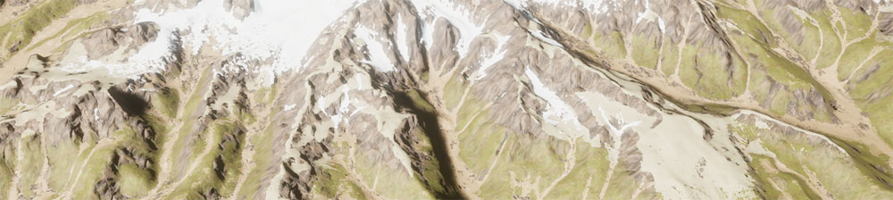
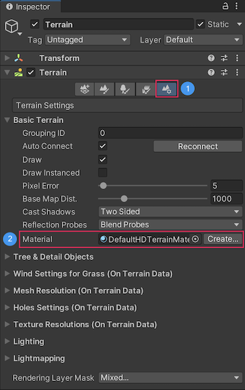
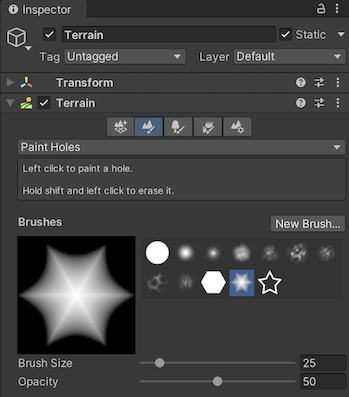

# **Terrain Lit Shader**

The High Definition Render Pipeline (HDRP) uses the Terrain Lit Shader for Unity Terrain. This Shader is a simpler version of the [Lit Shader](Lit-Shader.md). A Terrain can use a Terrain Lit Material with up to eight [Terrain Layers](https://docs.unity3d.com/Manual/class-TerrainLayer.html).

## Creating a Terrain Lit Material

To create a new Terrain Lit Shader Material:

1. Go to your Project window and right-click in the **Assets** folder
2. Select **Create > Material**. This adds a new Material to your Unity Project’s Asset folder.
3. Click on the Material to view it in the Inspector.
4. Click on the **Shader** drop-down and select **HDRP > TerrainLit**.

## Using a Terrain Lit Material

To use a Terrain Lit Material, you must assign it to a Terrain:

1. View the Terrain in the Inspector and click on the gear button to go to the **Terrain Settings** section.
2. Either drag and drop or use the radio button to assign your Terrain Lit Material to the **Material** property.

## Using the Paint Holes Tool

If you use the **Paint Holes** tool on your terrain, make sure to enable the **Terrain Holes** feature in your Project's HDRP Asset. Otherwise, the holes do not appear when you build your application.

## Material properties

### Surface Options

| **Property**       | **Description**                                              |
| ------------------ | ------------------------------------------------------------ |
| **Receive Decals** | Enable the checkbox to allow HDRP to draw decals on this Material’s surface. |

### Terrain

| **Property**                  | **Description**                                              |
| ----------------------------- | ------------------------------------------------------------ |
| **Enable Height-based Blend** | Specifies whether HDRP should only render the Terrain Layer with the greatest height value for a particular pixel. When enabled, HDRP takes the height values from the blue channel of the **Mask Map** Texture. When disabled, HDRP blends the Terrain Layers based on the weights painted in the control map Textures. |
| **- Height Transition**       | Controls how much HDRP blends the terrain if multiple Terrain Layers are approximately the same height. |
| **Enable Per-pixel Normal**   | Specifies whether HDRP should sample the normal map Texture on a per-pixel level.  When enabled, Unity preserves more geometry details for distant terrain parts. Unity generates a geometry normal map at runtime from the heightmap, rather than the Mesh geometry. This means you can have high-resolution Mesh normals, even if your Mesh is low resolution. It only works if you enable **Draw Instanced** on the terrain. |
| **Specular Occlusion Mode**   | Sets the mode that HDRP uses to calculate specular occlusion.  &#8226; **Off**: Disables specular occlusion. &#8226; **From Ambient Occlusion**: Calculates specular occlusion from the ambient occlusion map and the Camera's view direction. |

### Advanced Options

| **Property**              | **Description**                                              |
| ------------------------- | ------------------------------------------------------------ |
| **Enable GPU Instancing** | Enable the checkbox to tell HDRP to render Meshes with the same geometry and Material in one batch when possible. This makes rendering faster. HDRP cannot render Meshes in one batch if they have different Materials, or if the hardware does not support GPU instancing. For example, you cannot [static-batch](https://docs.unity3d.com/Manual/DrawCallBatching.html) GameObjects that have an animation based on the object pivot, but the GPU can instance them. |
