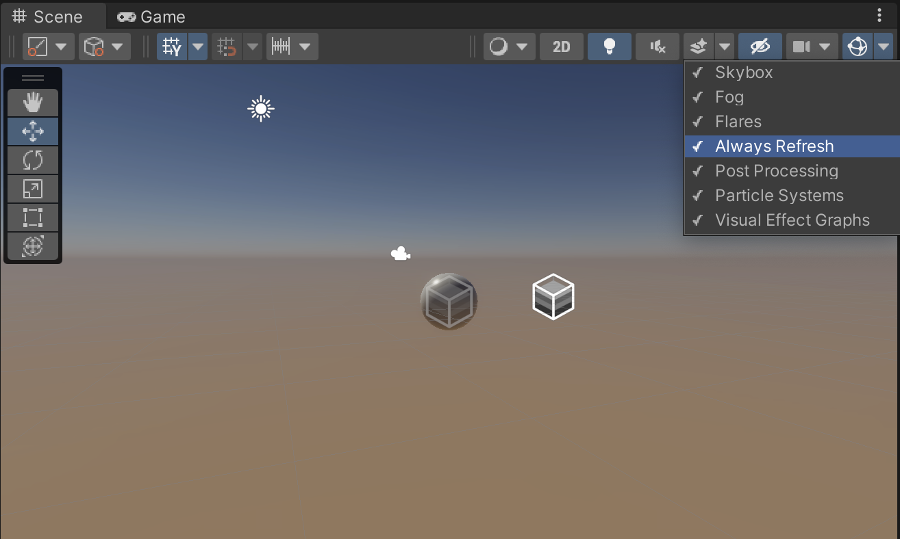

# Upgrading to HDRP from the built-in render pipeline

The High Definition Render Pipeline (HDRP) uses a new set of [Shaders](https://docs.unity3d.com/Manual/class-Shader.html) and [lighting units](Physical-Light-Units.md), both of which are incompatible with the Built-in Renderer. To upgrade a Unity Project to HDRP, you must first convert all your [Materials](#MaterialConversion) and Shaders, then adjust individual [Light](#LightAdjustment) settings accordingly.

This document explains how to convert your Project to HDRP.

## Setting up HDRP

Firstly, to install HDRP, add the High Definition RP package to your Unity Project:

1. Open your Unity project.
2. To open the **Package Manager** window, go to **Window** > **Package Manager**.
3. In the **Package Manager** window, in the **Packages:** field, select **Unity Registry** from the menu.
4. Select **High Definition RP** from the list of packages.
5. In the bottom right corner of the Package Manager window, select **Install**.

**Note**: When you install HDRP, Unity automatically attaches two HDRP-specific components to GameObjects in your Scene. It attaches the **HD Additional Light Data** component to Lights, and the **HD Additional Camera Data** component to Cameras. If you don't set your Project to use HDRP, and any HDRP component is present in your Scene, Unity throws errors. To fix these errors, see the following instructions on how to set up HDRP in your Project.

To set up HDRP in your project, use the [HDRP Wizard](Render-Pipeline-Wizard.md).

1. To open the **HD Render Pipeline Wizard** window, go to **Window** > **Rendering** > **HD Render Pipeline Wizard**.
2. In the **Configuration Checking** section, go to the **HDRP** tab and click **Fix All**. This fixes every HDRP configuration issue with your Project.

You have fixed your Project's HDRP configuration issues, but your Scene doesn't render correctly because GameObjects in the Scene still use Shaders made for the Built-in Render Pipeline. To find out how to upgrade Built-in Shaders to HDRP Shaders, see [Upgrading Materials](#MaterialConversion) below.

## Upgrading Materials

To upgrade the Materials in your Scene to HDRP-compatible Materials:

1. Go to **Edit** > **Rendering** > **Materials**
2. Choose one of the following options:

    * **Convert All Built-in Materials to HDRP**: Converts every compatible Material in your Project to an HDRP Material.
    * **Convert Selected Built-in Materials to HDRP**: Converts every compatible Material currently selected in the Project window to an HDRP Material.
    * **Convert Scene Terrains to HDRP Terrains**: Replaces the built-in default standard terrain Material in every [Terrain](https://docs.unity3d.com/Manual/script-Terrain.html) in the scene with HDRP default Terrain Material.

### Limitations

The automatic upgrade options described above can't upgrade all Materials to HDRP correctly:

* You can't automatically upgrade custom Materials or Shaders to HDRP. You must [convert custom Materials and Shaders manually](#ManualConversion).
* Height mapped Materials might look incorrect. This is because HDRP supports more height map displacement techniques and decompression options than the Built-in Render Pipeline. To upgrade a Material that uses a heightmap, modify the Material's **Amplitude** and **Base** properties until the result more closely matches the Built-in Render Pipeline version.
* You can't upgrade particle shaders. HDRP doesn't support particle shaders, but it does provide Shader Graphs that are compatible with the [Built-in Particle System](https://docs.unity3d.com/Manual/Built-inParticleSystem.html). These Shader Graphs work in a similar way to the built-in particle shaders. To use these Shader Graphs, import the **Particle System Shader Samples** sample:

    1. Open the Package Manager window (menu: **Window** > **Package Manager**).
    2. Find and click the **High Definition RP** entry.
    3. In the package information for **High Definition RP**, go to the **Samples** section and click the **Import into Project** button next to **Particle System Shader Samples**.

### Converting Materials manually

HDRP uses multiple processes to automatically convert Built-in Standard and Unlit Materials to HDRP Lit and Unlit Materials respectively. These processes use an overlay function to blend the color channels together, similar to the process you would use in image editing software like Adobe Photoshop.

To help you convert custom Materials manually, this section describes the maps that the converter creates from the Built-in Materials.

#### Mask maps

The Built-in Shader to HDRP Shader conversion process combines the different Material maps of the Built-in Standard Shader into the separate RGBA channels of the mask map in the HDRP [Lit Material](Lit-Shader.md). For information on which color channel each map goes in, see [mask map](Mask-Map-and-Detail-Map.md#MaskMap).

#### Detail maps

The Built-in Shader to HDRP Shader conversion process combines the different detail maps of the Built-in Standard Shader into the separate RGBA channels of the detail map in the HDRP [Lit Material](Lit-Shader.md). It also adds a smoothness detail too. For information on which color channel each map goes in, see [detail map](Mask-Map-and-Detail-Map.md#DetailMap).

## Adjusting lighting

HDRP uses [physical Light units](Physical-Light-Units.md) to control the intensity of Lights. These units don't match the arbitrary units that the Built-in render pipeline uses.

For light intensity units, Directional Lights use [Lux](Physical-Light-Units.md#Lux) and all other Light types can use [Lumen](Physical-Light-Units.md#Lumen), [Candela](Physical-Light-Units.md#Candela), [EV](Physical-Light-Units.md#EV), or simulate Lux at a certain distance.

To set up lighting in your HDRP Project:

1. To add the default sky [Volume](Volumes.md) to your Scene and set up ambient lighting go to **GameObject** > **Volume** > **Sky and Fog Global Volume**.
2. Set the [Environment Lighting](Environment-Lighting.md) to use this new sky:

    1. Open the Lighting window (menu: **Window** > **Rendering** > **Lighting Settings**).
    2. In the **Environment** tab, set the **Profile** property to the same [Volume Profile](Volume-Profile.md) that the Sky and Fog Global Volume uses.
    3. Set the **Static Lighting Sky** property to **PhysicallyBasedSky**.
    4. Optionally, if you don't want Unity to re-bake the Scene's lighting when you make the rest of the changes in this section, you can disable the **Auto Generate** checkbox at the bottom of the window.

3. Currently, the shadows are low quality. To increase the shadow quality:

    1. Create a new **Global Volume** GameObject (menu: **GameObject** > **Volume** > **Global Volume**) and name it **Global Settings**.
    2. To create a new Volume Profile for this Global Volume:

        1. Open the Global Volume's Inspector window and go to the **Volume** component.
        2. Go to **Profile** and select **New**.

    3. To add a **Shadows** override:

        1. Go to **Add Override** > **Shadowing** > **Shadows**.
        2. Enable **Max Distance**.
        3. Set **Max Distance** to 50.

4. Configure your Sun Light GameObject.

    1. Select your Light GameObject that represents the Sun in your Scene to view it in the Inspector.
    2. Go to **Emmision** and set the **Intensity** to **100000**.
    3. Set **Light Appearance** to **Color**.
    4. Set **Color** to white.
    5. To see the sun in the sky, go to **Shape** and set **Angular Diameter** to **3**.

5. The Scene is now over-exposed. To fix this:

    1. Select the **Global Settings** GameObject you created in step **3**.
    2. Add an **Exposure** override to its Volume component (menu: **Add Override** > **Exposure**).
    3. Enable **Mode** and set it to **Automatic**.
    4. To refresh the exposure, go to the Scene view and enable **Always Refresh**.

    

7. HDRP supports colored light cookies, whereas the Built-in light cookies use a texture format that only contains alpha. To correct the Light cookie:

    1. In the Project window, select your Light cookie from your **Assets** folder.
    2. In the Inspector, change the import type from **Cookie** to **Default**.
    3. Set the **Wrap Mode** to **Clamp**.

8. Correct spot lights:

    1. In the Hierarchy, select a Spot Light and view the Light component in the Inspector.
    2. Go to **Emission** and set **Intensity** to 17000 **Lumen** to represent two 8500 Lumen light bulbs.
    3. In the **Emission**, select the More menu (&#8942;) and enable [additional properties](More-Options.md).
    4. Enable **Reflector** checkbox. This simulates a reflective surface behind the spot Light to adjust the visual intensity.

9. Make the light bulb Material emissive:

    1. In the Project window, select **Assets/ExampleAssets/Materials/Lightbulb_Mat.mat**.
    2. In the Inspector, go to **Emission Inputs** and enable **Use Emission Intensity**.
    3. Set **Emissive Color** to white, and set the **Emission Intensity** to **8500 Luminance**.

10. If you disabled **Auto Generate** in step **2**, go to the Lighting window and press the **Generate Lighting** button. You can also re-enable **Auto Generate**.

## Post-processing

HDRP no longer supports the **Post Processing** package and instead includes its own [implementation for post-processing](Post-Processing-Main.md). If your Project uses the Post Processing package, remove the Post Processing package from the Project. To do this:

1. In the Unity Editor, open the Package Manager window (menu: **Window** > **Package Manager**).
2. Find and select the **Post Processing** package, and click **Remove**.

If your Project uses the Post Processing package's Scripting API to edit post-processing effects, you need to update your scripts to work with the new post-processing effects. To convert the Scene to HDRP post-processing:

1. In the Hierarchy, delete your post-processing GameObject.
2. Create a new **Global Volume** GameObject (menu: **GameObject** > **Volume** > **Global Volume**) and name it "Post-processes".
3. Create a new Volume Profile:

    1. Open the Global Volume's Inspector window and go to the **Volume** component.
    2. Go to **Profile** and select **New**.

4. Add a **Tonemapping** override to the Volume:

    1. Go to **Add Override** > **Post-processing** > **Tonemapping**.
    2. Enable **Mode** and set it to **ACES**.

5. Add a **Bloom** override to the Volume

    1. Go to **Add Override** > **Post-processing** > **Bloom**.
    2. Enable **Intensity** and set it to **0.2**.

**Note**: The result of the Bloom isn't the same as the one in the Post Processing package. This is because HDRP's Bloom effect is physically accurate, and mimics the quality of a camera lens.

5. Add a **Motion Blur** override to the Volume:

    1. Go to **Add Override** > **Post-processing** > **Motion Blur**.
    2. Enable **Intensity** and set it to **0.1**.

6. Add a **Vignette** override to the Volume:

    1. Go to **Add Override** > **Post-processing** > **Vignette**.
    2. Set the following property values:

        * Enable **Intensity** and set it to **0.55**.
        * Enable **Smoothness** and set it to **0.4**.
        * Enable **Roundness** and set it to **0**.

7. Add a **Depth Of Field** override to the Volume:

    1. Go to **Add Override** > **Post-processing** > **Depth Of Field**.
    2. Set the following property values:

        * Enable **Focus Mode** and set it to **Manual**.
        * In the **Near Blur** section:

            1. Enable **Start** and set it to **0**
            2. Enable **End** and set it to 0.5

        * In the **Far Blur** section:

            1. Enable **Start** and set it to **2**.
            2. Enable **End** and set it to **10**. This effect is only visible in the Game view.

8. Select the **Global Settings** GameObject to view it in the Inspector.

9. In the Volume component, add an **Ambient** **Occlusion** override:

    1. Go to **Add Override** > **Lighting** > **Ambient Occlusion**.
    2. Enable **Intensity** and set it to **0.5**.
