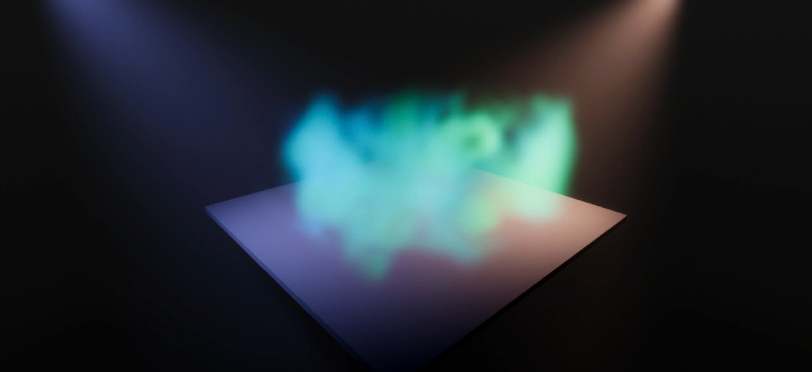

# Volumetric fog samples

This page provides an overview of how to use the Local Volumetric Fog component
in Unity to enhance your fog effects with **3D Textures** or **Shader
Graphs**. It also covers various blending modes and quality settings to optimize
the visual quality and performance of your fog effects.

Learn how to configure the Local Volumetric Fog component, use different
blending modes, and explore a variety of sample effects like 3D texture masks,
ground smoke, local clouds, foggy orbs, procedural noise fog, and fumes. Each
sample demonstrates unique techniques for creating and controlling volumetric
fog effects.

## Using local volumetric fog

The Local Volumetric Fog component allows you to use **3D Textures** or **Shader
Graphs** to add details and animation locally to the fog. **Blending Modes**
also allow you to add, multiply, or overwrite fog values.

The **Volumetric Fog quality settings**, found in the active **Volume Profile**,
determine the Local Fog's visual quality. Manual control offers precise
management over the Fog's budget: for an effect with lots of variation over a
short distance, increase the **Volume Slice Count**. If performance becomes an
issue, you can keep the **Screen Resolution Percentage** low as a tradeoff.

## Sample effects

To set up a volumetric sample scene, select **Window** > **Package manager** > **High Definition RP** > **Samples**, then import **Volumetric Samples**. Each sample is a prefab in the `Assets/Samples/High Definition RP/[HDRP version number]/Volumetric samples` folder.

### 3D texture mask

This Local Volumetric Fog uses the **Texture Mask Mode**. It requires a **3D
texture**, with more examples found in **VolumetricSamples/3D Textures**. RGB
channels provide tint, while the alpha channel drives the density. If the 3D
texture contains only the alpha channel, the tint will be presumed white.

### Ground smoke

This Ground Smoke Shader Graph relies exclusively on 2D textures. To achieve
this effect, adjust the density vertically by projecting a 2D noise pattern from
above. Two textures of varying sizes move in separate directions, while a basic
color gradient adds depth to the volume.

### Cloudy (local clouds)

This Shader Graph creates the Local Clouds Effect using various sampled noises
stored in **3D textures** to generate distinct cloud-like formations. For
realistic sky clouds, opt for **Volumetric Clouds**, as Local Volumetric Fog is
designed for close-range, localized camera effects.

### Foggy orb and light

This Foggy Orb uses a Shader Graph. The 3D texture scrolls upwards and rotates,
which helps to give it a good flow. It has a **light** in the middle.

### Procedural noise fog

This sample showcases procedural 3D Noise. You can compute 3D noise directly in
the Shader Graph. Several **3D noise functions** are available as **SubGraphs**
found in **VolumetricSamples/Fog Volume Shadergraph/Procedural
Noises**. Procedural Noise can be slow to run due to the complex math
involved. Check out the Material on the Sample to visualize different noise
functions.

### Fumes

This Fumes Effect uses a Shader Graph with a **procedural 3D Noise
SubGraph**. Not utilizing any textures allows you to scale and deform the effect
without a loss in quality.

## Blending modes

The **Local Volumetric Fog** offers different **Blending Modes**.

- **Additive blending mode**: Seamlessly blends with the surrounding fog by
  adding the color and density values of overlapping volumes. This mode does not
  allow subtraction.
- **Overwrite blending mode**: Replaces any fog value and doesn't blend with
  surrounding fog. Useful for removing fog from an interior.
- **Multiply blending mode**: Tints the fog color locally and reduces the fog's
  density by multiplying it with small values.
- **Min and max blending modes**: Clamp values in one way or the other.

### Volumetric heart

This simple Heart effect uses basic math in Shader Graph without involving any
textures.

## Additional resources

- [Local Volumetric Fog Volume
  Reference](https://docs.unity3d.com/Packages/com.unity.render-pipelines.high-definition@latest/index.html?subfolder=/manual/local-volumetric-fog-volume-reference.html)
