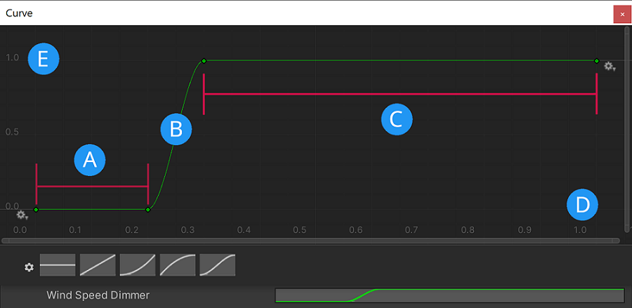

# Foam in the water system

The foam properties make it possible to control how much foam appears on your water surface and to make small adjustments to the foam's appearance.
## Configuration
It is currently best practice to only adjust two of the foam settings: **Simulation Foam Amount** and the **Wind Speed Dimmer**.

**Simulation Foam Amount** determines foam patch size.
### Wind Speed Dimmer
This control determines the amount of foam that **Distant Wind Speed** values produce.

 
* A: **Distant Wind Speeds** at the bottom of the curve do not produce any foam.
* B: **Distant Wind Speeds** in the range where the curve rises produce some foam.
* C: **Distant Wind Speeds** in the range at the top of the curve produce lots of foam.
* D: The x axis of this graph represents normalized **Distant Wind Speed**.
* E: The y axis of this graph represents the percentage of the maximum foam amount.

## Limitations
This foam implementation is monochromatic. You cannot add a tint to represent algae, for example.

## Additional resources
* <a href="WaterSystem-Properties.md">Settings and properties related to the Water System</a>